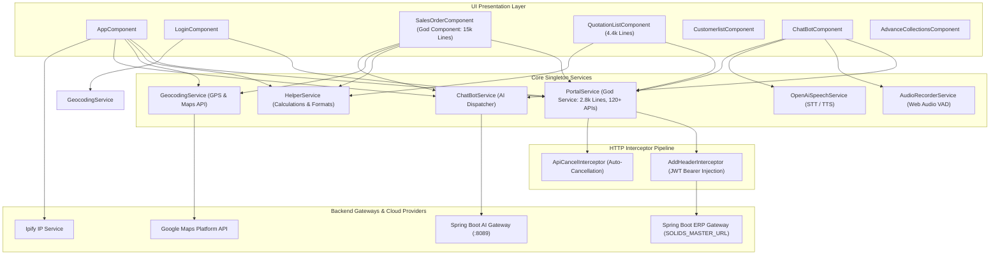

Searched for "OUT_RANGE_ORD"
Searched for "OUT_RANGE"
Viewed sales-order.component.ts:600-750
Searched for "distance"
Searched for "getDistanceFromLatLon"
Searched for "customer-geo"
Viewed portal.service.ts:2710-2840
Searched for "createSalesmanCustomerVisit"
Viewed sales-order.component.ts:5250-5450
Viewed sales-order.component.ts:5450-5600
Searched for "isOutsideBooking"
Searched for "allowedRadius"
Searched for "allowedRadius|isOutsideBooking"
Viewed sales-order.component.ts:1-250
Viewed sales-order.component.ts:1100-1400
Viewed sales-order.component.ts:1400-1600
Viewed sales-order.component.ts:740-1100
Viewed sales-order.component.ts:450-600

# Enterprise SFA Codebase Deep Architectural & Business Investigation (Sections 4 through 10)

---

## 4️⃣ Salesman Geo-Location Tracking Deep-Dive

### 4.1 Runtime Execution Trace

```
Application Startup / Login
  │
  ▼
1. GEO_TRACK_ENABLE_YN Check (AppComponent.loadGeoTrackingIntervalAndInit)
   • Calls: PortalService.getActiveGeneric('GEO_TRACK_ENABLE_YN', '')
   • API: GET /api/common/active/genericMaster/list?catgId=GEO_TRACK_ENABLE_YN
   • Business Rule: Checks if match.valueDesc === 'Y' for current compId. If 'N', tracking halts immediately.
  │
  ▼
2. GEO_TRACK_INTERVAL Resolution (AppComponent.loadGeoTrackingIntervalAndInit)
   • Calls: PortalService.getActiveGeneric('GEO_TRACK_INTERVAL', '')
   • API: GET /api/common/active/genericMaster/list?catgId=GEO_TRACK_INTERVAL
   • State: Parses valueDesc into milliseconds (e.g., 3600000 ms = 1 hr). Sets geoTrackingIntervalDuration.
  │
  ▼
3. GEO_TRACK Role Authorization (AppComponent.checkGeoTrackingAccess)
   • Calls: PortalService.getDynamicList({ subcatgid: 'ACCESS_LIST', filter: { ROLE_ID, COMPID } })
   • API: POST /api/common/dynamic/landing/list
   • Business Rule: Verifies accessList.some(item => item.AccessId === 'GEO_TRACK').
  │
  ▼
4. Timer Creation (AppComponent.initBackgroundGeoTracking)
   • Increments trackingSessionId to invalidate stale asynchronous execution contexts.
   • Clears any existing interval via clearGeoInterval().
   • Creates window.setInterval(sendLocationLog, geoTrackingIntervalDuration).
   • Registers interval ID with PortalService.setBackgroundGeoTrackInterval().
  │
  ▼
5. Location Acquisition & Hardware Telemetry (AppComponent.sendLocationLog)
   • GPS: await GeocodingService.getCurrentLocation() using navigator.geolocation.getCurrentPosition().
   • Battery: await navigator.getBattery() (reads level * 100).
   • Hardware ID: Reads/generates stable device UUID from localStorage('SOLIDS_DEVICE_ID').
   • Client IP: GET https://api.ipify.org?format=json.
  │
  ▼
6. Address Resolution via Google Maps Geocoding (GeocodingService.getAddressFromCoords)
   • Calls: google.maps.Geocoder.geocode({ location: { lat, lng } }).
   • Returns formatted address string and raw JSON response string.
  │
  ▼
7. Log Persistence (AppComponent.sendLocationLog)
   • Calls: HttpClient.post(`${SOLIDS_MASTER_URL}/api/map-api-log/save`, payload).
   • Payload contains: wmalUserId, wmalCompId, wmalDeviceId, wmalLatitude, wmalLongitude,
     wmalLocationAccuracy, wmalAddress, wmalBatteryPercentage, wmalIp, wmalTrackingSource ('GPS').
  │
  ▼
8. Cycle Completion & Route Inactivity Monitoring
   • Calls: handleTrackingCycleCompleted(sessionId).
   • Increments trackingCallCount++.
   • If trackingCallCount >= routeTimeoutMultiplier (default: 2), pauses tracking until the user changes routes.
```

---

### 4.2 Lifecycle, Restart, Stop, and Inactivity Logic

* **Route Change Restart** ([`app.component.ts:L843–L850`](file:///d:/Ramesh/SH_FE/sh_fe/src/app/app.component.ts#L843-L850)):
  When `onRouteChange()` detects `currentRoute !== lastTrackedRoute`, it updates `lastTrackedRoute = currentRoute` and calls `restartBackgroundGeoTracking()`, clearing intervals, resetting `trackingCallCount = 0`, and re-arming timers.
* **Stop / Teardown Logic** ([`app.component.ts:L352–L356`](file:///d:/Ramesh/SH_FE/sh_fe/src/app/app.component.ts#L352-L356)):
  `pauseBackgroundGeoTracking()` clears `backgroundGeoTrackIntervalId` and disarms `routeTimeoutId`. `clearBackgroundGeoTracking()` completely zeroes tracking state upon logout or navigation to `/login`.
* **Route Inactivity Timeout Monitoring** ([`app.component.ts:L978–L1005`](file:///d:/Ramesh/SH_FE/sh_fe/src/app/app.component.ts#L978-L1005)):
  `startRouteTimeoutMonitoring()` reads `localStorage('routeActivity')`. If the user stays on a single route for longer than `geoTrackingIntervalDuration * routeTimeoutMultiplier`, `handleRouteTimeout()` is invoked, setting `isRouteTimedOut = true` and calling `pauseBackgroundGeoTracking()`.

---

### 4.3 Sequence Diagram & Data Flow

```
+========================================================================================================+
|                                    GEO-TRACKING RUNTIME SEQUENCE                                       |
+========================================================================================================+

[ AppComponent ]            [ GeocodingService ]      [ Browser Hardware APIs ]     [ Backend API ]
       │                             │                           │                         │
       │─── 1. Interval Tick ────────┼───────────────────────────┼─────────────────────────┤
       │                             │                           │                         │
       │─── 2. getCurrentLocation() ─▶                           │                         │
       │                             │── 3. getCurrentPosition ─▶│                         │
       │                             │◀─ 4. Coords (lat, lng) ───│                         │
       │◀── 5. Coords (lat, lng) ────│                           │                         │
       │                             │                           │                         │
       │─── 6. getBattery() ────────────────────────────────────▶│ (navigator.getBattery) │
       │◀── 7. Battery % ────────────────────────────────────────│                         │
       │                             │                           │                         │
       │─── 8. getAddress(lat, lng) ─▶                           │                         │
       │                             │── 9. Geocoder.geocode ───▶│ (Google Maps API)       │
       │                             │◀─ 10. Formatted Address ──│                         │
       │◀── 11. Formatted Address ───│                           │                         │
       │                                                         │                         │
       │─── 12. POST /api/map-api-log/save (wmalLatitude, wmalLongitude, wmalAddress, ...) ──────▶│
       │◀── 13. HTTP 200 OK (Saved Log) ──────────────────────────────────────────────────────────│
       │                                                                                   │
       │─── 14. handleTrackingCycleCompleted() -> trackingCallCount >= multiplier -> Pause │
+========================================================================================================+
```

---

### 4.4 Failure Scenarios, Business Rules & Risky Areas

| Category | Finding / Analysis |
| :--- | :--- |
| **GPS Denial / Timeout** | [`sendLocationErrorLog()`](file:///d:/Ramesh/SH_FE/sh_fe/src/app/app.component.ts#L566) catches `GeolocationError`. Logs payload with `wmalLatitude: 0, wmalLongitude: 0` and records the exact error message into `wmalError` column. |
| **Stale Async Sessions** | [`app.component.ts:L310`](file:///d:/Ramesh/SH_FE/sh_fe/src/app/app.component.ts#L310) uses `trackingSessionId` counter. If a route change or logout occurs while GPS acquisition is in-flight, the callback detects `sessionId !== this.trackingSessionId` and aborts. |
| **Duplicate Timers Risk** | `initBackgroundGeoTracking()` guards against re-entrancy via `this.isInitializingTracking = true` and explicitly invokes `this.clearGeoInterval()` before setting a new window interval. |
| **Memory Leak Vector** | If the component is destroyed without invoking `ngOnDestroy()`, any uncleared `setInterval` or `setTimeout` references will continue running. `app.component.ts` enforces `clearRouteTimeoutMonitoring()` and `clearBackgroundGeoTracking()` inside `ngOnDestroy()`. |

---

## 5️⃣ Sales Order Geofencing & Business Rules Engine

### 5.1 Business Rules Matrix for Sales Order Processing

```
+-------------------------------------------------------------------------------------------------------------------------------+
| RULE CODE       | PRIVILEGE / CHECK           | CONDITION CHECKED             | TRUE BEHAVIOR           | FALSE BEHAVIOR      |
+-----------------+-----------------------------+-------------------------------+-------------------------+---------------------+
| GEO_TRACK       | ACCESS_LIST: 'GEO_TRACK'    | Role has GPS tracking enabled | Enforces geofence &     | Standard order entry|
|                 |                             |                               | salesman check-in       | without GPS checks  |
+-----------------+-----------------------------+-------------------------------+-------------------------+---------------------+
| GEO_CUSTOMER    | subcatgid:                  | Selected customer exists in   | Allows customer         | Customer omitted    |
| _VALID          | 'GEO_CUSTOMER_VALID'        | route/beat schedule for today | selection               | from dropdown list  |
+-----------------+-----------------------------+-------------------------------+-------------------------+---------------------+
| 50-Meter        | Distance <= allowedRadius   | Salesman distance to customer | Inside booking: sets    | Outside booking:    |
| Geofence        | (default: 50 meters)        | GPS is <= 50 meters           | isOutsideBooking = false| triggers exception  |
+-----------------+-----------------------------+-------------------------------+-------------------------+---------------------+
| OUT_RANGE_ORD   | ACCESS_LIST: 'OUT_RANGE_ORD'| Distance > 50m and salesman   | Allows order with       | Blocks order entry; |
|                 |                             | submits out-of-range order    | supervisor clearance    | shows warning modal |
+-----------------+-----------------------------+-------------------------------+-------------------------+---------------------+
| OUT_BEAT_ORD    | ACCESS_LIST: 'OUT_BEAT_ORD' | Customer not in today's beat  | Allows out-of-beat order| Blocks customer     |
|                 |                             | schedule (Day of week)        | with audit flag         | selection           |
+-----------------+-----------------------------+-------------------------------+-------------------------+---------------------+
| OUT_ROUTE_ORD   | ACCESS_LIST: 'OUT_ROUTE_ORD'| Customer not in active route  | Allows out-of-route     | Blocks customer     |
|                 |                             | dropdown selection            | order with audit flag   | selection           |
+-----------------+-----------------------------+-------------------------------+-------------------------+---------------------+
| NO_ORD          | ACCESS_LIST: 'NO_ORD'       | Salesman checks in but        | Opens No Order dialog;  | "No Order" button   |
|                 |                             | customer places no order      | logs visit reason to ERP| is hidden/disabled  |
+-----------------+-----------------------------+-------------------------------+-------------------------+---------------------+
```

---

### 5.2 Geofence Distance Calculation Algorithm

The application computes geodesic distances using two complementary tiers:

1. **Client-Side Geodesic Geometry** ([`GeocodingService.calculateDistance`](file:///d:/Ramesh/SH_FE/sh_fe/src/app/service/geocoding.service.ts)):
   Uses the spherical **Haversine Formula**:
   $$\Delta\text{lat} = \text{lat}_2 - \text{lat}_1, \quad \Delta\text{lon} = \text{lon}_2 - \text{lon}_1$$
   $$a = \sin^2\left(\frac{\Delta\text{lat}}{2}\right) + \cos(\text{lat}_1) \cdot \cos(\text{lat}_2) \cdot \sin^2\left(\frac{\Delta\text{lon}}{2}\right)$$
   $$c = 2 \cdot \text{atan2}\left(\sqrt{a}, \sqrt{1-a}\right), \quad d = R \cdot c \quad (R = 6,371,000\text{ meters})$$
2. **Server-Side Distance Verification API** ([`PortalService.calculateCustomerGeoDistance`](file:///d:/Ramesh/SH_FE/sh_fe/src/app/service/portal.service.ts#L2807-L2812)):
   ```http
   POST /api/v1/customer-geo/calculate-distance?lat1={lat1}&lon1={lon1}&lat2={lat2}&lon2={lon2}
   ```
   Authoritatively validates geodesic distance in meters on the backend prior to approving geofence compliance.

---

### 5.3 Visit Logging Pipeline (`createSalesmanCustomerVisit`)

Whenever a Sales Order or "No Order" voucher is finalized ([`sales-order.component.ts:L5297–L5336`](file:///d:/Ramesh/SH_FE/sh_fe/src/app/sales-order/sales-order.component.ts#L5297-L5336)):
```json
{
  "salesmanCode": "USR-102",
  "customerCode": "CUST-4491",
  "companyCode": "COMP01",
  "visitDate": "2026-09-01",
  "visitTime": "11:30:00",
  "salesmanLatitude": 25.2048,
  "salesmanLongitude": 55.2708,
  "allowedRadius": 50,
  "flexField01": "SO",
  "flexField02": "SORAK26-00921",
  "flexField03": "Order",
  "flexField04": 1250.00,
  "flexField07": "SO_TXN,Standard Order,114017",
  "flexField08": "INSIDE",
  "flexField09": "ROUTE_01",
  "flexField10": 1.0,
  "flexField11": "AED",
  "flexField12": 1250.00
}
```
Transmitted to `POST /api/v1/salesman-customer-visit` and followed by `sendLocationLog()`.

---

## 6️⃣ Enterprise API Dependency Map

```
+==================================================================================================================================================================================================+
| COMPONENT                  | SERVICE       | METHOD                 | HTTP   | ENDPOINT                                              | PAYLOAD / PARAMS                | PURPOSE                             |
+============================+===============+========================+========+=======================================================+=================================+=====================================+
| [ Authentication ]                                                                                                                                                                               |
| LoginComponent             | PortalService | loginRes()             | POST   | /api/auth/login                                       | { mailId, password, compId }    | Authenticates user; returns JWT     |
| LoginComponent             | PortalService | loginOtpRes()          | POST   | /api/auth/login/otp                                   | { hashKey, otp }                | Validates MFA OTP token             |
| AppComponent               | PortalService | changeUserStatus()     | POST   | /api/auth/login/update/userdetails                    | userId, isActive ('Y'/'N')      | Updates online/offline user status  |
| AppComponent               | PortalService | logoutForAllUsers()    | POST   | /api/auth/logout/all                                  | None                            | Invalidates all tenant sessions     |
+----------------------------+---------------+------------------------+--------+-------------------------------------------------------+---------------------------------+-------------------------------------+
| [ Master & Configuration ]                                                                                                                                                                       |
| AppComponent               | PortalService | getActiveGeneric()     | GET    | /api/common/active/genericMaster/list?catgId={id}     | catgId (TXN_ORDER, etc.)        | Loads system generic master values  |
| AppComponent               | PortalService | getMenuList()          | GET    | /api/common/menu/role/list?roleId={r}&compId={c}      | None                            | Loads role-authorized navigation tree|
| SalesOrderComponent        | PortalService | getDynamicList()       | POST   | /api/common/dynamic/landing/list                      | { subcatgid: 'ACCESS_LIST' }    | Fetches user role access rights     |
| SalesOrderComponent        | PortalService | get_quotation_Drop...  | POST   | /api/common/quotation/dropdown/list?catgId={id}       | { P_COMP_CODE, P_CUST_CODE }    | Loads ERP master dropdown catalogs  |
+----------------------------+---------------+------------------------+--------+-------------------------------------------------------+---------------------------------+-------------------------------------+
| [ Customer CRM ]                                                                                                                                                                                 |
| CustomerlistComponent      | PortalService | getCustomerList()      | POST   | /api/common/quotation/dropdown/list?catgId=WPOSCUST...| { P_SEARCH, P_ROW, P_SM_CODE }  | Fetches assigned customer catalog   |
| CustomerDetailsComponent   | PortalService | getCustomerGeoByCode() | GET    | /api/v1/customer-geo/code/{customerCode}              | None                            | Retrieves customer GPS coordinates  |
| CustomerDetailsComponent   | PortalService | createCustomerGeo()    | POST   | /api/v1/customer-geo                                  | { customerCode, latitude, ... } | Creates new customer geofence record|
+----------------------------+---------------+------------------------+--------+-------------------------------------------------------+---------------------------------+-------------------------------------+
| [ Sales Order & Invoicing ]                                                                                                                                                                      |
| SalesOrderComponent        | PortalService | orderCreate()          | POST   | /api/invoice/create                                   | WctInvoiceHeaderDTO             | Saves new Sales Order / Invoice     |
| SalesOrderComponent        | PortalService | orderUpdate()          | POST   | /api/invoice/update                                   | WctInvoiceHeaderDTO             | Updates existing Sales Order voucher|
| SalesOrderComponent        | PortalService | getOrderDetailById()   | GET    | /api/invoice/detail?quoteId={id}                      | None                            | Fetches order lines, batches & taxes|
| SalesOrderComponent        | PortalService | pushToERP()            | POST   | /api/invoice/external/create/sun/invoice              | quoteRef, orderType, type='S'   | Posts sales order to Orion/Sun ERP  |
| SalesOrderComponent        | PortalService | updateNoOrder()        | POST   | /api/invoice/no-order/create                          | WctInvoiceHeaderDTO             | Records "No Order" salesman visit   |
+----------------------------+---------------+------------------------+--------+-------------------------------------------------------+---------------------------------+-------------------------------------+
| [ Quotations ]                                                                                                                                                                                   |
| QuotationListComponent     | PortalService | SalesquoteCreate()     | POST   | /api/sales/quotation/create                           | WctSalesQuotationHeaderDTO      | Creates sales quotation document    |
| QuotationListComponent     | PortalService | uploadFile()           | POST   | /api/sales/quotation/import/excel                     | FormData (Spreadsheet)          | Batch imports quotation line items  |
+----------------------------+---------------+------------------------+--------+-------------------------------------------------------+---------------------------------+-------------------------------------+
| [ Collections & Treasury ]                                                                                                                                                                       |
| AdvanceCollectionsComp     | PortalService | createAdvHeader()      | POST   | /api/advance/collection/create                        | WatCollectionHeaderDTO          | Saves advance payment collection    |
| AdvanceCollectionsComp     | PortalService | bankreciptValidation() | POST   | /api/invoice/external/validate/advance/coll           | { customerNo, bankCode, ... }   | Validates cheque clearance in ERP   |
| AdvanceCollectionsComp     | PortalService | pushToERPAdvance...    | POST   | /api/invoice/external/create/advance/collection       | agId                            | Posts advance collection to ERP JV  |
+----------------------------+---------------+------------------------+--------+-------------------------------------------------------+---------------------------------+-------------------------------------+
| [ Inventory Logistics ]                                                                                                                                                                          |
| MaterialRequestAddComponent| PortalService | integrateMRWithErp()   | POST   | /api/material/request/sun/external/create             | mrRef, orderType='MR'           | Posts Material Request to ERP       |
| LocationTransferOutAddComp | PortalService | integrateLTOWithErp()  | POST   | /api/lto/external/create                              | ltoRef, orderType='LTO'         | Posts warehouse stock dispatch (LTO)|
| LocationTransferInAddComp  | PortalService | integrateLTIWithErp()  | POST   | /api/lti/external/create                              | ltiRef, orderType='LTI'         | Posts warehouse stock receipt (LTI) |
+----------------------------+---------------+------------------------+--------+-------------------------------------------------------+---------------------------------+-------------------------------------+
| [ Geotracking & Field Visits ]                                                                                                                                                                   |
| AppComponent               | HttpClient    | sendLocationLog()      | POST   | /api/map-api-log/save                                 | MapApiLogDTO (GPS, battery, IP) | Persists background salesman GPS log|
| SalesOrderComponent        | PortalService | createSalesmanCusto... | POST   | /api/v1/salesman-customer-visit                       | SalesmanVisitDTO                | Records check-in visit with geofence|
| SalesmanGeotrackingComp    | PortalService | getMapApiLogs()        | GET    | /api/map-api-log/user/{userId}/date/{date}            | None                            | Fetches GPS trail for map rendering |
+----------------------------+---------------+------------------------+--------+-------------------------------------------------------+---------------------------------+-------------------------------------+
| [ AI Voice & Chatbot ]                                                                                                                                                                           |
| ChatBotComponent           | OpenAiSpeech  | transcribe()           | POST   | /api/openai/speech-to-text                            | FormData (Audio Blob, gpt-4o)   | Transcribes voice speech to text    |
| ChatBotComponent           | OpenAiSpeech  | synthesize()           | POST   | /api/openai/text-to-speech                            | { model: gpt-4o-mini-tts, ... } | Synthesizes response text to audio  |
| ChatBotComponent           | ChatBotService| sendMessage()          | POST   | /api/ai/v1/workflow/{workflow}/chat                   | { message: string }             | Executes Spring Boot NLU workflow   |
+==================================================================================================================================================================================================+
```

---

## 7️⃣ Database / Master Configuration Investigation

```
+====================================================================================================================================+
| 1. GEO_TRACK_ENABLE_YN                                                                                                             |
| • Retrieval: PortalService.getActiveGeneric('GEO_TRACK_ENABLE_YN', '') -> GET /api/common/active/genericMaster/list               |
| • Storage: AppComponent.canEnableYN (boolean)                                                                                      |
| • Controlled Behavior: Master toggle for the entire background GPS tracking engine.                                                |
+====================================================================================================================================+
| 2. GEO_TRACK_INTERVAL                                                                                                              |
| • Retrieval: PortalService.getActiveGeneric('GEO_TRACK_INTERVAL', '') -> GET /api/common/active/genericMaster/list                |
| • Storage: AppComponent.geoTrackingIntervalDuration (ms)                                                                           |
| • Controlled Behavior: Sets the timer frequency (e.g. 3600000ms) for background GPS location logging.                              |
+====================================================================================================================================+
| 3. GEO_TRACK (Access Right)                                                                                                        |
| • Retrieval: PortalService.getDynamicList({ subcatgid: 'ACCESS_LIST' }) -> POST /api/common/dynamic/landing/list                   |
| • Storage: AppComponent.checkGeoTrackingAccess() & SalesOrderComponent.hasGeoTrackAccess                                           |
| • Controlled Behavior: Authorizes specific salesman user roles to be tracked and enforces geofenced visits.                        |
+====================================================================================================================================+
| 4. NO_ORD (Access Right)                                                                                                           |
| • Retrieval: PortalService.getDynamicList({ subcatgid: 'ACCESS_LIST' })                                                            |
| • Storage: SalesOrderComponent.hasNoOrderAccess (boolean)                                                                          |
| • Controlled Behavior: Controls visibility and submission of the "No Order" button when a customer places no order during a visit.|
+====================================================================================================================================+
| 5. OUT_RANGE_ORD / OUT_BEAT_ORD / OUT_ROUTE_ORD                                                                                    |
| • Retrieval: PortalService.getDynamicList({ subcatgid: 'ACCESS_LIST' })                                                            |
| • Storage: SalesOrderComponent.isOutOfRangeOrder / isOutOfBeatOrder / isOutOfRouteOrder                                            |
| • Controlled Behavior: Authorizes salesman to bypass strict 50m geofence, beat schedule, or route assignment when creating orders. |
+====================================================================================================================================+
| 6. GEO_CUSTOMER_VALID                                                                                                              |
| • Retrieval: PortalService.getDynamicList({ subcatgid: 'GEO_CUSTOMER_VALID', filter: { BEATCODE, ROUTECODE, CUSTCODE } })          |
| • Storage: SalesOrderComponent.customerlist                                                                                        |
| • Controlled Behavior: Filters customer autocomplete to display ONLY customers assigned to today's active route and beat.         |
+====================================================================================================================================+
| 7. Chatbot Transaction Mappings (wtudTranCode, wtudTranUrl)                                                                        |
| • Retrieval: PortalService.getChatbotMappingDetail(erpTxnCode) -> GET /api/common/chatbot/mapping/detail                           |
| • Storage: ChatBotService.returnRoute() & ChatBotComponent.typeTxnCode                                                             |
| • Controlled Behavior: Maps AI workflow intents to concrete frontend routes (e.g., SO -> /sales-order/view).                       |
+====================================================================================================================================+
```

---

## 8️⃣ Top 10 Runtime Entry Points

### 1. User Authentication Entrypoint
* **Entry Point**: `LoginComponent.submitLogin()` ([`login.component.ts:L193`](file:///d:/Ramesh/SH_FE/sh_fe/src/app/solids/login/login.component.ts#L193))
* **Triggered by**: User clicks "Login" button.
* **Chain**:
  `submitLogin()` $\rightarrow$ `PortalService.loginRes()` $\rightarrow$ `POST /api/auth/login` $\rightarrow$ Response: `{ apiKey, userId, roleId }` $\rightarrow$ State: `localStorage.setItem('SOLIDS_DATA', ...)` $\rightarrow$ UI: Injects Bearer token $\rightarrow$ Navigation: Redirects to `/customer-detail`.

### 2. Startup Location & Menu Initializer
* **Entry Point**: `AppComponent.ngOnInit()` ([`app.component.ts:L132`](file:///d:/Ramesh/SH_FE/sh_fe/src/app/app.component.ts#L132))
* **Triggered by**: Angular Root Component Bootstrap.
* **Chain**:
  `ngOnInit()` $\rightarrow$ `getLocationList()` $\rightarrow$ `POST /api/common/dynamic/landing/list` $\rightarrow$ Response: `APPL_LOCN_LIST` $\rightarrow$ State: `localStorage('defaultLocationCode')` $\rightarrow$ `menuPriority()` $\rightarrow$ `GET /api/common/menu/role/list` $\rightarrow$ UI: Renders sorted sidebar menu tree.

### 3. Background GPS Ping Entrypoint
* **Entry Point**: `AppComponent.sendLocationLog()` ([`app.component.ts:L441`](file:///d:/Ramesh/SH_FE/sh_fe/src/app/app.component.ts#L441))
* **Triggered by**: Periodic `setInterval` tick (`geoTrackingIntervalDuration`).
* **Chain**:
  `sendLocationLog()` $\rightarrow$ `GeocodingService.getCurrentLocation()` $\rightarrow$ `Google Maps Geocoder` $\rightarrow$ `POST /api/map-api-log/save` $\rightarrow$ Response: `{ success: true }` $\rightarrow$ State: `trackingCallCount++` $\rightarrow$ UI: GPS indicator updated.

### 4. Sales Order Creation & Margin Engine
* **Entry Point**: `SalesOrderComponent.createOrder()` ([`sales-order.component.ts:L5150`](file:///d:/Ramesh/SH_FE/sh_fe/src/app/sales-order/sales-order.component.ts#L5150))
* **Triggered by**: User clicks "Save Order" in Sales Order view.
* **Chain**:
  `createOrder()` $\rightarrow$ `HelperService.calculationValidation()` $\rightarrow$ `PortalService.orderCreate()` $\rightarrow$ `POST /api/invoice/create` $\rightarrow$ Response: `{ quoteId, quoteRef }` $\rightarrow$ State: `detailId = quoteId` $\rightarrow$ `createSalesmanCustomerVisit()` $\rightarrow$ UI: Unlocks print buttons $\rightarrow$ Navigation: `/sales-order/update/{quoteId}`.

### 5. Sales Order ERP Synchronization
* **Entry Point**: `SalesOrderComponent.pushToERP()` ([`sales-order.component.ts:L4200`](file:///d:/Ramesh/SH_FE/sh_fe/src/app/sales-order/sales-order.component.ts#L4200))
* **Triggered by**: User clicks "Push to ERP".
* **Chain**:
  `pushToERP()` $\rightarrow$ `validateHeaderWhileSaving()` $\rightarrow$ `PortalService.pushToERP()` $\rightarrow$ `POST /api/invoice/external/create/sun/invoice` $\rightarrow$ Response: `{ status: "SUCCESS" }` $\rightarrow$ State: Order status set to Synced $\rightarrow$ UI: Locks form controls.

### 6. Customer Selection & Geofence Verification
* **Entry Point**: `SalesOrderComponent.getCustomerDefaults()` ([`sales-order.component.ts:L1294`](file:///d:/Ramesh/SH_FE/sh_fe/src/app/sales-order/sales-order.component.ts#L1294))
* **Triggered by**: User selects a customer in autocomplete dropdown.
* **Chain**:
  `getCustomerDefaults()` $\rightarrow$ `PortalService.get_quotation_Dropdownlist('WPOSCUSTDETAIL')` $\rightarrow$ `GeocodingService.getCurrentLocation()` $\rightarrow$ Computes distance vs 50m radius $\rightarrow$ State: Sets `isOutsideBooking` $\rightarrow$ UI: Shows geofence confirmation modal if outside.

### 7. "No Order" Visit Submission
* **Entry Point**: `SalesOrderComponent.confirmNoOrder()` ([`sales-order.component.ts:L5406`](file:///d:/Ramesh/SH_FE/sh_fe/src/app/sales-order/sales-order.component.ts#L5406))
* **Triggered by**: User selects "No Order" reason in modal.
* **Chain**:
  `confirmNoOrder()` $\rightarrow$ `PortalService.updateNoOrder()` $\rightarrow$ `POST /api/invoice/no-order/create` $\rightarrow$ `PortalService.createSalesmanCustomerVisit()` $\rightarrow$ Response: `{ quoteId, quoteRef }` $\rightarrow$ State: Clears current customer $\rightarrow$ Navigation: Navigates back to `/invoice/list`.

### 8. Advance Payment Collection Entrypoint
* **Entry Point**: `AdvanceCollectionsComponent.saveAdvance()` ([`advance-collections.component.ts`](file:///d:/Ramesh/SH_FE/sh_fe/src/app/advance-collections/advance-collections.component.ts))
* **Triggered by**: User clicks "Save Collection".
* **Chain**:
  `saveAdvance()` $\rightarrow$ `PortalService.bankreciptValidation()` $\rightarrow$ `PortalService.createAdvHeader()` $\rightarrow$ `POST /api/advance/collection/create` $\rightarrow$ Response: `{ tranRef: "ADCRAK26-0045" }` $\rightarrow$ State: Form patched $\rightarrow$ UI: Generates receipt PDF.

### 9. AI Voice Assistant Conversation Dispatcher
* **Entry Point**: `ChatBotComponent.onRecordingStopped()` ([`chat-bot.component.ts:L1189`](file:///d:/Ramesh/SH_FE/sh_fe/src/app/chat-bot/chat-bot.component.ts#L1189))
* **Triggered by**: AudioRecorderService voice activity detector completes recording.
* **Chain**:
  `onRecordingStopped()` $\rightarrow$ `OpenAiSpeechService.transcribe()` $\rightarrow$ `ChatBotService.sendMessage()` $\rightarrow$ `POST /api/ai/v1/workflow/.../chat` $\rightarrow$ Response: `{ state: "COMPLETED", draft, voucherId }` $\rightarrow$ `OpenAiSpeechService.synthesize()` $\rightarrow$ Navigation: `/sales-order/view/{voucherId}`.

### 10. Material Requisition Warehouse Dispatch
* **Entry Point**: `MaterialRequestAddComponent.integrateMR()` ([`material-request-add.component.ts`](file:///d:/Ramesh/SH_FE/sh_fe/src/app/material-request/material-request-add/material-request-add.component.ts))
* **Triggered by**: User clicks "Integrate with ERP".
* **Chain**:
  `integrateMR()` $\rightarrow$ `realtimeQtyValidation()` $\rightarrow$ `PortalService.integrateMRWithErp()` $\rightarrow$ `POST /api/material/request/sun/external/create` $\rightarrow$ Response: `{ status: "SUCCESS" }` $\rightarrow$ State: Status updated to Integrated $\rightarrow$ Navigation: `/material-request`.

---

## 9️⃣ Application Dependency Graph & Architectural Smells



### Architectural Findings

1. **God Components & Services**:
   * [`SalesOrderComponent`](file:///d:/Ramesh/SH_FE/sh_fe/src/app/sales-order/sales-order.component.ts) (15,652 lines) combines form definitions, business calculations, DOM manipulation, batch modals, discount logic, geofencing checks, and printing.
   * [`PortalService`](file:///d:/Ramesh/SH_FE/sh_fe/src/app/service/portal.service.ts) (2,874 lines) acts as a monolithic repository for over 120 REST endpoints across all enterprise modules.
2. **Shared State Holders**:
   * Global state is coordinated primarily via `localStorage` keys (`SOLIDS_DATA`, `SOLIDS_MASTER_URL`, `SOLIDS_DEVICE_ID`, `routeActivity`, `defaultLocationCode`).
   * Reactive state is held in `ChatBotService.quotationData$` and `AudioRecorderService.volume$`.
3. **Circular Navigation Pattern**:
   * Navigation often routes through `/customer-detail` with `skipLocationChange: true` before redirecting to target paths to force view re-initialization.

---

## 🔟 Comprehensive Analysis of `SalesOrderComponent`

```
File: src/app/sales-order/sales-order.component.ts (15,652 lines)
```

### 1. `intializeSaleOrderForm()` ([L163–L206](file:///d:/Ramesh/SH_FE/sh_fe/src/app/sales-order/sales-order.component.ts#L163-L206))
* **Why it exists**: Builds the 38-control Reactive Form representing the Sales Order transaction header.
* **Caller**: `ngOnInit()`, `newOrder()`.
* **Inputs**: None.
* **Variables Modified**: `this.saleOrderForm`, `this.agId`.
* **Business Rule**: Initializes default order type to `'SO'` (disabled), sets transaction dates to current date, and locks currency exchange rates.
* **UI Changes**: Binds input controls in `sales-order.component.html`.
* **Breakage Risk**: If broken, all form bindings fail and the view fails to render.

### 2. `getPrivelege()` ([L603–L684](file:///d:/Ramesh/SH_FE/sh_fe/src/app/sales-order/sales-order.component.ts#L603-L684))
* **Why it exists**: Resolves user role permissions for geotracking, out-of-range orders, short closures, and collections.
* **Caller**: `ngOnInit()`.
* **Service/API**: `PortalService.getDynamicList()` targeting `subcatgid: 'ACCESS_LIST'` and `subcatgid: 'GEO_ACCESS_TXN'`.
* **Variables Modified**: `hasGeoTrackAccess`, `hasNoOrderAccess`, `isOutOfRangeOrder`, `isOutOfBeatOrder`, `isOutOfRouteOrder`.
* **Business Rule**: Dynamically gates order submission buttons and geofence bypass dialogs.

### 3. `getCustomerList(searchTerm)` ([L789–L872](file:///d:/Ramesh/SH_FE/sh_fe/src/app/sales-order/sales-order.component.ts#L789-L872))
* **Why it exists**: Populates the customer autocomplete dropdown, applying route/beat filters.
* **Caller**: `ngOnInit()`, `routeCodeChanged()`, user typing in search box.
* **Service/API**: `PortalService.get_quotation_Dropdownlist('WPOSCUSTMSTCOMPWS')` and `PortalService.getDynamicList('GEO_CUSTOMER_VALID')`.
* **Variables Modified**: `this.customerlist`.
* **Business Rule**: If geotracking is enabled, filters out any customer not scheduled for today's route/beat.

### 4. `getCustomerDefaults(customerCode)` ([L1294–L1431](file:///d:/Ramesh/SH_FE/sh_fe/src/app/sales-order/sales-order.component.ts#L1294-L1431))
* **Why it exists**: Automatically populates customer payment terms, shipping addresses, credit limits, outstanding balances, and currency upon customer selection.
* **Caller**: Customer dropdown selection event.
* **Service/API**: `PortalService.get_quotation_Dropdownlist('WPOSCUSTDETAIL')`.
* **Variables Modified**: `saleOrderForm.patchValue()`, `this.outStandingDetail`.
* **Next Methods Triggered**: `getBalanceAmt(customerCode)`, `validateCashCustomer()`.

### 5. `createOrder(proceedToApprove)` ([L5150–L5387](file:///d:/Ramesh/SH_FE/sh_fe/src/app/sales-order/sales-order.component.ts#L5150-L5387))
* **Why it exists**: Validates line-item prices, formats DTO payload, and creates/updates the order in the database.
* **Caller**: User clicks "Save" or "Save & Approve".
* **Service/API**: `PortalService.orderCreate()` / `PortalService.orderUpdate()` $\rightarrow$ `POST /api/invoice/create`.
* **Variables Modified**: `this.detailId`, `this.loadingYN`.
* **Next Methods Triggered**: `PortalService.createSalesmanCustomerVisit()`, `this.sendLocationLog()`, `this.saveAndApprove()`.

### 6. `confirmNoOrder()` ([L5406–L5565](file:///d:/Ramesh/SH_FE/sh_fe/src/app/sales-order/sales-order.component.ts#L5406-L5565))
* **Why it exists**: Submits a "No Order" visit voucher when a customer places no order.
* **Caller**: User clicks "Confirm" in No Order modal dialog.
* **Service/API**: `PortalService.updateNoOrder()` $\rightarrow$ `POST /api/invoice/no-order/create`.
* **Next Methods Triggered**: `createSalesmanCustomerVisit()`, `sendLocationLog()`, `backHandler()`.

### 7. `realtimeQtyValidation(quoteDetail)` ([L5566–L5600](file:///d:/Ramesh/SH_FE/sh_fe/src/app/sales-order/sales-order.component.ts#L5566-L5600))
* **Why it exists**: Queries live stock balances to prevent overselling when multiple salesmen book the same inventory concurrently.
* **Caller**: `createOrder()`, `saveAndApprove()`.
* **Service/API**: `PortalService.getListFromRefs()`.
* **Business Rule**: Asserts `usedQty + requestedQty <= actualWarehouseStock`. Returns validation warning if stock is exceeded.