Searched for "ContentChild"
Searched for "signal("
Searched for "switchMap"
Searched for "debounceTime"
Searched for "combineLatest"
Searched for "finalize"
Searched for "tap("
Searched for "| async"
Searched for "mergeMap"   
Searched for "exhaustMap"
Searched for "shareReplay"
Searched for "ReplaySubject"
Viewed material-return-add.component.ts:2415-2440
Viewed material-return-add.component.ts:2400-2425
Searched for "ChangeDetectionStrategy"
Searched for "trackBy"
Searched for "NgZone"
Searched for "FormArray"
Searched for "InjectionToken"
Viewed environment.ts:1-14
Viewed custom-select.component.ts:1-60
Viewed custom-select.component.ts:180-226
Searched for "resolve:"

# Developer Learning-Outcome Analysis
**Target Application:** Enterprise Sales Force Automation & ERP Web Client (`sh_fe`)  
**Technology Stack:** Angular 15.1.0, TypeScript 4.9.4, RxJS 7.8.0, Zone.js 0.12.0, Angular CDK 15.2.1, ngx-bootstrap, PrimeNG 15.4.1

---

# 1. Angular Concepts I Will Learn

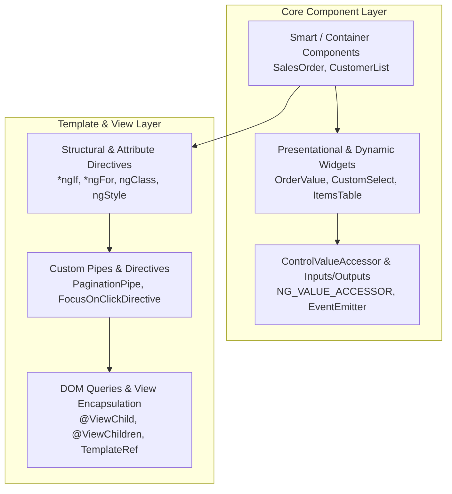

---

## Components

### 1. Smart / Container Components
* **Where used:** [`sales-order.component.ts`](file:///d:/Ramesh/SH_FE/sh_fe/src/app/sales-order/sales-order.component.ts), [`customerlist.component.ts`](file:///d:/Ramesh/SH_FE/sh_fe/src/app/customer/customerlist/customerlist.component.ts), [`user-master-detail.component.ts`](file:///d:/Ramesh/SH_FE/sh_fe/src/app/masters/user-master-detail/user-master-detail.component.ts)
* **File:** [`src/app/sales-order/sales-order.component.ts`](file:///d:/Ramesh/SH_FE/sh_fe/src/app/sales-order/sales-order.component.ts#L42-L60)
* **Method/Property:** `ngOnInit()`, `saveSalesOrder()`, `getCustomerFIlter()`
* **Why it is used:** Acts as the orchestrator for multi-tab business transactions, fetching backend data, managing massive form state, coordinating child modals, and handling persistence.
* **What I will learn:** How to manage complex container components that handle full ERP transaction lifecycles, API coordination, and data synchronization across multiple views.

### 2. Presentational / Dumb Components
* **Where used:** [`order-value.component.ts`](file:///d:/Ramesh/SH_FE/sh_fe/src/app/dynamic-components/order-value/order-value.component.ts), [`items-table.component.ts`](file:///d:/Ramesh/SH_FE/sh_fe/src/app/dynamic-components/items-table/items-table.component.ts)
* **File:** [`src/app/dynamic-components/order-value/order-value.component.ts`](file:///d:/Ramesh/SH_FE/sh_fe/src/app/dynamic-components/order-value/order-value.component.ts#L11-L35)
* **Method/Property:** `currencyDecimal`, `discountAmt`, `netValue`, `vatValue`
* **Why it is used:** Receives calculation data purely via inputs, formats line-item totals, and renders VAT/discount summaries without performing independent HTTP operations.
* **What I will learn:** How to isolate reusable UI calculators that depend strictly on parent inputs.

### 3. Parent-Child Communication (`@Input()`)
* **Where used:** [`order-value.component.ts`](file:///d:/Ramesh/SH_FE/sh_fe/src/app/dynamic-components/order-value/order-value.component.ts#L12-L34), [`custom-select.component.ts`](file:///d:/Ramesh/SH_FE/sh_fe/src/app/dynamic-components/custom-select/custom-select.component.ts#L33-L36)
* **File:** [`src/app/dynamic-components/order-value/order-value.component.ts`](file:///d:/Ramesh/SH_FE/sh_fe/src/app/dynamic-components/order-value/order-value.component.ts#L12-L26)
* **Method/Property:** `@Input() salesOrder: any;`, `@Input() totalAmount: any;`, `@Input() exchangeRate: any = 1;`
* **Why it is used:** Passes header-level exchange rates and item calculations from the main sales order form down into the summary widget.
* **What I will learn:** How data flows top-down in component hierarchies and how inputs trigger change detection cycles.

### 4. Parent-Child Communication (`@Output()` & `EventEmitter`)
* **Where used:** [`header.component.ts`](file:///d:/Ramesh/SH_FE/sh_fe/src/app/components/layouts/header/header.component.ts#L23), [`quotationdetail.component.ts`](file:///d:/Ramesh/SH_FE/sh_fe/src/app/quotationdetail/quotationdetail.component.ts#L29-L30)
* **File:** [`src/app/components/layouts/header/header.component.ts`](file:///d:/Ramesh/SH_FE/sh_fe/src/app/components/layouts/header/header.component.ts#L23-L28)
* **Method/Property:** `@Output() toggleSidebar = new EventEmitter<boolean>(false);` -> `expandedBtn()` emits `true`.
* **Why it is used:** Notifies the layout wrapper that the sidebar toggle button was clicked.
* **What I will learn:** Event-driven architecture for notifying parent layouts of child user actions.

### 5. View Queries (`@ViewChild`)
* **Where used:** [`chat-bot.component.ts`](file:///d:/Ramesh/SH_FE/sh_fe/src/app/chat-bot/chat-bot.component.ts#L54-L55), [`header.component.ts`](file:///d:/Ramesh/SH_FE/sh_fe/src/app/components/layouts/header/header.component.ts#L24)
* **File:** [`src/app/chat-bot/chat-bot.component.ts`](file:///d:/Ramesh/SH_FE/sh_fe/src/app/chat-bot/chat-bot.component.ts#L54-L55)
* **Method/Property:** `@ViewChild('scrollContainer') private scrollContainer!: ElementRef;`
* **Why it is used:** Programmatically scrolls the chat container to the bottom upon receiving bot stream messages.
* **What I will learn:** How to access underlying native DOM elements safely through Angular's query abstractions.

### 6. View Queries (`@ViewChildren` & `QueryList`)
* **Where used:** [`custom-select.component.ts`](file:///d:/Ramesh/SH_FE/sh_fe/src/app/dynamic-components/custom-select/custom-select.component.ts#L10-L11), [`sales-order.component.ts`](file:///d:/Ramesh/SH_FE/sh_fe/src/app/sales-order/sales-order.component.ts#L24)
* **File:** [`src/app/dynamic-components/custom-select/custom-select.component.ts`](file:///d:/Ramesh/SH_FE/sh_fe/src/app/dynamic-components/custom-select/custom-select.component.ts#L10-L11)
* **Method/Property:** `@ViewChildren(...)`
* **Why it is used:** Tracks rendered option items in custom dropdowns to manage keyboard navigation focus index.
* **What I will learn:** Querying multiple child elements and responding to dynamic query list updates.

### 7. Content Queries (`@ContentChild` / `@ContentChildren`)
* **Status in Codebase:** **NOT PRESENT** (Project relies entirely on `@ViewChild` and structural templates).

### 8. Custom Form Integration (`ControlValueAccessor`)
* **Where used:** [`custom-select.component.ts`](file:///d:/Ramesh/SH_FE/sh_fe/src/app/dynamic-components/custom-select/custom-select.component.ts#L23-L29)
* **File:** [`src/app/dynamic-components/custom-select/custom-select.component.ts`](file:///d:/Ramesh/SH_FE/sh_fe/src/app/dynamic-components/custom-select/custom-select.component.ts#L206-L220)
* **Method/Property:** `writeValue()`, `registerOnChange()`, `registerOnTouched()`, `NG_VALUE_ACCESSOR` provider.
* **Why it is used:** Turns a custom search/select component into a first-class Angular Form control compatible with `formControlName` and `[(ngModel)]`.
* **What I will learn:** Building custom form controls that seamlessly participate in Angular's Reactive Forms engine.

### 9. Component Lifecycle Hooks
* **Where used:** Throughout all major components.
  - `ngOnInit`: [`login.component.ts`](file:///d:/Ramesh/SH_FE/sh_fe/src/app/solids/login/login.component.ts#L39) (Data loading, role extraction)
  - `ngOnChanges`: [`order-value.component.ts`](file:///d:/Ramesh/SH_FE/sh_fe/src/app/dynamic-components/order-value/order-value.component.ts#L47-L60) (Recalculating decimals upon parent exchange rate input changes)
  - `ngOnDestroy`: [`chat-bot.component.ts`](file:///d:/Ramesh/SH_FE/sh_fe/src/app/chat-bot/chat-bot.component.ts#L53) (Clearing audio streams and interval subscriptions)
  - `ngAfterViewChecked`: [`chat-bot.component.ts`](file:///d:/Ramesh/SH_FE/sh_fe/src/app/chat-bot/chat-bot.component.ts#L53) (Auto-scroll synchronization after DOM updates)
* **What I will learn:** When and where to execute logic during an Angular component's lifetime to avoid memory leaks and expression-changed errors.

---

## Templates

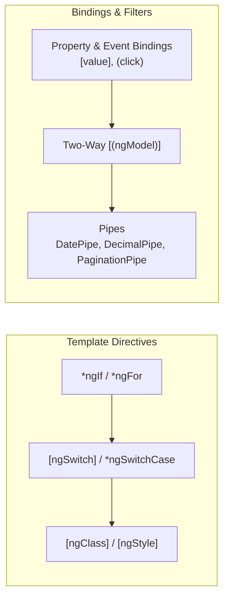

* **Interpolation (`{{ }}`):** [`customerlist.component.html`](file:///d:/Ramesh/SH_FE/sh_fe/src/app/customer/customerlist/customerlist.component.html) displays dynamic ERP data such as `{{ item.customerName }}` and computed totals.
* **Property Binding (`[property]`):** [`sales-order.component.html`](file:///d:/Ramesh/SH_FE/sh_fe/src/app/sales-order/sales-order.component.html) binds form properties dynamically: `[disabled]="isReadOnly"`, `[bsConfig]="bsRangeConfig"`.
* **Event Binding (`(event)`):** [`customerlist.component.html`](file:///d:/Ramesh/SH_FE/sh_fe/src/app/customer/customerlist/customerlist.component.html) binds user actions: `(click)="sort('customerNo')"`, `(ngModelChange)="onSearchChange($event)"`.
* **Two-Way Binding (`[(ngModel)]`):** [`customerlist.component.html`](file:///d:/Ramesh/SH_FE/sh_fe/src/app/customer/customerlist/customerlist.component.html) binds local filter inputs like `[(ngModel)]="searchInput"`.
* **Structural Directives (`*ngIf`, `*ngFor`, `ngSwitch`):**
  - `*ngIf`: Conditionally renders modals, tabs, and action buttons based on user permissions.
  - `*ngFor`: Iterates line items in [`custom-select.component.html`](file:///d:/Ramesh/SH_FE/sh_fe/src/app/dynamic-components/custom-select/custom-select.component.html#L27) using `trackBy: trackByFn`.
  - `[ngSwitch]`, `*ngSwitchCase`: Renders tab content dynamically (e.g. Quotation vs Sales Order vs Invoice tabs).
* **Control Flow Syntax (`@if`, `@for`):** **NOT PRESENT** (This codebase uses Angular 15 syntax).
* **Built-in Pipes:**
  - [`DatePipe`](file:///d:/Ramesh/SH_FE/sh_fe/src/app/app.module.ts#L97): Formats transaction dates in tables and headers (`date: 'dd/MM/yyyy'`).
  - [`DecimalPipe`](file:///d:/Ramesh/SH_FE/sh_fe/src/app/app.module.ts#L98): Formats currency quantities and decimals (`number: '1.2-2'`).
  - [`AsyncPipe`](file:///d:/Ramesh/SH_FE/sh_fe/src/app/solids/login/login.component.html#L58): `*ngFor="let option of filteredOptions | async"`.
* **Custom Pipes:**
  - [`PaginationPipe`](file:///d:/Ramesh/SH_FE/sh_fe/src/app/pagination.pipe.ts#L37-L54): Dynamic in-memory searching across deep nested object keys.
  - [`NgmultiselectfilterPipe`](file:///d:/Ramesh/SH_FE/sh_fe/src/app/ngmultiselectfilter.pipe.ts): Filters multi-select dropdown collections.
* **Template Reference Variables (`#var`):**
  - `#scrollContainer` in [`chat-bot.component.html`](file:///d:/Ramesh/SH_FE/sh_fe/src/app/chat-bot/chat-bot.component.html) for DOM measurement.
  - `#template` in [`header.component.ts`](file:///d:/Ramesh/SH_FE/sh_fe/src/app/components/layouts/header/header.component.ts#L93) passed into `modalService.show(template)`.
* **Dynamic Classes/Styles (`[ngClass]`, `[ngStyle]`):**
  - Dynamic highlight classes applied to active tabs, overdue invoice rows, and theme backgrounds (`[style.background]="backColor"`).

---

# 2. Angular Architecture Concepts

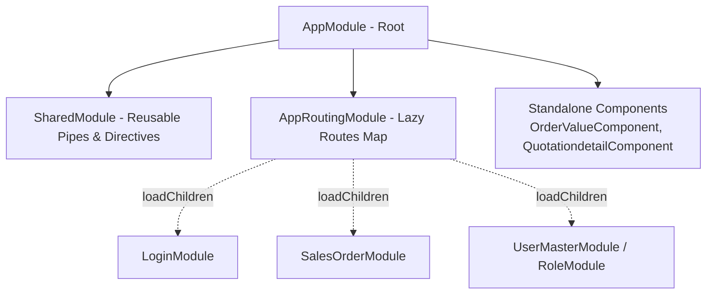

### 1. Hybrid Standalone & NgModule Architecture
* **Where it appears:** [`app.module.ts`](file:///d:/Ramesh/SH_FE/sh_fe/src/app/app.module.ts#L78-L81) imports standalone [`ItemLocationInfoComponent`](file:///d:/Ramesh/SH_FE/sh_fe/src/app/dynamic-components/item-location-info/item-location-info.component.ts) and [`OrderValueComponent`](file:///d:/Ramesh/SH_FE/sh_fe/src/app/dynamic-components/order-value/order-value.component.ts#L8-L10).
* **Why the project uses it:** Bridges legacy Angular 2–14 module-based enterprise code with modern Angular 15+ standalone components without requiring a ground-up rewrite.
* **Architectural Lesson:** How to incrementally modernize enterprise codebases by importing standalone components directly into existing `@NgModule` `imports` arrays.

### 2. Lazy Loaded Feature Modules
* **Where it appears:** [`app-routing.module.ts`](file:///d:/Ramesh/SH_FE/sh_fe/src/app/app-routing.module.ts#L9-L20) defines over 40 lazy-loaded feature boundaries via `loadChildren: () => import(...).then(m => m.Module)`.
* **Why the project uses it:** Prevents loading all 50+ ERP screens into the initial bundle, optimizing initial load time.
* **Architectural Lesson:** How route-level code splitting reduces browser parse/compile times for large enterprise suites.

### 3. Shared Module Pattern
* **Where it appears:** [`shared.module.ts`](file:///d:/Ramesh/SH_FE/sh_fe/src/app/shared/shared.module.ts#L1-L33) declares and exports `FocusOnClickDirective`, `PaginationPipe`, `HeaderComponent`, and `FlexyFieldsComponent`.
* **Why the project uses it:** Centralizes reusable UI components, directives, and pipes so individual feature modules don't declare duplicates.
* **Architectural Lesson:** How to organize common dependencies without triggering circular references.

### 4. HTTP Interceptor Pipeline
* **Where it appears:** [`app.module.ts`](file:///d:/Ramesh/SH_FE/sh_fe/src/app/app.module.ts#L99-L104), [`AddHeaderinterceptor.ts`](file:///d:/Ramesh/SH_FE/sh_fe/src/app/interceptor/AddHeaderinterceptor.ts), [`api-cancel.interceptor.ts`](file:///d:/Ramesh/SH_FE/sh_fe/src/app/api-cancel.interceptor.ts).
* **Why the project uses it:** Transparently applies auth tokens to every outgoing HTTP call and manages race conditions/cancellation for lookup searches.
* **Architectural Lesson:** Constructing an onion-architecture HTTP middleware chain using Angular's `HTTP_INTERCEPTORS` multi-providers.

### 5. Route Navigation Guards
* **Where it appears:** [`ConfirmDeactivateGuard.ts`](file:///d:/Ramesh/SH_FE/sh_fe/src/app/ConfirmDeactivateGuard.ts#L8-L21).
* **Why the project uses it:** Intercepts router state transitions when forms have unsaved modifications (`target.hasChanges`).
* **Architectural Lesson:** Protecting client-side data integrity using router lifecycle hooks.

### 6. Environment-Based Configuration
* **Where it appears:** [`environment.ts`](file:///d:/Ramesh/SH_FE/sh_fe/src/environments/environment.ts#L5-L13), [`app.module.ts`](file:///d:/Ramesh/SH_FE/sh_fe/src/app/app.module.ts#L91).
* **Why the project uses it:** Stores environment-specific backend base URLs (`api_url`, `aiServiceBaseUrl`, `voiceApiBaseUrl`, Google Maps API keys).
* **Architectural Lesson:** Managing compile-time environment replacements using Angular CLI `fileReplacements`.

---

# 3. TypeScript Concepts

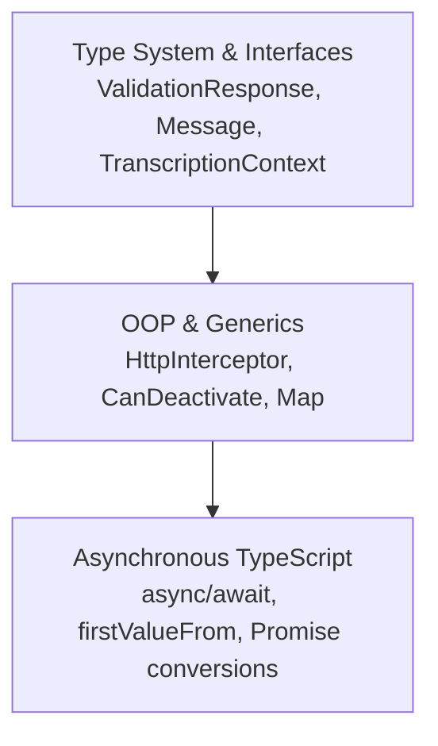

### 1. Interfaces & Type Aliases
* **Code Example:** [`portal.service.ts`](file:///d:/Ramesh/SH_FE/sh_fe/src/app/service/portal.service.ts#L5-L13), [`chat-bot.component.ts`](file:///d:/Ramesh/SH_FE/sh_fe/src/app/chat-bot/chat-bot.component.ts#L38-L46)
```typescript
// portal.service.ts
export interface ValidationResponse {
  Status: string;
  Remarks?: string;
  ItemCode?: string;
  [key: string]: any;
}

// chat-bot.component.ts
interface Message {
  text: string;
  sender: 'user' | 'bot';
  timestamp: Date;
  link?: any[];
  queryParams?: any;
}
```
* **Lesson:** Strong typing for domain objects, index signatures (`[key: string]: any`), and string literal union types (`'user' | 'bot'`).

### 2. Generics
* **Code Example:** [`api-cancel.interceptor.ts`](file:///d:/Ramesh/SH_FE/sh_fe/src/app/api-cancel.interceptor.ts#L8), [`responsive.service.ts`](file:///d:/Ramesh/SH_FE/sh_fe/src/app/service/responsive.service.ts#L17)
```typescript
private ongoingRequests = new Map<string, Subject<void>>();
private screenSizeSubject = new BehaviorSubject<BreakpointState | null>(null);
```
* **Lesson:** Parameterizing collections and RxJS subjects with generic types to guarantee compile-time type safety.

### 3. Asynchronous Programming (`async` / `await` & Promises)
* **Code Example:** [`login.component.ts`](file:///d:/Ramesh/SH_FE/sh_fe/src/app/solids/login/login.component.ts#L39), [`openai-speech.service.ts`](file:///d:/Ramesh/SH_FE/sh_fe/src/app/chat-bot/openai-speech.service.ts#L140-L150)
```typescript
async ngOnInit() {
  // async lifecycle hook using firstValueFrom to await Observable responses
}
```
* **Lesson:** Mixing Promise-based `async/await` syntax with Angular lifecycles and bridging Observables via `firstValueFrom`.

### 4. Optional Chaining & Nullish Coalescing
* **Code Example:** [`responsive.service.ts`](file:///d:/Ramesh/SH_FE/sh_fe/src/app/service/responsive.service.ts#L34), [`portal.service.ts`](file:///d:/Ramesh/SH_FE/sh_fe/src/app/service/portal.service.ts#L48)
```typescript
return this.screenSize$.pipe(
  map(state => state?.breakpoints[this.mobile] ?? false)
);
const isControl = accountInfo?.mainCtlAcntFlag !== 'C';
```
* **Lesson:** Safe property traversal on potentially undefined API payloads and default fallback assignments.

### 5. Type Assertions & Dynamic Casting
* **Code Example:** [`header.component.ts`](file:///d:/Ramesh/SH_FE/sh_fe/src/app/components/layouts/header/header.component.ts#L49), [`focus-on-click.directive.ts`](file:///d:/Ramesh/SH_FE/sh_fe/src/app/focus-on-click.directive.ts#L14)
```typescript
const targetElement = event.target as HTMLElement;
```
* **Lesson:** Casting DOM elements to `HTMLElement` to access standard browser properties in event handlers.

---

# 4. RxJS Concepts

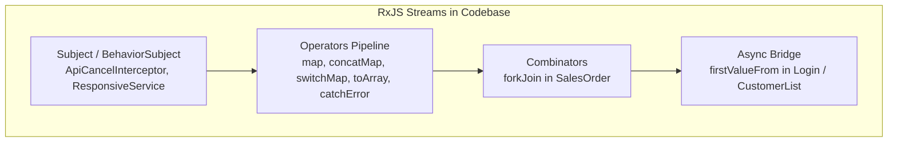

## Operator Matrix

| Concept / Operator | Where Used (File & Method) | Input → Output Stream | Why Used | What I Should Learn |
| :--- | :--- | :--- | :--- | :--- |
| **`BehaviorSubject`** | [`responsive.service.ts`](file:///d:/Ramesh/SH_FE/sh_fe/src/app/service/responsive.service.ts#L17) (`screenSizeSubject`) | `BreakpointState` → Observable stream | Retains latest responsive viewport state for late subscribers. | How to create reactive state stores with initial values. |
| **`Subject`** | [`api-cancel.interceptor.ts`](file:///d:/Ramesh/SH_FE/sh_fe/src/app/api-cancel.interceptor.ts#L23) (`cancelSubject`) | Trigger event `void` | Signals in-flight HTTP request cancellation. | Event-driven notification streams without initial value caching. |
| **`takeUntil`** | [`api-cancel.interceptor.ts`](file:///d:/Ramesh/SH_FE/sh_fe/src/app/api-cancel.interceptor.ts#L28) (`intercept`) | `Observable<HttpEvent<any>>` → Cancelled on `cancelSubject.next()` | Aborts active `/fetchDatas` request if duplicate triggers. | Declarative stream termination to prevent race conditions and leaks. |
| **`switchMap`** | [`material-return-add.component.ts`](file:///d:/Ramesh/SH_FE/sh_fe/src/app/material-return/material-return-add/material-return-add.component.ts#L2423) | Array of validated items → Higher-order backend save stream | Switches to final submission Observable once validation completes. | Higher-order mapping that cancels previous inner streams. |
| **`concatMap`** | [`material-return-add.component.ts`](file:///d:/Ramesh/SH_FE/sh_fe/src/app/material-return/material-return-add/material-return-add.component.ts#L2400) | Item list stream → Sequential validation API calls | Validates line items sequentially in exact order. | Preserving sequence when executing dependent HTTP requests. |
| **`toArray`** | [`material-return-add.component.ts`](file:///d:/Ramesh/SH_FE/sh_fe/src/app/material-return/material-return-add/material-return-add.component.ts#L2422) | Individual emitted items → Single array emission | Collects emitted validation results into a single array before proceeding. | Aggregating discrete stream emissions upon completion. |
| **`forkJoin`** | [`sales-order.component.ts`](file:///d:/Ramesh/SH_FE/sh_fe/src/app/sales-order/sales-order.component.ts#L13) | `[Observable<A>, Observable<B>, Observable<C>]` → `[A, B, C]` | Fetches customer, pricing, and master catalogs concurrently. | Parallel HTTP execution equivalent to `Promise.all`. |
| **`firstValueFrom`** | [`customerlist.component.ts`](file:///d:/Ramesh/SH_FE/sh_fe/src/app/customer/customerlist/customerlist.component.ts#L12) | `Observable<T>` → `Promise<T>` | Awaits single-value HTTP call inside an async function. | Modern RxJS 7 replacement for deprecated `.toPromise()`. |
| **`catchError`** | [`material-return-add.component.ts`](file:///d:/Ramesh/SH_FE/sh_fe/src/app/material-return/material-return-add/material-return-add.component.ts#L2405) | Error stream → `of({ isValid: false, errorType: 'API_ERROR' })` | Catches per-item validation network errors without killing the stream. | Graceful error recovery and fallback value generation. |
| **`tap`** | [`openai-speech.service.ts`](file:///d:/Ramesh/SH_FE/sh_fe/src/app/chat-bot/openai-speech.service.ts#L95) | Pass-through data stream | Logs incoming speech audio payload for debugging. | Performing side effects without modifying stream values. |
| **`map`** | [`responsive.service.ts`](file:///d:/Ramesh/SH_FE/sh_fe/src/app/service/responsive.service.ts#L34) | `BreakpointState` → `boolean` | Projects viewport state into `isMobile()` boolean. | Synchronous value transformation. |
| **`debounceTime`** | [`report.component.ts`](file:///d:/Ramesh/SH_FE/sh_fe/src/app/report/report.component.ts#L10) | User keyup events → Rate-limited stream | Prevents firing search APIs on every keystroke. | Throttling high-frequency user input events. |

## RxJS Anti-Patterns & Maintenance Insights Identified in Codebase
1. **Nested Subscriptions:** Multiple components subscribe inside another `.subscribe()` callback (e.g., subscribing to route parameters, then subscribing to `portalService` inside).  
   *What to learn:* How to flatten nested subscriptions using `switchMap` or `concatMap`.
2. **Missing Unsubscribe / Subscription Leaks:** Several long-lived component subscriptions to `PortalService` do not use `takeUntil(this.destroy$)` or store `Subscription` handles to call `.unsubscribe()` in `ngOnDestroy`.  
   *What to learn:* Memory leak prevention and subscription lifecycle management.
3. **Manual Promise Bridging:** Converting Observables back and forth between Promises using `firstValueFrom` in components instead of using the reactive `async` pipe.  
   *What to learn:* Reactive template streaming vs procedural async/await data handling.

---

# 5. Signals & Reactivity

* **Signals Usage (`signal()`, `computed()`, `effect()`, `input()`):** **NOT PRESENT.**
* **Reactivity Model in this Project:**
  - Traditional **RxJS-based reactivity** for services (`BehaviorSubject`, `Subject`, Observables).
  - **Zone.js-driven change detection** for DOM events, timers, and HTTP response triggers.
* **What I will learn:** The classic, widely deployed enterprise Angular reactivity model that powers the vast majority of existing production applications.

---

# 6. Change Detection

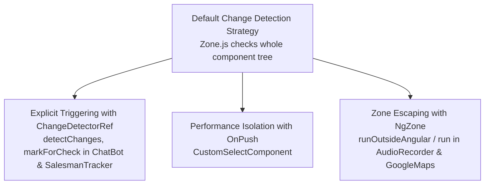

* **Primary Strategy:** `ChangeDetectionStrategy.Default` across almost all screens.
* **`OnPush` Strategy Implementation:**
  - **File:** [`custom-select.component.ts`](file:///d:/Ramesh/SH_FE/sh_fe/src/app/dynamic-components/custom-select/custom-select.component.ts#L30)
  - `changeDetection: ChangeDetectionStrategy.OnPush` is applied to optimize dropdown rendering during rapid keyboard scrolling.
* **`ChangeDetectorRef` Usage:**
  - [`chat-bot.component.ts`](file:///d:/Ramesh/SH_FE/sh_fe/src/app/chat-bot/chat-bot.component.ts#L5) and [`salesman-geotracking.component.ts`](file:///d:/Ramesh/SH_FE/sh_fe/src/app/masters/salesman-geotracking/salesman-geotracking.component.ts#L1): Injects `ChangeDetectorRef` to call `this.cdr.detectChanges()` when audio transcription buffers or map coordinates arrive outside Angular's default zone.
* **`NgZone` Management:**
  - [`audio-recorder.service.ts`](file:///d:/Ramesh/SH_FE/sh_fe/src/app/chat-bot/audio-recorder.service.ts#L59) & [`salesman-tracker.component.ts`](file:///d:/Ramesh/SH_FE/sh_fe/src/app/masters/salesman-tracker/salesman-tracker.component.ts#L123): Injects `NgZone` to re-enter the Angular zone via `this.ngZone.run(() => { ... })` when browser Web Audio `ondataavailable` or Google Maps geolocation callbacks fire.
* **Performance Lessons:** How to avoid full-tree change detection cycles by isolating third-party SDK callbacks and leveraging `OnPush` for data-heavy select widgets.

---

# 7. Forms

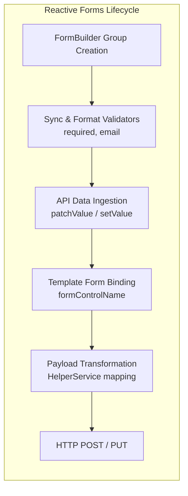

* **Form Architecture:** Heavy utilization of **Reactive Forms (`ReactiveFormsModule`)** alongside auxiliary template-driven filters.
* **`FormBuilder`, `FormGroup`, `FormControl`:**
  - [`user-master-detail.component.ts`](file:///d:/Ramesh/SH_FE/sh_fe/src/app/masters/user-master-detail/user-master-detail.component.ts#L117-L153): Instantiates `MAinDetail: FormGroup` managing 20+ form controls (`firstName`, `empNo`, `mailId`, `password`, `exception_ul_yn`).
* **`FormArray`:**
  - [`jasper-detial.component.ts`](file:///d:/Ramesh/SH_FE/sh_fe/src/app/jasper/jasper-detial/jasper-detial.component.ts#L2): Dynamic array controls for variable parameter lists.
* **Validation Engine:**
  - Built-in validators: `Validators.required`, `Validators.email`.
  - Conditional runtime validation: Toggling required status based on user role selections.
* **State Updates & Ingestion:**
  - `patchValue()`: Used when loading existing customer/user records from API endpoints into form controls.
  - `setValue()`: Used for strict complete model updates.
* **Payload Transformation Pipeline:**
  - [`helper.service.ts`](file:///d:/Ramesh/SH_FE/sh_fe/src/app/service/helper.service.ts#L11-L60) (`transformHeaderValuesToGenerateOrder`): Extracts raw form values, extracts dropdown codes, converts date objects, and formats JSON payload structures required by the backend ERP.

---

# 8. HTTP & API Communication

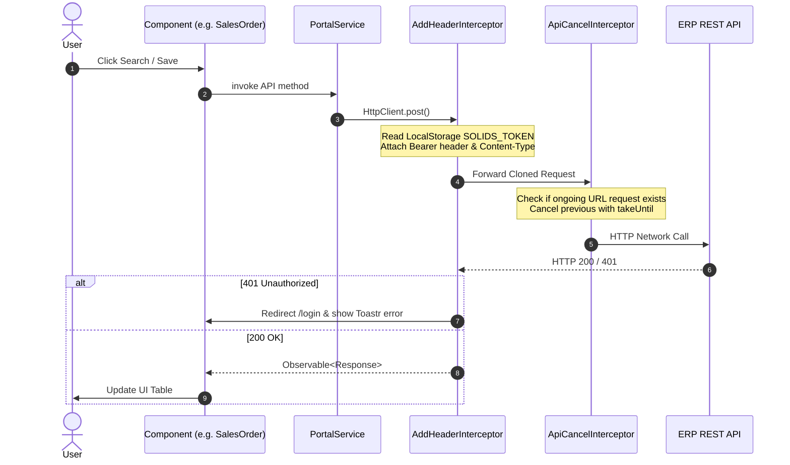

### API Learning Map
* **HTTP Methods Used:**
  - `GET`: Lookup catalogs, profile data, geo-tracking points.
  - `POST`: Document generation (Quotations, Sales Orders, Material Requests), authentication.
  - `PUT` / `PATCH`: Master updates, password changes.
* **Request Customization:**
  - [`AddHeaderinterceptor.ts`](file:///d:/Ramesh/SH_FE/sh_fe/src/app/interceptor/AddHeaderinterceptor.ts#L30-L43): Modifies requests to include `Authorization: Bearer <token>` and switches `Content-Type: application/ms-excel` for binary export endpoints.
* **Cancellation Middleware:**
  - [`api-cancel.interceptor.ts`](file:///d:/Ramesh/SH_FE/sh_fe/src/app/api-cancel.interceptor.ts#L10-L30): Intercepts `/fetchDatas` requests, storing a unique `requestKey = req.urlWithParams` in a `Map<string, Subject<void>>()`. When a new request with the same URL arrives, it completes the previous Subject, aborting the pending HTTP request.
* **Binary & Multipart Transfers:**
  - File uploads in [`upload-documents.component.ts`](file:///d:/Ramesh/SH_FE/sh_fe/src/app/dynamic-components/upload-documents/upload-documents.component.ts) using `FormData`.
  - Excel file blob streaming using `file-saver` and `xlsx`.

---

# 9. Routing

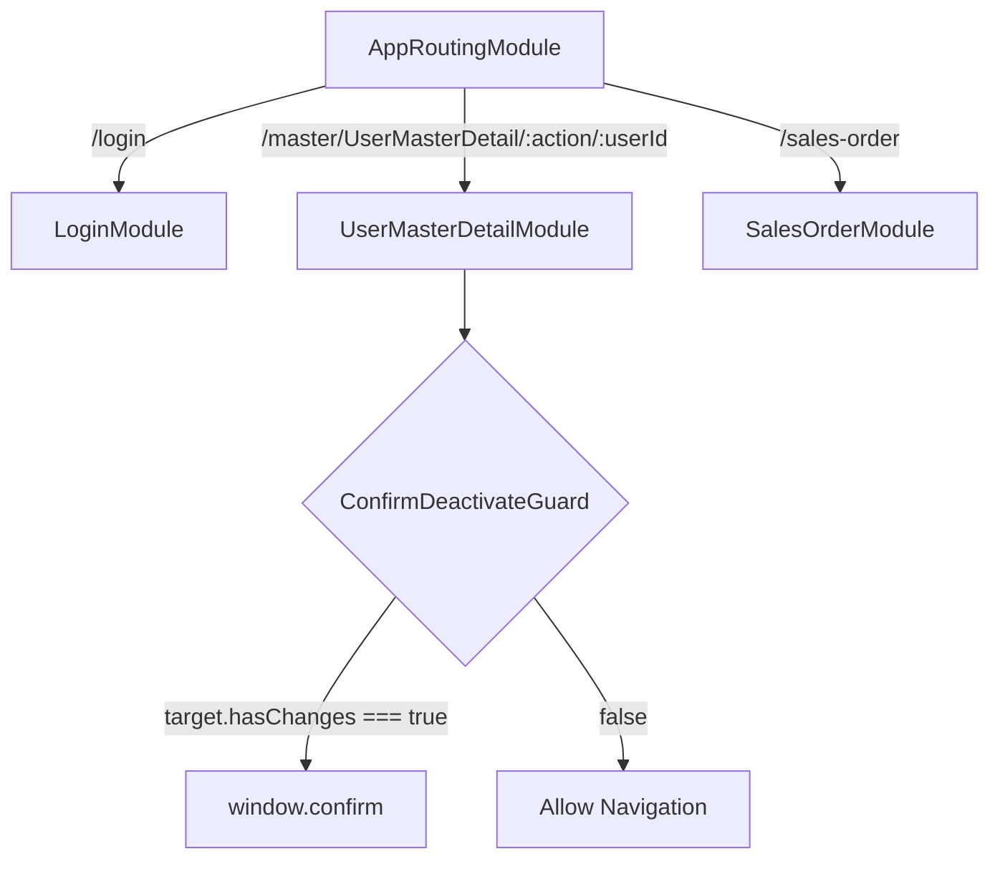

* **Route Declaration & Lazy Loading:** [`app-routing.module.ts`](file:///d:/Ramesh/SH_FE/sh_fe/src/app/app-routing.module.ts#L4-L100) configures over 600 lines of modular route mappings.
* **Route Parameter Matrix:**
  - Parameterized paths: `path: 'master/UserMasterDetail/:action/:userId'`
  - Read inside [`user-master-detail.component.ts`](file:///d:/Ramesh/SH_FE/sh_fe/src/app/masters/user-master-detail/user-master-detail.component.ts#L63-L75): Differentiates between `'view'`, `'edit'`, and `'create'` modes based on `:action`.
* **Query Parameters:**
  - Subscribed to in [`customerlist.component.ts`](file:///d:/Ramesh/SH_FE/sh_fe/src/app/customer/customerlist/customerlist.component.ts#L95) to preserve pagination and active tab selections during page refreshes.
* **Navigation Execution:**
  - Declarative: `routerLink` in sidebar layouts.
  - Programmatic: `this.router.navigate(['/sales-order'], { queryParams: { ... } })`.
* **Route Guards (`CanDeactivate`):**
  - [`ConfirmDeactivateGuard.ts`](file:///d:/Ramesh/SH_FE/sh_fe/src/app/ConfirmDeactivateGuard.ts#L8-L21): Protects against unintentional data loss when leaving modified records.

---

# 10. Dependency Injection

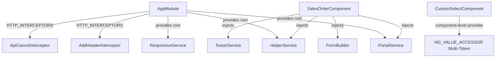

* **Root Singleton Services:** `@Injectable({ providedIn: 'root' })` on [`PortalService`](file:///d:/Ramesh/SH_FE/sh_fe/src/app/service/portal.service.ts#L15), [`HelperService`](file:///d:/Ramesh/SH_FE/sh_fe/src/app/service/helper.service.ts#L7), [`ResponsiveService`](file:///d:/Ramesh/SH_FE/sh_fe/src/app/service/responsive.service.ts#L7).
* **Component-Level Providers:** [`CustomSelectComponent`](file:///d:/Ramesh/SH_FE/sh_fe/src/app/dynamic-components/custom-select/custom-select.component.ts#L23-L29) provides `NG_VALUE_ACCESSOR` locally using `forwardRef`.
* **Injection Pattern:** 100% constructor parameter injection (`constructor(private portalService: PortalService, private fb: FormBuilder) { }`).
* **Service Dependency Chains:**
  - `LoginComponent` → injects `PortalService` & `GeocodingService` → injects `HttpClient` → intercepted by `AddHeaderInterceptor` & `ApiCancelInterceptor`.

---

# 11. State Management

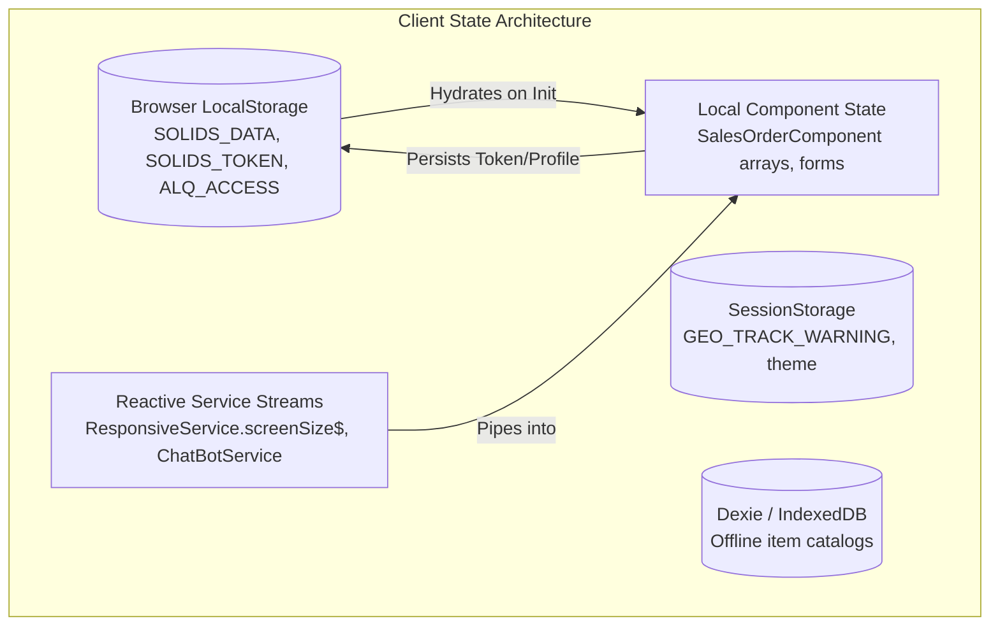

1. **Persistent Browser Storage (`LocalStorage`):**
   - Keys: `SOLIDS_DATA`, `SOLIDS_TOKEN`, `SOLIDS_MASTER_URL`, `ALQ_ACCESS`, `solid_adminYN`, `direction`.
   - Role: Preserves user identity, authorization flags, and tenant configuration across browser refreshes.
2. **Reactive Service Stores (`BehaviorSubject`):**
   - [`responsive.service.ts`](file:///d:/Ramesh/SH_FE/sh_fe/src/app/service/responsive.service.ts#L17) holds the reactive viewport state.
   - [`chat-bot.service.ts`](file:///d:/Ramesh/SH_FE/sh_fe/src/app/chat-bot/chat-bot.service.ts#L24) holds live quotation references.
3. **Local Component State:**
   - Arrays of line items, table filtering states, pagination models (`itemsPerPage`, `currentPage`).
4. **Offline / IndexedDB State (`Dexie`):**
   - Client-side database caching for master catalogs and offline transaction staging.

---

# 12. Authentication & Authorization

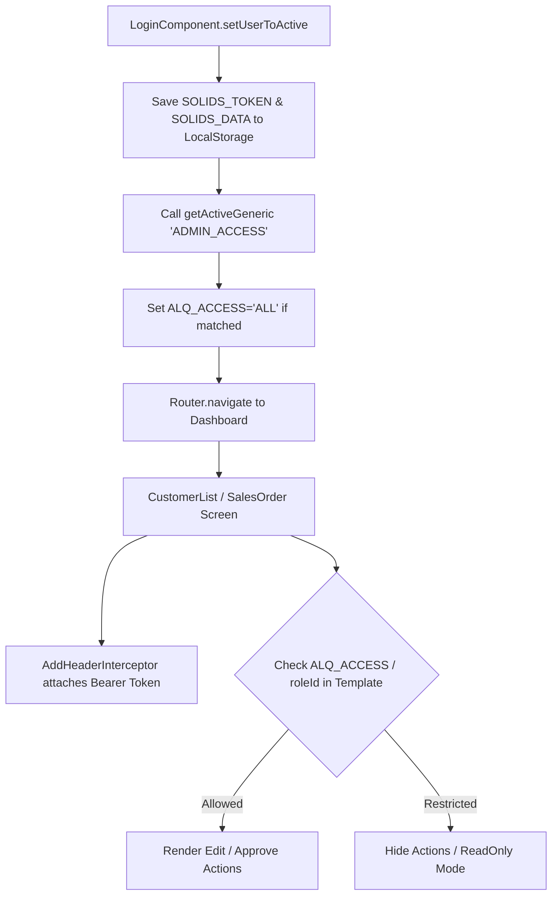

* **Authentication Handshake:** [`login.component.ts`](file:///d:/Ramesh/SH_FE/sh_fe/src/app/solids/login/login.component.ts#L41-L70) validates credentials, stores token payload into `SOLIDS_DATA`, and registers active user status.
* **Token Attachment:** [`AddHeaderinterceptor.ts`](file:///d:/Ramesh/SH_FE/sh_fe/src/app/interceptor/AddHeaderinterceptor.ts#L26-L42) reads `SOLIDS_TOKEN` from storage and appends `Authorization: Bearer <token>` to all HTTP traffic.
* **Role-Based Access Control (RBAC):**
  - High-level role checks via `localStorage.getItem('ALQ_ACCESS')` and `localStorage.getItem('solid_adminYN')`.
  - Detailed permissions configured via `UserRoleMasterDetailComponent` mapped to screen actions (create, edit, approve, void).
* **Session Expiry Handling:** Interceptor detects HTTP 401, clears `SOLIDS_DATA`, triggers `this.toastr.error('Token Expired')`, and navigates to `/login`.

---

# 13. Real-World Business Logic

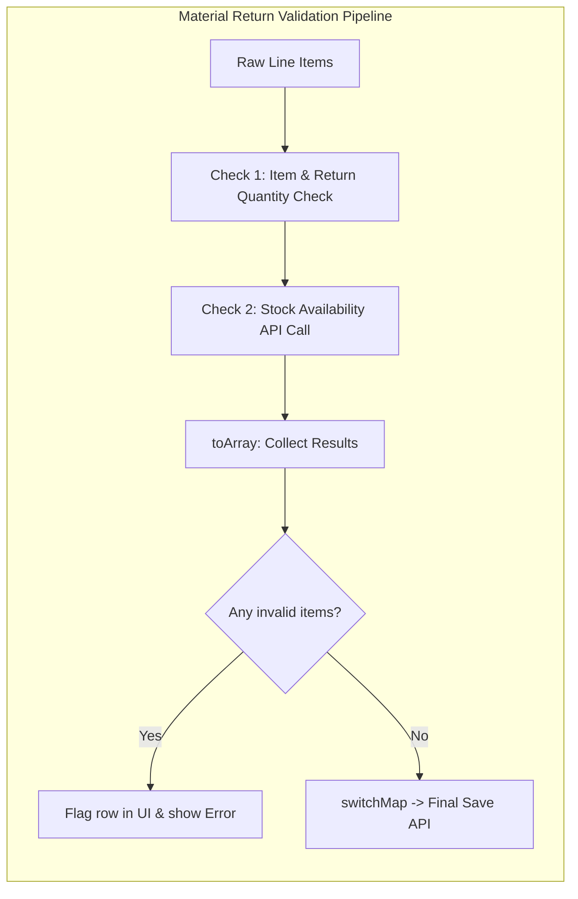

### Business Rules Implemented in Codebase

1. **Sub-Account Control Flag Rule:**
   - **File:** [`portal.service.ts`](file:///d:/Ramesh/SH_FE/sh_fe/src/app/service/portal.service.ts#L45-L49) (`isSubAccDisabled`)
   - **Input:** `mainAccountList: any[]`, `mainAccountCode: string`
   - **Condition:** If `accountInfo?.mainCtlAcntFlag !== 'C'`, sub-account selection is disabled.
   - **Result:** Prevents posting transactions to sub-accounts when the parent ledger account is not a control account.
2. **Stock Availability & Return Quantity Enforcement:**
   - **File:** [`material-return-add.component.ts`](file:///d:/Ramesh/SH_FE/sh_fe/src/app/material-return/material-return-add/material-return-add.component.ts#L2400-L2440)
   - **Input:** Array of return items with quantities.
   - **Condition:** Compares `enteredQtyBu` against available warehouse batch stock via sequential HTTP checks.
   - **Result:** Flags specific rows with validation errors before allowing document submission.
3. **Multi-Currency & Exchange Rate Calculations:**
   - **File:** [`order-value.component.ts`](file:///d:/Ramesh/SH_FE/sh_fe/src/app/dynamic-components/order-value/order-value.component.ts#L47-L60)
   - **Input:** Base total, exchange rate, VAT percentages, line discounts.
   - **Condition:** Recalculates net and inclusive VAT values when currency code or exchange rate inputs change.
   - **Result:** Updates footer summary dynamically across sales documents.

---

# 14. Browser & Web Platform Concepts

* **MediaDevices & Web Audio API:**
  - **File:** [`audio-recorder.service.ts`](file:///d:/Ramesh/SH_FE/sh_fe/src/app/chat-bot/audio-recorder.service.ts)
  - Uses `navigator.mediaDevices.getUserMedia({ audio: true })`, `MediaRecorder`, and `AudioContext` to capture microphone PCM streams, convert them to WAV/WebM blobs, and stream to transcription backends.
* **Geolocation API:**
  - **File:** [`geocoding.service.ts`](file:///d:/Ramesh/SH_FE/sh_fe/src/app/service/geocoding.service.ts), [`portal.service.ts`](file:///d:/Ramesh/SH_FE/sh_fe/src/app/service/portal.service.ts#L18-L30)
  - Uses `navigator.geolocation.getCurrentPosition()` and `watchPosition()` to monitor field sales representatives' GPS coordinates for beat-route tracking.
* **DOM Timers & Intervals:**
  - [`portal.service.ts`](file:///d:/Ramesh/SH_FE/sh_fe/src/app/service/portal.service.ts#L18-L30) (`backgroundGeoTrackIntervalId`): Manages recurring `setInterval` timers for location pings and ensures explicit cleanup via `clearInterval`.
* **Global Document Listeners (`@HostListener`):**
  - [`header.component.ts`](file:///d:/Ramesh/SH_FE/sh_fe/src/app/components/layouts/header/header.component.ts#L47): `@HostListener('document:click')` detects clicks outside dropdowns to close menus.

---

# 15. Third-Party Integrations

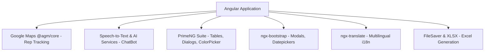

1. **Google Maps SDK (`@agm/core` & Geocoding):**
   - Configured in [`app.module.ts`](file:///d:/Ramesh/SH_FE/sh_fe/src/app/app.module.ts#L90-L93); visualizes salesman routes and customer GPS pins.
2. **AI & Speech Services (OpenAI & Sarvam):**
   - [`openai-speech.service.ts`](file:///d:/Ramesh/SH_FE/sh_fe/src/app/chat-bot/openai-speech.service.ts), [`sarvam-speech.service.ts`](file:///d:/Ramesh/SH_FE/sh_fe/src/app/chat-bot/sarvam-speech.service.ts): Sends recorded audio payloads to speech-to-text endpoints and plays synthesized audio responses.
3. **UI Component Frameworks:**
   - **ngx-bootstrap:** `ModalModule.forRoot()`, `BsDatepickerModule.forRoot()`, `TooltipModule`.
   - **PrimeNG:** `TableModule`, `DialogModule`, `AutoCompleteModule`, `ColorPickerModule`.
4. **Internationalization (`@ngx-translate`):**
   - [`app.module.ts`](file:///d:/Ramesh/SH_FE/sh_fe/src/app/app.module.ts#L82-L89): `HttpLoaderFactory` loads JSON translation files from `./assets/lang/*.json`.
5. **Excel Export (`xlsx` & `file-saver`):**
   - Generates and downloads `.xlsx` spreadsheets from table datasets.

---

# 16. Performance Concepts

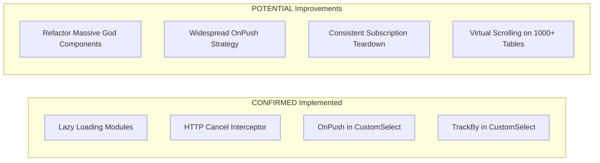

### Confirmed Implementations
* **Route Lazy Loading:** Over 40 modules loaded on demand via [`app-routing.module.ts`](file:///d:/Ramesh/SH_FE/sh_fe/src/app/app-routing.module.ts).
* **HTTP Request Cancellation:** [`api-cancel.interceptor.ts`](file:///d:/Ramesh/SH_FE/sh_fe/src/app/api-cancel.interceptor.ts) aborts redundant in-flight API requests.
* **Targeted `OnPush` & `trackBy`:** [`custom-select.component.ts`](file:///d:/Ramesh/SH_FE/sh_fe/src/app/dynamic-components/custom-select/custom-select.component.ts#L30) uses `OnPush` change detection and `trackBy: trackByFn`.

### Potential Improvements
* **Component Modularization:** God components (such as [`sales-order.component.ts`](file:///d:/Ramesh/SH_FE/sh_fe/src/app/sales-order/sales-order.component.ts) with 15,000+ lines) should be decomposed into smaller sub-components.
* **Systematic Subscription Management:** Replacing manual `.subscribe()` with `async` pipe or consistent `takeUntilDestroyed()`.
* **Virtual Scrolling:** Adding `@angular/cdk/scrolling` `cdk-virtual-scroll-viewport` to large catalog tables.

---

# 17. Error Handling

* **HTTP Error Handling in Pipelines:**
  - [`material-return-add.component.ts`](file:///d:/Ramesh/SH_FE/sh_fe/src/app/material-return/material-return-add/material-return-add.component.ts#L2405): Uses RxJS `catchError` to convert network failures into structured error objects without interrupting batch validation.
* **Global Auth Interceptor Handling:**
  - [`AddHeaderinterceptor.ts`](file:///d:/Ramesh/SH_FE/sh_fe/src/app/interceptor/AddHeaderinterceptor.ts#L54-L66): Catches HTTP 401, clears storage, displays a toast notification, and redirects to login.
* **User Feedback Notifications:**
  - `ToastrService` (`this.toastr.error('Message', 'Title')`, `this.toastr.warning(...)`) across all form components.
* **Asynchronous Fallbacks:**
  - [`portal.service.ts`](file:///d:/Ramesh/SH_FE/sh_fe/src/app/service/portal.service.ts#L56-L70) (`returnDate`): Gracefully handles corrupted date strings and returns `null` instead of throwing exceptions.

---

# 18. Security Concepts

### Confirmed Security Implementations
* **Bearer Token Authentication:** Applied centrally via [`AddHeaderinterceptor.ts`](file:///d:/Ramesh/SH_FE/sh_fe/src/app/interceptor/AddHeaderinterceptor.ts).
* **DOM Sanitization:** [`chat-bot.component.ts`](file:///d:/Ramesh/SH_FE/sh_fe/src/app/chat-bot/chat-bot.component.ts#L16) injects Angular's `DomSanitizer` to sanitize HTML output.
* **Navigation Deactivation Guards:** Prevents loss of sensitive unsaved records via [`ConfirmDeactivateGuard.ts`](file:///d:/Ramesh/SH_FE/sh_fe/src/app/ConfirmDeactivateGuard.ts).

### Potential Security Risks Identified
* **Tokens in LocalStorage:** JWT tokens stored in `localStorage.getItem('SOLIDS_DATA')` are accessible to client-side scripts (vulnerable to XSS compared to HttpOnly cookies).
* **Direct DOM Access with jQuery:** Usage of `declare var $: any;` in components bypasses Angular's built-in XSS security boundaries.
* **Hardcoded API Keys in Source:** [`environment.ts`](file:///d:/Ramesh/SH_FE/sh_fe/src/environments/environment.ts#L11-L12) contains static Google Maps and Sarvam AI API keys that are compiled into client bundles.

---

# 19. Enterprise Software Engineering Concepts

* **Multi-Tenancy Architecture:** Headers and requests dynamically inject `tenantId` and `compId` extracted from the logged-in user profile.
* **Separation of Concerns:** Business data fetching is encapsulated in `PortalService`, data shape mapping is encapsulated in `HelperService`, and layout tracking is in `ResponsiveService`.
* **Configuration-Driven Dynamic UI:** Form fields, dropdown options, and navigation tabs render dynamically based on backend master setup (`generic-master`, `authorization-setup`).
* **Internationalization & RTL Support:** Supports English and Arabic (`direction` property toggles LTR/RTL styles) using `@ngx-translate`.

---

# 20. Project-Specific Learning Outcomes

## "After working on this project, I should be able to..."

1. Build and maintain complex enterprise Angular ERP transactional modules.
2. Construct HTTP interceptor chains for global authentication headers and request cancellation.
3. Prevent race conditions in high-frequency search APIs using RxJS `takeUntil` and `Subject` caches.
4. Implement master-detail Reactive Forms with conditional validations and dynamic controls.
5. Create custom form controls using Angular's `ControlValueAccessor` interface (`NG_VALUE_ACCESSOR`).
6. Architect route-level lazy loading with parameterized paths and `CanDeactivate` guards.
7. Manage cross-component responsive UI state using `@angular/cdk/layout` and `BehaviorSubject`.
8. Integrate third-party mapping SDKs (Google Maps) and hardware Web APIs (Microphone, Geolocation).
9. Build custom Angular pipes for multi-property in-memory table filtering.
10. Develop custom attribute directives with `@HostListener` for keyboard navigation and DOM control.
11. Implement AI and voice-driven assistant interfaces within an enterprise application.
12. Export large data grids to formatted Excel files using binary array buffer handling.
13. Coordinate parallel API requests using RxJS `forkJoin` and bridge Observables with `firstValueFrom`.
14. Debug change detection issues and run performance-critical code outside Zone.js using `NgZone`.
15. Navigate and modernize hybrid codebases containing both NgModules and Standalone Components.

---

# 21. Skill Level & Domain Classification

| Learning Outcome | Skill Level | Domain |
| :--- | :--- | :--- |
| Basic Data Binding, Directives & Built-in Pipes | 🟢 Beginner | Angular |
| Component Input/Output & EventEmitter | 🟢 Beginner | Angular |
| Template-Driven Filter Inputs & Routing Basics | 🟢 Beginner | Angular |
| Reactive Forms with Dynamic Validators | 🟡 Intermediate | Angular |
| Dependency Injection & Centralized API Services | 🟡 Intermediate | Architecture |
| Route Parameters, Query Parameters & Lazy Loading | 🟡 Intermediate | Angular |
| Custom Pipes & Custom Attribute Directives | 🟡 Intermediate | Angular |
| HTTP Interceptors for Authentication (Bearer Tokens) | 🟡 Intermediate | Security & Integration |
| Parallel API Orchestration with `forkJoin` & `firstValueFrom` | 🟡 Intermediate | RxJS |
| DOM Querying (`@ViewChild`, `ElementRef`, `TemplateRef`) | 🟡 Intermediate | Angular |
| Multi-Tenancy & Role-Based Action Permissions | 🟡 Intermediate | Business Logic |
| Standalone Component Migration in Module Architectures | 🟡 Intermediate | Architecture |
| `ControlValueAccessor` Custom Form Components | 🔴 Advanced | Angular |
| Request Cancellation & Race-Condition Interceptors (`takeUntil`) | 🔴 Advanced | RxJS |
| Sequential Stream Processing (`concatMap`, `toArray`, `switchMap`) | 🔴 Advanced | RxJS |
| Hardware & Web Audio API Streaming (`MediaRecorder`, `AudioContext`) | 🔴 Advanced | Browser / Web API |
| Geolocation & Background Tracking Management | 🔴 Advanced | Browser / Web API |
| Zone.js Escaping & Manual Change Detection (`NgZone`, `CDR`) | 🔴 Advanced | Performance |

---

# 22. Learning Roadmap from This Project

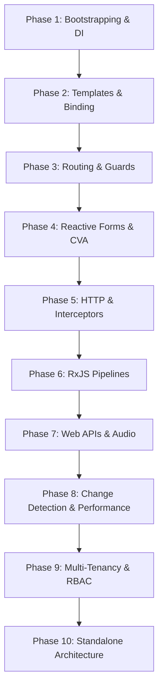

### Phase 1: Bootstrapping, Modules & Dependency Injection
* **Files to study:** [`app.module.ts`](file:///d:/Ramesh/SH_FE/sh_fe/src/app/app.module.ts), [`portal.service.ts`](file:///d:/Ramesh/SH_FE/sh_fe/src/app/service/portal.service.ts)
* **Code to trace:** `AppModule` imports and `PortalService` root provider registration.
* **Practical skill gained:** Understanding how Angular applications bootstrap and inject services across modules.

### Phase 2: Templates, Directives & Custom Pipes
* **Files to study:** [`shared.module.ts`](file:///d:/Ramesh/SH_FE/sh_fe/src/app/shared/shared.module.ts), [`pagination.pipe.ts`](file:///d:/Ramesh/SH_FE/sh_fe/src/app/pagination.pipe.ts), [`focus-on-click.directive.ts`](file:///d:/Ramesh/SH_FE/sh_fe/src/app/focus-on-click.directive.ts)
* **Code to trace:** `PaginationPipe.transform()` filtering logic and `FocusOnClickDirective` host listeners.
* **Practical skill gained:** Building reusable UI filters and DOM manipulation directives.

### Phase 3: Routing, Parameters & Navigation Guards
* **Files to study:** [`app-routing.module.ts`](file:///d:/Ramesh/SH_FE/sh_fe/src/app/app-routing.module.ts), [`ConfirmDeactivateGuard.ts`](file:///d:/Ramesh/SH_FE/sh_fe/src/app/ConfirmDeactivateGuard.ts), [`customerlist.component.ts`](file:///d:/Ramesh/SH_FE/sh_fe/src/app/customer/customerlist/customerlist.component.ts)
* **Code to trace:** `ActivatedRoute.queryParams.subscribe()` in `CustomerlistComponent`.
* **Practical skill gained:** Handling deep linking, route parameters, and preventing dirty form exits.

### Phase 4: Reactive Forms & Custom Controls
* **Files to study:** [`user-master-detail.component.ts`](file:///d:/Ramesh/SH_FE/sh_fe/src/app/masters/user-master-detail/user-master-detail.component.ts), [`custom-select.component.ts`](file:///d:/Ramesh/SH_FE/sh_fe/src/app/dynamic-components/custom-select/custom-select.component.ts)
* **Code to trace:** `FormBuilder.group()` initialization and `ControlValueAccessor` methods (`writeValue`, `registerOnChange`).
* **Practical skill gained:** Building enterprise forms and connecting custom UI dropdowns to `ReactiveFormsModule`.

### Phase 5: HTTP Communication & Middleware Interceptors
* **Files to study:** [`AddHeaderinterceptor.ts`](file:///d:/Ramesh/SH_FE/sh_fe/src/app/interceptor/AddHeaderinterceptor.ts), [`api-cancel.interceptor.ts`](file:///d:/Ramesh/SH_FE/sh_fe/src/app/api-cancel.interceptor.ts)
* **Code to trace:** `req.clone()` header injection and `ongoingRequests.get(key)?.next()` cancellation logic.
* **Practical skill gained:** Writing global authentication interceptors and managing concurrent API calls.

### Phase 6: Advanced RxJS & Parallel Stream Orchestration
* **Files to study:** [`material-return-add.component.ts`](file:///d:/Ramesh/SH_FE/sh_fe/src/app/material-return/material-return-add/material-return-add.component.ts#L2400-L2440), [`sales-order.component.ts`](file:///d:/Ramesh/SH_FE/sh_fe/src/app/sales-order/sales-order.component.ts#L13)
* **Code to trace:** `concatMap` -> `toArray` -> `switchMap` validation sequence and `forkJoin` data fetching.
* **Practical skill gained:** Mastering higher-order mapping operators and parallel async streams.

### Phase 7: Web Hardware APIs (Audio, Geolocation) & AI
* **Files to study:** [`audio-recorder.service.ts`](file:///d:/Ramesh/SH_FE/sh_fe/src/app/chat-bot/audio-recorder.service.ts), [`geocoding.service.ts`](file:///d:/Ramesh/SH_FE/sh_fe/src/app/service/geocoding.service.ts), [`chat-bot.component.ts`](file:///d:/Ramesh/SH_FE/sh_fe/src/app/chat-bot/chat-bot.component.ts)
* **Code to trace:** Microphone stream capture in `AudioRecorderService` and GPS tracking in `GeocodingService`.
* **Practical skill gained:** Integrating native browser hardware APIs into Angular services.

### Phase 8: Change Detection & Performance Tuning
* **Files to study:** [`custom-select.component.ts`](file:///d:/Ramesh/SH_FE/sh_fe/src/app/dynamic-components/custom-select/custom-select.component.ts), [`salesman-tracker.component.ts`](file:///d:/Ramesh/SH_FE/sh_fe/src/app/masters/salesman-tracker/salesman-tracker.component.ts)
* **Code to trace:** `ChangeDetectionStrategy.OnPush`, `trackByFn`, and `NgZone.run()` callbacks.
* **Practical skill gained:** Diagnosing and resolving change detection performance bottlenecks.

### Phase 9: Multi-Tenancy & Role-Based Authorization
* **Files to study:** [`login.component.ts`](file:///d:/Ramesh/SH_FE/sh_fe/src/app/solids/login/login.component.ts), [`header.component.ts`](file:///d:/Ramesh/SH_FE/sh_fe/src/app/components/layouts/header/header.component.ts)
* **Code to trace:** Role extraction (`ALQ_ACCESS`) and multi-tenant URL building.
* **Practical skill gained:** Implementing enterprise security and multi-tenant access models.

### Phase 10: Modern Standalone Component Architecture
* **Files to study:** [`order-value.component.ts`](file:///d:/Ramesh/SH_FE/sh_fe/src/app/dynamic-components/order-value/order-value.component.ts), [`quotationdetail.component.ts`](file:///d:/Ramesh/SH_FE/sh_fe/src/app/quotationdetail/quotationdetail.component.ts)
* **Code to trace:** `standalone: true` declaration and component-level `imports: [...]`.
* **Practical skill gained:** Modernizing legacy module-based applications using Angular 15+ standalone components.

---

# 23. Interview Knowledge I Can Derive from This Project

### 1. "How do you handle authentication and token injection globally in Angular?"
* **Why this project gives exposure:** The application uses [`AddHeaderinterceptor.ts`](file:///d:/Ramesh/SH_FE/sh_fe/src/app/interceptor/AddHeaderinterceptor.ts) to read the stored token and clone requests with `Authorization: Bearer <token>`.
* **What to understand deeply:** Immutability of `HttpRequest`, using `req.clone()`, multi-provider registration via `HTTP_INTERCEPTORS`, and intercepting HTTP 401 errors.
* **Difficulty:** 🟡 Intermediate

### 2. "How do you prevent race conditions and cancel redundant in-flight HTTP requests?"
* **Why this project gives exposure:** The application uses [`api-cancel.interceptor.ts`](file:///d:/Ramesh/SH_FE/sh_fe/src/app/api-cancel.interceptor.ts) with a `Map<string, Subject<void>>` and the `takeUntil` operator.
* **What to understand deeply:** How `takeUntil` triggers completion on an inner HTTP Observable, aborting the browser XMLHttpRequest/Fetch call before stale data overwrites fresh state.
* **Difficulty:** 🔴 Advanced

### 3. "How do you build custom Angular form controls that integrate with Reactive Forms?"
* **Why this project gives exposure:** [`custom-select.component.ts`](file:///d:/Ramesh/SH_FE/sh_fe/src/app/dynamic-components/custom-select/custom-select.component.ts) implements `ControlValueAccessor` and provides `NG_VALUE_ACCESSOR`.
* **What to understand deeply:** The four methods of `ControlValueAccessor` (`writeValue`, `registerOnChange`, `registerOnTouched`, `setDisabledState`) and why `forwardRef` is required in the component provider.
* **Difficulty:** 🔴 Advanced

### 4. "What is the difference between `forkJoin`, `combineLatest`, and `switchMap`?"
* **Why this project gives exposure:** The project uses `forkJoin` in [`sales-order.component.ts`](file:///d:/Ramesh/SH_FE/sh_fe/src/app/sales-order/sales-order.component.ts) for parallel lookups and `switchMap` in [`material-return-add.component.ts`](file:///d:/Ramesh/SH_FE/sh_fe/src/app/material-return/material-return-add/material-return-add.component.ts) for chained saves.
* **What to understand deeply:** `forkJoin` waits for all HTTP Observables to complete (like `Promise.all`), while `switchMap` cancels previous in-flight inner streams upon new outer emissions.
* **Difficulty:** 🟡 Intermediate / 🔴 Advanced

### 5. "How does Angular's Zone.js interact with third-party SDKs, and when do you use `NgZone`?"
* **Why this project gives exposure:** [`audio-recorder.service.ts`](file:///d:/Ramesh/SH_FE/sh_fe/src/app/chat-bot/audio-recorder.service.ts) and [`salesman-tracker.component.ts`](file:///d:/Ramesh/SH_FE/sh_fe/src/app/masters/salesman-tracker/salesman-tracker.component.ts) inject `NgZone`.
* **What to understand deeply:** Asynchronous callbacks from external libraries (Google Maps events, Web Audio `ondataavailable`) may execute outside Angular's execution zone. `this.ngZone.run()` brings execution back inside to trigger change detection.
* **Difficulty:** 🔴 Advanced

---

# 24. Final Learning Matrix

| Concept | Category | Used in Project? | File | Method / Location | Difficulty | Learning Outcome | Interview Importance |
| :--- | :--- | :--- | :--- | :--- | :--- | :--- | :--- |
| **HTTP Interceptor Auth** | Security / HTTP | **YES** | [`AddHeaderinterceptor.ts`](file:///d:/Ramesh/SH_FE/sh_fe/src/app/interceptor/AddHeaderinterceptor.ts) | `intercept()` | 🟡 Intermediate | Attach Bearer tokens and headers globally | ⭐⭐⭐⭐⭐ (Must Master) |
| **HTTP Cancellation** | RxJS / HTTP | **YES** | [`api-cancel.interceptor.ts`](file:///d:/Ramesh/SH_FE/sh_fe/src/app/api-cancel.interceptor.ts) | `intercept()` | 🔴 Advanced | Cancel stale requests with `takeUntil` | ⭐⭐⭐⭐⭐ (Must Master) |
| **Reactive Forms** | Forms | **YES** | [`user-master-detail.component.ts`](file:///d:/Ramesh/SH_FE/sh_fe/src/app/masters/user-master-detail/user-master-detail.component.ts) | `ngOnInit()` | 🟡 Intermediate | Manage complex multi-field validations | ⭐⭐⭐⭐⭐ (Must Master) |
| **ControlValueAccessor** | Forms | **YES** | [`custom-select.component.ts`](file:///d:/Ramesh/SH_FE/sh_fe/src/app/dynamic-components/custom-select/custom-select.component.ts) | `writeValue()` | 🔴 Advanced | Build reusable custom form controls | ⭐⭐⭐⭐⭐ (Must Master) |
| **Route Lazy Loading** | Architecture | **YES** | [`app-routing.module.ts`](file:///d:/Ramesh/SH_FE/sh_fe/src/app/app-routing.module.ts) | `routes` configuration | 🟡 Intermediate | Implement route-level code splitting | ⭐⭐⭐⭐⭐ (Must Master) |
| **Route Guards (`CanDeactivate`)** | Routing | **YES** | [`ConfirmDeactivateGuard.ts`](file:///d:/Ramesh/SH_FE/sh_fe/src/app/ConfirmDeactivateGuard.ts) | `canDeactivate()` | 🟡 Intermediate | Prevent data loss on unsaved forms | ⭐⭐⭐⭐ (High) |
| **BehaviorSubject State** | State / RxJS | **YES** | [`responsive.service.ts`](file:///d:/Ramesh/SH_FE/sh_fe/src/app/service/responsive.service.ts) | `screenSizeSubject` | 🟡 Intermediate | Reactive cross-component state management | ⭐⭐⭐⭐⭐ (Must Master) |
| **Stream Sequences (`concatMap`)** | RxJS | **YES** | [`material-return-add.component.ts`](file:///d:/Ramesh/SH_FE/sh_fe/src/app/material-return/material-return-add/material-return-add.component.ts) | validation pipeline | 🔴 Advanced | Execute ordered asynchronous requests | ⭐⭐⭐⭐ (High) |
| **Parallel Streams (`forkJoin`)** | RxJS | **YES** | [`sales-order.component.ts`](file:///d:/Ramesh/SH_FE/sh_fe/src/app/sales-order/sales-order.component.ts) | master loading | 🟡 Intermediate | Concurrent API data retrieval | ⭐⭐⭐⭐⭐ (Must Master) |
| **Custom Directives & HostListeners** | Directives | **YES** | [`focus-on-click.directive.ts`](file:///d:/Ramesh/SH_FE/sh_fe/src/app/focus-on-click.directive.ts) | `onClick()` | 🟡 Intermediate | Enhance DOM and listen to global events | ⭐⭐⭐⭐ (High) |
| **Custom Pipes** | Pipes | **YES** | [`pagination.pipe.ts`](file:///d:/Ramesh/SH_FE/sh_fe/src/app/pagination.pipe.ts) | `transform()` | 🟡 Intermediate | Build multi-key search filters | ⭐⭐⭐⭐ (High) |
| **View Queries (`@ViewChild`)** | Components | **YES** | [`chat-bot.component.ts`](file:///d:/Ramesh/SH_FE/sh_fe/src/app/chat-bot/chat-bot.component.ts) | `scrollContainer` | 🟡 Intermediate | Safe DOM element access & control | ⭐⭐⭐⭐ (High) |
| **Standalone Components** | Architecture | **YES** | [`order-value.component.ts`](file:///d:/Ramesh/SH_FE/sh_fe/src/app/dynamic-components/order-value/order-value.component.ts) | `@Component metadata` | 🟡 Intermediate | Angular 15+ standalone interoperability | ⭐⭐⭐⭐⭐ (Must Master) |
| **Web Audio API Integration** | Web APIs | **YES** | [`audio-recorder.service.ts`](file:///d:/Ramesh/SH_FE/sh_fe/src/app/chat-bot/audio-recorder.service.ts) | `startRecording()` | 🔴 Advanced | Audio recording & PCM stream processing | ⭐⭐⭐ (Niche / High Impact) |
| **Geolocation & Intervals** | Web APIs | **YES** | [`portal.service.ts`](file:///d:/Ramesh/SH_FE/sh_fe/src/app/service/portal.service.ts) | `setBackgroundGeoTrackInterval()` | 🟡 Intermediate | Browser GPS and timer cleanup | ⭐⭐⭐ (Medium) |
| **Zone.js Escaping (`NgZone`)** | Performance | **YES** | [`salesman-tracker.component.ts`](file:///d:/Ramesh/SH_FE/sh_fe/src/app/masters/salesman-tracker/salesman-tracker.component.ts) | `ngZone.run()` | 🔴 Advanced | Re-entering Angular change detection | ⭐⭐⭐⭐ (High) |
| **Drag and Drop (`Angular CDK`)** | UI / CDK | **YES** | [`sales-order.component.ts`](file:///d:/Ramesh/SH_FE/sh_fe/src/app/sales-order/sales-order.component.ts) | `moveItemInArray()` | 🟡 Intermediate | Interactive list & row reordering | ⭐⭐⭐ (Medium) |
| **Internationalization (`i18n`)** | Enterprise | **YES** | [`app.module.ts`](file:///d:/Ramesh/SH_FE/sh_fe/src/app/app.module.ts) | `HttpLoaderFactory` | 🟡 Intermediate | Multi-language translation loading | ⭐⭐⭐ (Medium) |

---

## Concepts NOT Currently Found in This Project (Recommended for Modern Angular Developers)

1. **Angular Signals (`signal()`, `computed()`, `effect()`, `input()`, `output()`):** Introduced in Angular 16/17+; this project uses Angular 15 RxJS-based reactivity.
2. **Built-in Control Flow Syntax (`@if`, `@for`, `@switch`):** Introduced in Angular 17+; this project uses `*ngIf`, `*ngFor`, and `[ngSwitch]`.
3. **Route Resolvers (`ResolveFn` / `Resolve` interface):** Routes in this codebase load data directly inside component `ngOnInit` hooks rather than pre-fetching via resolvers.
4. **Zoneless Angular (`provideExperimentalZonelessChangeDetection()`):** This project relies entirely on standard `zone.js`.
5. **NgRx / Redux Store (Actions, Reducers, Effects, Selectors):** State management in this codebase is achieved via service `BehaviorSubject` instances and `localStorage` rather than a centralized Redux store.