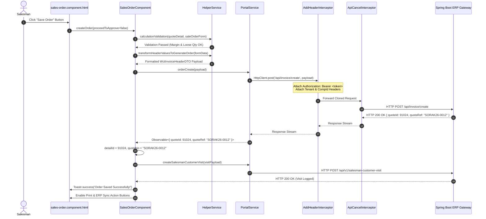
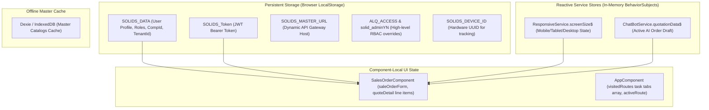

Viewed main.ts:1-8
Viewed index.html:1-54
Viewed app.component.ts:100-160
Viewed app.component.html:1-60
Viewed app.component.html:180-214

# End-to-End Enterprise Angular Application Flow Analysis
**Target System:** Waldo NextGen Sales Force Automation (SFA) & Enterprise Resource Planning (ERP) Web Client  
**Codebase Root:** `d:/Ramesh/SH_FE/sh_fe`  
**Framework & Engine:** Angular 15.1.0, TypeScript 4.9.4, RxJS 7.8.0, Zone.js 0.12.0

---

# PART 1 — Application Startup Flow

```
Browser Request (index.html)
       │
       ▼
1. HTML Document Parsed
   • File: index.html
   • Assets Loaded: FontAwesome, RemixIcon, Bootstrap 4/5 JS, jQuery, ngx-bootstrap CSS
   • Inline DOM MutationObserver attaches anti-autofill attributes to all input/textarea tags
   • Target Element: <app-root></app-root>
       │
       ▼
2. JavaScript Bundle Entrypoint
   • File: src/main.ts
   • Method: platformBrowserDynamic().bootstrapModule(AppModule)
   • Calls: Angular JIT compiler and bootstraps AppModule
       │
       ▼
3. Root Module Definition & Dependency Registration
   • File: src/app/app.module.ts
   • Class: AppModule
   • Registers Providers:
     - HTTP_INTERCEPTORS: AddHeaderInterceptor (Bearer auth, multi-tenant headers)
     - HTTP_INTERCEPTORS: ApiCancelInterceptor (Auto-cancellation of duplicate search streams)
     - DatePipe, DecimalPipe
     - TranslateModule loader factory (loads ./assets/lang/*.json)
     - AgmCoreModule (Google Maps JavaScript API initialization with environment.googleMapsApiKey)
   • Bootstrap Component: AppComponent
       │
       ▼
4. Root Shell Component Construction & Subscriptions
   • File: src/app/app.component.ts
   • Class: AppComponent
   • Method: constructor()
   • Actions:
     - Reads localStorage('SOLIDS_DATA') to check existing session
     - Subscribes to Router.events (filters NavigationEnd) -> attaches onRouteChange() listener
     - Evaluates localStorage('SOLIDS_DATA_RELOAD')
       │
       ▼
5. Root Shell Initialization (ngOnInit)
   • File: src/app/app.component.ts
   • Method: ngOnInit()
   • Execution Sequence:
     1. getLocationList(SOLIDS_DATA) -> POST /api/common/dynamic/landing/list (APPL_LOCN_LIST)
     2. loadGeoTrackingIntervalAndInit() -> GET /api/common/active/genericMaster/list?catgId=GEO_TRACK_ENABLE_YN
     3. getAutoLogoutTime() -> GET /api/common/active/genericMaster/list?catgId=AUTO_LOGOUT_TIME
     4. menuPriority() -> GET /api/common/menu/role/list (Loads authorized sidebar routes)
       │
       ▼
6. Router Evaluation
   • File: src/app/app-routing.module.ts
   • Root Path Rule: { path: '', redirectTo: '/login', pathMatch: 'full' }
   • If no active session: Router redirects to /login -> Lazy loads LoginModule
   • If active session exists: User can navigate to /customer-detail or saved tab
       │
       ▼
7. First Screen Rendered
   • Unauthenticated: LoginComponent ([solids/login/login.component.html](file:///d:/Ramesh/SH_FE/sh_fe/src/app/solids/login/login.component.html))
   • Authenticated: Shell Layout with <app-header>, dynamic sidebar, task tabs, and <router-outlet>
```

---

# PART 2 — Project Architecture Flow

```text
SFA / ERP Application Architecture (sh_fe)
│
├── 1. Core Infrastructure Layer
│   ├── Startup & Shell: main.ts, AppModule, AppComponent (Global layout, timer orchestrator)
│   ├── HTTP Interceptors:
│   │   ├── AddHeaderInterceptor (JWT Bearer, tenantId, Excel content-types, 401 handler)
│   │   └── ApiCancelInterceptor (Request cancellation map using Subject & takeUntil)
│   ├── Navigation Guards: ConfirmDeactivateGuard (Unsaved form change verification)
│   └── Configuration: environment.ts (REST gateway URLs, Google Maps API key, AI endpoints)
│
├── 2. Shared & Dynamic Component Library
│   ├── SharedModule: FocusOnClickDirective, PaginationPipe, NgmultiselectfilterPipe, HeaderComponent
│   └── dynamic-components/ (29 Reusable Business Widgets):
│       ├── order-value (Standalone VAT, discount, gross & net margin banner)
│       ├── custom-select (ControlValueAccessor search dropdown with OnPush & trackBy)
│       ├── items-table, flexy-fields, item-location-info (Stock by warehouse viewer)
│       ├── upload-documents (Multipart FormData document uploader)
│       ├── customer-detail-modal, sales-return-modal, collections-modal
│       └── report-pending-dn, report-pending-so
│
├── 3. Singleton Services Layer (src/app/service/)
│   ├── PortalService (Monolithic REST Gateway: 2,874 lines, 120+ ERP endpoints)
│   ├── HelperService (Financial math, loose-qty packaging calculations, WAC margin checks)
│   ├── GeocodingService (Google Maps Geocoder SDK, GPS coordinate capture, Haversine formula)
│   ├── ResponsiveService (CDK BreakpointObserver stream exposing screenSize$, isMobile())
│   └── ThemeService (Light/Dark mode attribute toggler)
│
├── 4. Business Domain Modules (Lazy-Loaded via AppRoutingModule)
│   ├── Solid Master Core:
│   │   └── solids/login (Authentication, OTP validation, tenant menu loading)
│   ├── Master Configurations:
│   │   ├── masters/user-master, user-master-detail (User CRUD & privileges)
│   │   ├── masters/user-role-master, user-role-master-detail (RBAC matrices)
│   │   ├── masters/transactionmaster, authorization-setup (Approval hierarchy limits)
│   │   ├── masters/customer-master-list, customeraddress
│   │   └── masters/salesman-tracker, salesman-geotracking (Google Maps rep trail viewer)
│   ├── Field CRM & Customer Operations:
│   │   ├── customer/customerlist (Multi-tab customer workbench: Quotations, Sales, Invoices)
│   │   └── customer-details (Customer 360 overview, geofence registration)
│   ├── Sales & Commercial Transactions:
│   │   ├── sales-order (Sales Order creation, batch allocation, margin & geofence validation)
│   │   ├── quotation-list, quotationdetail (Quotation management & Excel bulk import)
│   │   ├── delivery-note, pending-dn, delivery-note-print, picking-list-print
│   │   ├── sales-return (Material credit validation)
│   │   └── invoice-detail, invoice-payment-status
│   ├── Treasury & Financial Collections:
│   │   ├── advance-collections (Advance receipt posting & ERP JV push)
│   │   ├── arrear-collections, collections-list, payment-voucher
│   │   └── collection-summary-report
│   ├── Warehouse Logistics & Material Movements:
│   │   ├── material-request, material-request-issue, material-request-return
│   │   ├── location-transfer-out (LTO warehouse stock dispatch)
│   │   └── location-transfer-in (LTI warehouse stock intake)
│   └── Executive Reports & Analytics:
│       ├── sales-report, branch-sales, itemwise-sales-by-quantity, sales-history
│       ├── failed-document-report, report-geo-api (GPS telemetry logs)
│       └── jasper (JasperReports BI print orchestrator)
│
└── 5. AI & Conversational Voice Subsystem (src/app/chat-bot/)
    ├── ChatBotComponent (Floating AI conversational assistant interface)
    ├── ChatBotService (Spring Boot AI Gateway NLU dispatcher, quotation draft store)
    ├── AudioRecorderService (Web Audio API MediaRecorder with real-time RMS voice detection)
    ├── OpenAiSpeechService (OpenAI Whisper STT & GPT-4o-mini-tts audio synthesis)
    └── SarvamSpeechService (Indic language speech transcription & synthesis)
```

---

# PART 3 — Routing Flow

```
User URL Entry / Browser Navigation
       │
       ▼
AppRoutingModule (app-routing.module.ts)
       │
       ├── Root Check: '' -> redirectTo: '/login' (pathMatch: 'full')
       │
       ├── Lazy Loaded Route Match (e.g. 'sales-order')
       │   └── loadChildren: () => import('./sales-order/sales-order.module').then(m => m.SalesOrderModule)
       │
       ├── Route Guard Check
       │   └── ConfirmDeactivateGuard (canDeactivate)
       │       ├── Checks target.hasChanges flag on active component
       │       ├── If true -> prompts window.confirm('Do you really want to cancel?')
       │       └── If false -> allows route transition
       │
       ├── Route Resolvers
       │   └── NOT CONFIRMED FROM SOURCE (This codebase does not use Angular Route Resolvers;
       │       components fetch data asynchronously inside ngOnInit).
       │
       ├── Component Instantiation & Parameter Ingestion
       │   ├── Parameterized Routes:
       │   │   • master/UserMasterDetail/:action/:userId
       │   │   • master/UserRoleMasterDetail/:action/:roleId
       │   │   • master/AuthorizationSetupDetail/:action/:Id
       │   │   • Ingested via: ActivatedRoute.params.subscribe(p => this.userId = p['userId'])
       │   └── Query Parameters:
       │       • ?erp_txn_code=... & ?quoteId=... & ?tab=...
       │       • Ingested via: ActivatedRoute.queryParams.subscribe(qp => ...)
       │
       └── View Rendering in <router-outlet>
```

### Specific Programmatic Navigation Patterns Found in Source

1. **Intermediary View Re-initialization Pattern:**
   * **Source:** [`sales-order.component.ts:L3420`](file:///d:/Ramesh/SH_FE/sh_fe/src/app/sales-order/sales-order.component.ts) and [`customerlist.component.ts`](file:///d:/Ramesh/SH_FE/sh_fe/src/app/customer/customerlist/customerlist.component.ts)
   * **Code:**
     ```typescript
     this.router.navigateByUrl('/customer-detail', { skipLocationChange: true }).then(() => {
       this.router.navigate(['/' + targetPath], { queryParams: queryParamsData });
     });
     ```
   * **Purpose:** Forces Angular to destroy and re-create a target route component when navigating with modified query parameters.
2. **Multi-Tab Task Window Switcher:**
   * **Source:** [`app.component.ts:L1420–L1450`](file:///d:/Ramesh/SH_FE/sh_fe/src/app/app.component.ts)
   * **Method:** `handleActiveRouteNavigation(item)`
   * **Action:** Re-navigates to previously opened tab URLs stored in `visitedRoutes` array.

---

# PART 4 — Authentication Flow

```
1. Login Screen Rendered
   • File: solids/login/login.component.ts
   • Class: LoginComponent
   • Form: this.form = this.fb.group({ mailId: ['', Validators.required], password: ['', Validators.required], compId: [''] })
       │
       ▼
2. Form Submission (Standard Login)
   • Method: submitLogin() (Line 193)
   • Service: PortalService.loginRes(payload) (portal.service.ts:Line 85)
   • HTTP: POST http://192.168.10.71:9080/api/auth/login
   • Payload: { mailId: "admin", password: "...", compId: "COMP01" }
       │
       ▼
3. Optional Multi-Factor Authentication (OTP Login)
   • Trigger: If backend responds with MFA challenge
   • Method: submitOTPLogin() (Line 240)
   • Service: PortalService.loginOtpRes(payload)
   • HTTP: POST /api/auth/login/otp
   • Payload: { hashKey: "...", otp: "123456" }
       │
       ▼
4. Successful Authentication & Session Ingestion
   • Method: LoginComponent.menuPriority(data) (Line 140)
   • Actions:
     - Stores session: localStorage.setItem('SOLIDS_DATA', JSON.stringify(data))
     - Extracts JWT token: localStorage.setItem('SOLIDS_Token', data.SOLIDS_TOKEN)
     - Stores tenant URL: localStorage.setItem('SOLIDS_MASTER_URL', data.SOLIDS_MASTER_URL)
     - Sets user online: PortalService.changeUserStatus(userId, 'Y') -> POST /api/auth/login/update/userdetails
     - Resolves global access: Checks PortalService.getActiveGeneric('ADMIN_ACCESS') -> Sets localStorage('ALQ_ACCESS', 'ALL')
       │
       ▼
5. Outgoing Request Token Injection
   • File: interceptor/AddHeaderinterceptor.ts
   • Class: AddHeaderInterceptor
   • Method: intercept(req, next)
   • Actions:
     - Extracts token from localStorage('SOLIDS_DATA')['SOLIDS_TOKEN']
     - Clones request: req.clone({ headers: req.headers.set('Authorization', 'Bearer ' + apikey) })
       │
       ▼
6. Unauthorized / Session Expiry Handling
   • File: interceptor/AddHeaderinterceptor.ts (Lines 54–66) & app.component.ts (Line 145)
   • Trigger: HTTP 401 Unauthorized Response or AUTO_LOGOUT_TIME timer expiry
   • Actions:
     - localStorage.removeItem('SOLIDS_DATA')
     - localStorage.removeItem('SOLIDS_Token')
     - ToastrService.error('Token Expired, Please login again!!', 'Login Expired')
     - Router.navigate(['/login'])
       │
       ▼
7. Explicit User Logout
   • File: app.component.ts
   • Method: logoutAction() (Line 1390)
   • Calls: PortalService.logoutForAllUsers() -> POST /api/auth/logout/all
   • Clears background GPS timers via clearBackgroundGeoTracking()
   • Clears localStorage and redirects to /login
```

---

# PART 5 — Authorization Flow

```
                     User Identity (SOLIDS_DATA in LocalStorage)
                                        │
                                        ▼
                  Role Assignment (SOLIDS_ROLE_ID, SOLIDS_COMPID)
                                        │
                                        ▼
┌───────────────────────────────────────────────────────────────────────────────────┐
│                      Server-Side Privilege Discovery Engine                       │
│  • API Call: PortalService.getDynamicList({ subcatgid: 'ACCESS_LIST' })          │
│  • Endpoint: POST /api/common/dynamic/landing/list                                │
│  • Output: Array of authorized AccessId records for the active role               │
└───────────────────────────────────────────────────────────────────────────────────┘
                                        │
                                        ▼
┌───────────────────────────────────────────────────────────────────────────────────┐
│                           Core Access Keys Evaluated                              │
├─────────────────┬───────────────────────────────────┬─────────────────────────────┤
│ ACCESS KEY      │ WHERE CHECKED                     │ RUNTIME BEHAVIOR EFFECT     │
├─────────────────┼───────────────────────────────────┼─────────────────────────────┤
│ 'GEO_TRACK'     │ AppComponent (L310)               │ Enables background GPS log  │
│                 │ SalesOrderComponent (L615)        │ Enforces 50m customer radius│
├─────────────────┼───────────────────────────────────┼─────────────────────────────┤
│ 'NO_ORD'        │ SalesOrderComponent (L625)        │ Renders "No Order" button   │
│                 │                                   │ for empty salesman visits   │
├─────────────────┼───────────────────────────────────┼─────────────────────────────┤
│ 'OUT_RANGE_ORD' │ SalesOrderComponent (L635)        │ Permits order booking when  │
│                 │                                   │ salesman is >50m from client│
├─────────────────┼───────────────────────────────────┼─────────────────────────────┤
│ 'OUT_BEAT_ORD'  │ SalesOrderComponent (L645)        │ Permits booking customers   │
│                 │                                   │ not scheduled in today beat │
├─────────────────┼───────────────────────────────────┼─────────────────────────────┤
│ 'OUT_ROUTE_ORD' │ SalesOrderComponent (L655)        │ Permits booking customers   │
│                 │                                   │ outside active sales route  │
├─────────────────┼───────────────────────────────────┼─────────────────────────────┤
│ 'ADMIN_ACCESS'  │ LoginComponent (L56)              │ Sets ALQ_ACCESS = 'ALL'     │
│                 │                                   │ Grants bypass on all limits │
├─────────────────┼───────────────────────────────────┼─────────────────────────────┤
│ 'solid_adminYN' │ user-master-detail.comp.ts (L103) │ Displays admin security tabs│
└─────────────────┴───────────────────────────────────┴─────────────────────────────┘
                                        │
                                        ▼
┌───────────────────────────────────────────────────────────────────────────────────┐
│                   Multi-Tier Authorization Limits (Approval Matrix)               │
│  • Screen: AuthorizationSetupDetailComponent                                      │
│  • Database Entity: WctAuthorizationSetup                                         │
│  • Rules: Defines Max Discount %, Max Order Value, Credit Overdue override levels │
│  • Execution: Orders exceeding tier limits transition to PENDING_APPROVAL status   │
└───────────────────────────────────────────────────────────────────────────────────┘
```

---

# PART 6 — Component Flow

### Major Feature Component Lifecycle Traces

#### 1. `SalesOrderComponent` ([`sales-order.component.ts`](file:///d:/Ramesh/SH_FE/sh_fe/src/app/sales-order/sales-order.component.ts))
* **Constructor (Lines 110–160):** Injects 15 dependencies (`FormBuilder`, `PortalService`, `HelperService`, `GeocodingService`, `BsModalService`, `ToastrService`, `Router`, `ActivatedRoute`). Subscribes to router events.
* **ngOnInit (Lines 220–350):**
  1. Calls `intializeSaleOrderForm()` -> Builds 38 form controls.
  2. Calls `getPrivelege()` -> Dispatches `POST /api/common/dynamic/landing/list` for `ACCESS_LIST`.
  3. Calls `getCustomerList()` -> Dispatches customer dropdown query.
  4. Reads route params (`:quoteId`, `:action`) -> If ID exists, invokes `getDetail(id)`.
* **User Event (`(click)="createOrder(false)"`):**
  1. Invokes `calculationValidation()` in `HelperService`.
  2. Invokes `realtimeQtyValidation()` to verify live warehouse batch stock.
  3. Calls `PortalService.orderCreate()` -> Dispatches `POST /api/invoice/create`.
  4. Calls `createSalesmanCustomerVisit()` -> Dispatches `POST /api/v1/salesman-customer-visit`.
  5. Triggers `ToastrService.success('Order Created Successfully')`.
  6. Navigates to updated order detail view.

#### 2. `ChatBotComponent` ([`chat-bot.component.ts`](file:///d:/Ramesh/SH_FE/sh_fe/src/app/chat-bot/chat-bot.component.ts))
* **Constructor:** Injects `ChatBotService`, `AudioRecorderService`, `OpenAiSpeechService`, `NgZone`, `ChangeDetectorRef`, `DomSanitizer`.
* **ngOnInit:** Initializes voice state machine (`isVoiceLoopActive = false`), loads transaction mapping details.
* **ngAfterViewChecked:** Measures `scrollContainer.nativeElement.scrollHeight` and updates scroll position to the bottom of the chat window.
* **ngOnDestroy:** Cancels active speech synthesis, stops audio streams, and sets `isDestroyed = true`.

---

# PART 7 — Component → Service → API Flow



---

# PART 8 — Business Flow Discovery

```
+========================================================================================================+
|                                    DISCOVERED ENTERPRISE WORKFLOWS                                     |
+========================================================================================================+

1. SALES ORDER BOOKING WORKFLOW
   Salesman selects customer -> Route & Beat validated -> 50m Geofence checked -> Products entered ->
   Packaging loose-units converted -> WAC cost margin checked -> Stock checked -> Order created in DB ->
   Salesman visit logged -> GPS ping transmitted -> Order pushed to Orion/Sun ERP.

2. "NO ORDER" CUSTOMER VISIT WORKFLOW
   Salesman reaches customer shop -> GPS distance verified -> Customer places no order -> Salesman opens
   "No Order" modal -> Selects reason code (e.g., "Sufficient Stock", "Shop Closed") -> Submits visit ->
   API POST /api/invoice/no-order/create -> Field telemetry logged -> Form resets for next customer.

3. ADVANCE PAYMENT COLLECTION WORKFLOW
   Finance/Salesman opens Advance Collections -> Selects customer -> Enters Cheque/Cash/Bank details ->
   Calls bankreciptValidation() -> Submits collection -> API POST /api/advance/collection/create ->
   Generates Official Advance Receipt Voucher -> Dispatches pushToERPAdvanceCollection() for ERP JV.

4. WAREHOUSE MATERIAL REQUISITION & DISPATCH (MR -> LTO -> LTI)
   • Step A (Requisition): Branch creates Material Request -> Dispatches integrateMRWithErp().
   • Step B (Dispatch): Central Warehouse creates Location Transfer Out (LTO) -> Dispatches integrateLTOWithErp().
   • Step C (Receipt): Destination Branch verifies quantities -> Creates Location Transfer In (LTI) ->
     Dispatches integrateLTIWithErp() to update destination ledger stock.

5. BACKGROUND FIELD TELEMETRY & GEOFENCING ENGINE
   AppComponent timer ticks (e.g., every 1 hour) -> Acquires GPS lat/lng -> Captures device battery % ->
   Reverse-geocodes address with Google Maps -> Posts telemetry to /api/map-api-log/save ->
   If route inactive for >2 cycles -> Pauses tracking until route changes.

6. CONVERSATIONAL AI VOICE ORDERING
   User speaks into Chatbot -> AudioRecorderService captures PCM audio with VAD -> OpenAI Whisper transcribes
   speech -> Spring Boot AI Gateway classifies intent -> Order draft populated -> Form auto-filled ->
   Voucher generated -> OpenAI TTS vocalizes confirmation.
```

---

# PART 9 — Form Flow

```
                      Form Initialization (ngOnInit)
                                     │
                                     ▼
         FormBuilder.group({ customerNo: ['', Validators.required], ... })
         (38 Header FormControls in SalesOrderComponent: Lines 163–206)
                                     │
                                     ▼
                    Dynamic Master Data Hydration
         • Dropdowns populated from PortalService (Customers, Salesmen, Price Lists, Currencies)
         • patchValue() applied when viewing/editing existing records
                                     │
                                     ▼
                        User Line-Item Input
         • Line items added to quoteDetail array (Item, Quantity, Loose Qty, UOM, Rate, Discount)
                                     │
                                     ▼
                 Client-Side Business Validation Checks
         1. Loose Quantity Rule: quantityLs <= maxLooseQty (HelperService: L1048)
         2. Packaging Formula: BaseQty = (Qty + (QtyLs / MaxLs)) * ConvFactor
         3. Margin Protection Rule: Net Rate >= Item Cost (HelperService: L908)
         4. Multi-Currency Calculation: NetValue = TotalAmount - Discount + VAT (OrderValueComponent)
                                     │
                                     ▼
                         Form Submission Trigger
                                     │
                                     ▼
               DTO Payload Transformation (HelperService)
         • Strips internal UI state flags
         • Formats dates to DD/MM/YYYY or YYYY-MM-DD
         • Constructs WctInvoiceHeaderDTO & Array of WctInvoiceDetailDTO
                                     │
                                     ▼
                 HTTP Dispatch (POST /api/invoice/create)
```

---

# PART 10 — RxJS Flow

```
+================================================================================================================================+
| OPERATOR / PATTERN  | ACTUAL USAGE IN THIS CODEBASE                                   | ARCHITECTURAL REASON / BENEFIT         |
+=====================+=================================================================+========================================+
| 1. takeUntil        | ApiCancelInterceptor (L28):                                     | Automatically terminates in-flight     |
|                     | return next.handle(req).pipe(takeUntil(cancelSubject));         | search requests when user types new query|
+---------------------+-----------------------------------------------------------------+----------------------------------------+
| 2. BehaviorSubject  | ResponsiveService (L17):                                        | Holds active responsive viewport state |
|                     | private screenSizeSubject = new BehaviorSubject(null);          | and multicasts it to late subscribers  |
+---------------------+-----------------------------------------------------------------+----------------------------------------+
| 3. forkJoin         | SalesOrderComponent (L13):                                      | Executes parallel catalog lookups and  |
|                     | forkJoin([cust$, items$, terms$]).subscribe(...)                | emits when all catalogs are ready      |
+---------------------+-----------------------------------------------------------------+----------------------------------------+
| 4. switchMap        | material-return-add.component.ts (L2423):                       | Switches from completed item validation|
|                     | toArray().pipe(switchMap(results => this.saveReturn(results)))  | array to the final backend save stream |
+---------------------+-----------------------------------------------------------------+----------------------------------------+
| 5. concatMap        | material-return-add.component.ts (L2400):                       | Sequentially validates line items one  |
|                     | from(items).pipe(concatMap(item => this.validateStock(item)))   | by one to preserve warehouse sequence  |
+---------------------+-----------------------------------------------------------------+----------------------------------------+
| 6. catchError       | material-return-add.component.ts (L2405):                       | Converts network errors on single items|
|                     | catchError(err => of({ isValid: false, errorType: 'API_ERR' })) | into structured error flags without crash|
+---------------------+-----------------------------------------------------------------+----------------------------------------+
| 7. firstValueFrom   | customerlist.component.ts (L12):                                | Converts single-emission Observable    |
|                     | const data = await firstValueFrom(this.Portal_Service.getList())| into Promise for clean async/await code|
+---------------------+-----------------------------------------------------------------+----------------------------------------+
| 8. debounceTime     | report.component.ts (L10):                                      | Throttles high-frequency user search   |
|                     | searchControl.valueChanges.pipe(debounceTime(400))              | input before dispatching report queries|
+================================================================================================================================+
```

---

# PART 11 — State Flow



---

# PART 12 — Master / Configuration Flow

```
1. Master Configuration Retrieval
   • File: portal.service.ts
   • Method: getActiveGeneric(catgId, compId)
   • API: GET /api/common/active/genericMaster/list?catgId={catgId}
       │
       ▼
2. Specific Master Keys & Runtime Enforcement
   ├── 'GEO_TRACK_ENABLE_YN'
   │   └── Evaluated in AppComponent (L300): Master kill-switch for GPS engine.
   ├── 'GEO_TRACK_INTERVAL'
   │   └── Evaluated in AppComponent (L318): Defines GPS ping frequency in ms (e.g. 3600000).
   ├── 'AUTO_LOGOUT_TIME'
   │   └── Evaluated in AppComponent (L145): Sets idle session timeout timer in minutes.
   ├── 'ADMIN_ACCESS'
   │   └── Evaluated in LoginComponent (L56): Grants super-admin full company visibility.
   ├── 'TXN_ORDER'
   │   └── Evaluated in SalesOrderComponent: Determines default order transaction sequence.
   └── 'wtudTranCode' / 'wtudTranUrl'
       └── Evaluated in ChatBotService: Maps AI NLP intents to exact frontend route paths.
```

---

# PART 13 — Geolocation Flow

```
1. Background Salesman GPS Ping
   AppComponent (Interval Tick)
       │
       ├── navigator.geolocation.getCurrentPosition() -> Returns { latitude, longitude, accuracy }
       ├── navigator.getBattery() -> Returns battery percentage
       ├── Ipify API (https://api.ipify.org?format=json) -> Returns client public IP
       ├── GeocodingService.getAddressFromCoords(lat, lng) -> Google Maps Geocoder reverse-lookup
       └── HTTP POST /api/map-api-log/save -> Persists GPS log record to database
       │
2. Geofenced Order Booking (SalesOrderComponent)
   Salesman selects customer
       │
       ├── Fetches registered customer GPS from GET /api/v1/customer-geo/code/{customerCode}
       ├── Captures current salesman GPS from GeocodingService.getCurrentLocation()
       ├── Calculates distance in meters using Haversine Geodesic Formula:
       │   d = 2 * R * asin(sqrt(sin²(Δlat/2) + cos(lat1)*cos(lat2)*sin²(Δlon/2)))
       ├── Compares distance against allowedRadius (Default: 50 meters)
       │   ├── If Distance <= 50m -> Inside Booking (isOutsideBooking = false)
       │   └── If Distance > 50m -> Outside Booking (isOutsideBooking = true)
       │       └── Checks ACCESS_LIST for 'OUT_RANGE_ORD'
       │           ├── If Authorized -> Shows confirmation prompt and flags audit trail
       │           └── If Unauthorized -> Blocks order entry and displays geofence warning
       └── Submits visit record to POST /api/v1/salesman-customer-visit
```

---

# PART 14 — AI Chatbot Flow

```
User Clicks Chatbot Launcher (Bottom-Right Floating Icon)
       │
       ▼
ChatBotComponent Opens (chat-bot.component.ts)
       │
       ├── Mode A: Text Input -> User types message in chatInput
       │
       └── Mode B: Voice Input (Hands-Free ERP Voice Interface)
           1. AudioRecorderService.startRecording() -> Requests navigator.mediaDevices.getUserMedia()
           2. Web Audio AnalyserNode monitors real-time RMS volume for Voice Activity Detection (VAD)
           3. User finishes speaking -> AudioRecorderService emits audio/wav Blob
           4. OpenAiSpeechService.transcribe(blob) -> Dispatches POST /api/openai/speech-to-text
           5. Text transcript received and displayed as user chat bubble
       │
       ▼
AI Gateway Intent Processing
   • ChatBotService.sendMessage(text)
   • HTTP: POST http://192.168.10.102:8089/api/ai/v1/workflow/{workflow}/chat
   • AI Gateway extracts entities: Customer: "Al Qama Trading", Items: ["ITEM-101", "ITEM-204"], Qty: [10, 5]
       │
       ▼
Draft Population & Screen Routing
   • AI Gateway responds with: { state: "COMPLETED", draft: { ... }, erpTxnCode: "SO" }
   • ChatBotService.returnRoute("SO") -> Maps to /sales-order
   • ChatBotService.setQuotationData(draft) -> Multicasts draft to BehaviorSubject
   • ChatBotComponent triggers Router.navigate(['/sales-order'])
   • SalesOrderComponent receives draft data and auto-populates 38 form controls
   • OpenAiSpeechService.synthesize("Your Sales Order has been created") -> Plays vocal audio response
```

---

# PART 15 — Error Flow

```
+========================================================================================================+
| ERROR SOURCE                | PROPAGATION & INTERCEPTION PIPELINE            | USER / UI IMPACT        |
+=============================+================================================+=========================+
| HTTP 401 Unauthorized       | AddHeaderInterceptor catches status === 401    | Toastr: "Token Expired" |
|                             | -> Clears localStorage -> Navigates to /login  | Redirects to Login      |
+-----------------------------+------------------------------------------------+-------------------------+
| HTTP 400/500 Server Failure | PortalService catchError operator              | Toastr.error(message)   |
|                             | -> Formats backend message string              | Form unlocked for retry |
+-----------------------------+------------------------------------------------+-------------------------+
| Geolocation GPS Timeout     | GeocodingService.getCurrentLocation() catch    | Falls back to IP / Logs |
|                             | -> Dispatches sendLocationErrorLog()           | wmalError into database |
+-----------------------------+------------------------------------------------+-------------------------+
| Margin Check Violation      | HelperService.calculationValidation()          | Toastr.error("Net Rate  |
| (Net Rate < Item Cost)      | -> Returns isValid: false, message: "..."      | cannot be less than WAC")|
+-----------------------------+------------------------------------------------+-------------------------+
| Speech STT/TTS Failure      | OpenAiSpeechService catchError operator        | Console logged; falls   |
|                             | -> Falls back to native SpeechSynthesis        | back to text-only chat  |
+========================================================================================================+
```

---

# PART 16 — Timer / Background Process Flow

```
+================================================================================================================================+
| TIMER IDENTIFIER                 | FILE & METHOD                             | DURATION         | TEARDOWN / CLEANUP STATUS    |
+==================================+===========================================+==================+==============================+
| 1. Background GPS Telemetry      | app.component.ts                          | Dynamic (e.g. 1h)| CONFIRMED CLEANUP            |
|    (backgroundGeoTrackIntervalId)| initBackgroundGeoTracking() (L320)        | from config      | clearInterval in ngOnDestroy |
+----------------------------------+-------------------------------------------+------------------+------------------------------+
| 2. Route Timeout Monitor         | app.component.ts                          | Duration * 2     | CONFIRMED CLEANUP            |
|    (routeTimeoutId)              | startRouteTimeoutMonitoring() (L980)      | (e.g. 2 hours)   | clearTimeout in ngOnDestroy  |
+----------------------------------+-------------------------------------------+------------------+------------------------------+
| 3. Clipboard Flush Timer         | app.component.ts                          | 5 minutes        | CONFIRMED CLEANUP            |
|    (clipBoardIntervalId)         | startClipBoardInterval() (L122)           | (300,000 ms)     | clearInterval on start/stop  |
+----------------------------------+-------------------------------------------+------------------+------------------------------+
| 4. Customer List Poll Timer      | customerlist.component.ts                 | 30 seconds       | POTENTIAL LEAK RISK          |
|    (listInterval)                | startListInterval() (L187)                | (30,000 ms)      | Missing clearInterval cleanup|
+----------------------------------+-------------------------------------------+------------------+------------------------------+
| 5. Router Events Subscription    | sales-order.component.ts                  | Indefinite       | POTENTIAL LEAK RISK          |
|    (this.router.events)          | constructor() (L144)                      | Subscription     | Missing unsubscribe() teardown|
+================================================================================================================================+
```

---

# PART 17 — Third-Party Integration Flow

```
1. Google Maps JavaScript SDK & Geocoding
   • AppModule -> AgmCoreModule.forRoot({ apiKey: environment.googleMapsApiKey, libraries: ['places', 'geometry'] })
   • GeocodingService -> Injects google.maps.Geocoder to convert GPS coords <-> Physical Street Addresses
   • SalesmanTrackerComponent -> Renders interactive map with salesman polyline route trails

2. OpenAI Multimodal Cloud APIs
   • OpenAiSpeechService -> Streams audio blobs to POST /api/openai/speech-to-text (Whisper-1)
   • OpenAiSpeechService -> Streams text strings to POST /api/openai/text-to-speech (gpt-4o-mini-tts)

3. Sarvam AI Indic Voice Engine
   • SarvamSpeechService -> Communicates with Sarvam API using sk_nub5vhnf_lmQckKjVhk7rpgMMe9sVcOL8

4. SheetJS (xlsx) & FileSaver
   • QuotationListComponent -> Ingests Excel spreadsheets -> Parses binary rows into line-item JSON arrays
   • CustomerlistComponent -> Converts table datasets into downloadable .xlsx binary spreadsheets

5. ZXing Barcode & QR Scanner
   • dynamic-components/scanner -> Ingests device camera video stream -> Decodes product barcode strings
```

---

# PART 18 — Data Flow (Bidirectional Pipeline)

```
===================================================================================================
A. INGESTION PIPELINE (Backend Database -> Browser DOM)
===================================================================================================
1. Backend Database (Oracle / MySQL ERP Tables)
   │
   ▼ HTTP REST GET / POST
2. AddHeaderInterceptor & ApiCancelInterceptor (Clones request, injects token, handles cancel)
   │
   ▼ RxJS Observable Stream
3. PortalService (Encapsulates endpoint URL: /api/invoice/detail?quoteId=91024)
   │
   ▼ Observable Transformation (map, catchError)
4. SalesOrderComponent.getDetail(id)
   │
   ▼ Data Formatting (HelperService.returnDate, DecimalPipe)
5. Component Properties Hydrated (this.saleOrderForm.patchValue(header), this.quoteDetail = items)
   │
   ▼ Zone.js Change Detection Trigger
6. Angular Template Rendering (sales-order.component.html)
   │
   ▼ Direct DOM Update
7. Browser Screen Viewable to User

===================================================================================================
B. SUBMISSION PIPELINE (Browser DOM User Input -> Backend Database)
===================================================================================================
1. User Types in Form / Alters Quantity Controls
   │
   ▼ Event Binding ((click)="createOrder()", [(ngModel)], formControlName)
2. SalesOrderComponent.createOrder()
   │
   ▼ Mathematical & Business Rule Validation
3. HelperService.calculationValidation() (Checks loose unit packing & WAC cost margins)
   │
   ▼ DTO Construction
4. HelperService.transformHeaderValuesToGenerateOrder() (Produces clean WctInvoiceHeaderDTO)
   │
   ▼ Service Method Invocation
5. PortalService.orderCreate(dtoPayload)
   │
   ▼ HTTP Interceptors Pipeline
6. AddHeaderInterceptor (Attaches Bearer auth token and multi-tenant CompId)
   │
   ▼ HTTP POST /api/invoice/create
7. Backend ERP Gateway (Persists transaction and returns HTTP 200 OK { quoteId: 91024 })
```

---

# PART 19 — Complete Feature Map

| Feature | Entry Point | Component | Service | API Endpoint | Business Rule | State | UI Result | Navigation |
| :--- | :--- | :--- | :--- | :--- | :--- | :--- | :--- | :--- |
| **Authentication** | `/login` | `LoginComponent` | `PortalService` | `POST /api/auth/login` | Validates user & tenant | `SOLIDS_DATA` in `localStorage` | Unlocks app shell | `/customer-detail` |
| **Sales Order Booking** | `/sales-order` | `SalesOrderComponent` | `PortalService`, `HelperService` | `POST /api/invoice/create` | 50m Geofence & WAC Margin check | `saleOrderForm`, `quoteDetail` | Displays order ref, enables print | `/sales-order/update/{id}` |
| **"No Order" Visit** | `/sales-order` | `SalesOrderComponent` | `PortalService` | `POST /api/invoice/no-order/create` | Requires reason code if no sales | Resets customer state | Closes visit dialog | `/invoice/list` |
| **Customer 360 Workbench** | `/customer` | `CustomerlistComponent`| `PortalService` | `POST /api/common/quotation/dropdown/list` | Role-filtered customer list | `Quotation`, `Sales`, `Invoice` | Renders multi-tab history table | Deep-links to orders |
| **Advance Payment** | `/advance-collections` | `AdvanceCollectionsComponent`| `PortalService` | `POST /api/advance/collection/create` | Cheque bank validation in ERP | `WatCollectionHeaderDTO` | Generates receipt voucher PDF | `/advance-collections/list` |
| **Material Requisition** | `/material-request` | `MaterialRequestAddComponent`| `PortalService` | `POST /api/material/request/sun/external/create` | Sequential batch stock validation | `mrHeaderForm`, `mrDetail` | Posts MR to Sun/Orion ERP | `/material-request` |
| **Warehouse Dispatch (LTO)** | `/location-transfer-out` | `LocationTransferOutAddComponent`| `PortalService` | `POST /api/lto/external/create` | Stock dispatch from source whse | `ltoForm`, `ltoDetail` | Generates warehouse transfer pass | `/location-transfer-out` |
| **Background GPS Telemetry** | Global Shell | `AppComponent` | `GeocodingService`, `HttpClient` | `POST /api/map-api-log/save` | Enabled if `GEO_TRACK_ENABLE_YN='Y'` | `trackingCallCount` | Updates GPS indicator icon | Stays in background |
| **Salesman GPS Route Trail** | `/masters/salesman-tracker` | `SalesmanTrackerComponent`| `PortalService`, `GeocodingService` | `GET /api/map-api-log/user/{id}/date/{d}` | Renders GPS breadcrumbs on map | `mapApiLogs` array | Interactive Google Maps polyline | In-page map view |
| **AI Conversational Voice** | Floating Icon | `ChatBotComponent` | `ChatBotService`, `OpenAiSpeech` | `POST /api/ai/v1/workflow/.../chat` | AI intent mapped to route code | `quotationData$` | Auto-populates transaction form | Auto-navigates to transaction |

---

# PART 20 — Top 30 Most Important Files

```
 1. src/app/app.module.ts                              - Root Module, provider registrations, interceptors & schemas
 2. src/app/app.component.ts                           - Global Shell, background telemetry manager, tab manager
 3. src/app/service/portal.service.ts                  - Primary API Gateway Service (120+ REST endpoints)
 4. src/app/sales-order/sales-order.component.ts       - Core Sales Order Engine (15,652 lines)
 5. src/app/interceptor/AddHeaderinterceptor.ts        - Global Auth & Bearer token injection middleware
 6. src/app/interceptor/api-cancel.interceptor.ts      - Request auto-cancellation middleware (takeUntil)
 7. src/app/service/helper.service.ts                  - Core financial calculations & loose-unit packing math
 8. src/app/service/geocoding.service.ts               - Google Maps SDK integration & Haversine formula
 9. src/app/app-routing.module.ts                      - Global Routing Map (50+ lazy-loaded modules)
10. src/app/solids/login/login.component.ts            - Authentication, OTP & session initialization
11. src/app/customer/customerlist/customerlist.component.ts - Customer 360 Workbench & Transaction History
12. src/app/chat-bot/chat-bot.component.ts             - Conversational AI Assistant component
13. src/app/chat-bot/chat-bot.service.ts               - AI Gateway bridge & draft state holder
14. src/app/chat-bot/audio-recorder.service.ts         - Web Audio API Voice Activity Detection (VAD)
15. src/app/chat-bot/openai-speech.service.ts          - OpenAI Whisper STT & TTS integration
16. src/app/dynamic-components/order-value/order-value.component.ts - Standalone VAT, discount & total calculator
17. src/app/dynamic-components/custom-select/custom-select.component.ts - ControlValueAccessor search dropdown
18. src/app/ConfirmDeactivateGuard.ts                  - Route guard preventing unsaved form exit
19. src/app/masters/user-master-detail/user-master-detail.component.ts - User CRUD & permissions management
20. src/app/advance-collections/advance-collections.component.ts - Advance Treasury collection posting
21. src/app/material-request/material-request-add/material-request-add.component.ts - Material requisition engine
22. src/app/location-transfer-out/location-transfer-out-add/location-transfer-out-add.component.ts - Stock dispatch (LTO)
23. src/app/location-transfer-in/location-transfer-in-add/location-transfer-in-add.component.ts - Stock intake (LTI)
24. src/app/quotation-list/quotation-list.component.ts - Quotations & Excel batch import
25. src/app/masters/salesman-tracker/salesman-tracker.component.ts - Manager GPS rep tracking map
26. src/app/service/responsive.service.ts              - CDK BreakpointObserver viewport store
27. src/app/shared/shared.module.ts                    - Shared directives and pipes library
28. src/app/pagination.pipe.ts                         - Custom in-memory multi-attribute search filter
29. src/app/focus-on-click.directive.ts                - Text highlight directive for rapid ERP data entry
30. src/environments/environment.ts                    - REST gateway URLs and Cloud API keys
```

---

# PART 21 — "If I Change This, What Breaks?" (Dependency Impact Matrix)

```
+=================================================================================================================================+
| HIGHLY COUPLED FILE                     | DEPENDENT MODULES / CONSUMERS              | BREAKAGE IMPACT IF MODIFIED              |
+=========================================+============================================+==========================================+
| 1. PortalService                        | SalesOrderComponent, QuotationList,        | ALL backend API calls fail across the    |
|    (src/app/service/portal.service.ts)  | CustomerList, AdvanceCollections,          | entire application; forms fail to load   |
|                                         | MaterialRequest, ChatBot, AppComponent     | dropdowns or submit documents.           |
+-----------------------------------------+--------------------------------------------+------------------------------------------+
| 2. HelperService                        | SalesOrderComponent, QuotationList,        | Financial totals, VAT calculations,      |
|    (src/app/service/helper.service.ts)  | MaterialRequest, LocationTransferOut       | loose-unit conversions, and DTO backend  |
|                                         |                                            | payloads will produce incorrect numbers. |
+-----------------------------------------+--------------------------------------------+------------------------------------------+
| 3. AddHeaderInterceptor                 | Every HTTP request across the entire       | All API calls will return HTTP 401       |
|    (src/app/interceptor/AddHeader...ts) | application                                | Unauthorized; users get locked out.      |
+-----------------------------------------+--------------------------------------------+------------------------------------------+
| 4. LocalStorage Key 'SOLIDS_DATA'       | AppComponent, LoginComponent, Header,      | User identity, role permissions, tenant  |
|                                         | SalesOrderComponent, Interceptors          | branch, and currency will reset to null. |
+-----------------------------------------+--------------------------------------------+------------------------------------------+
| 5. GeocodingService                     | AppComponent, SalesOrderComponent,         | GPS telemetry, distance calculations, and|
|    (src/app/service/geocoding.service.ts| SalesmanTrackerComponent, CustomerDetails  | 50-meter geofence checks will crash.     |
+-----------------------------------------+--------------------------------------------+------------------------------------------+
| 6. AppModule                            | Whole Application Bootstrap                | Application fails to compile or bootstrap|
|    (src/app/app.module.ts)              |                                            | in the browser.                          |
+=================================================================================================================================+
```

---

# PART 22 — 10 End-to-End User Journeys

### User Journey 1: Standard Field Sales Order Booking
```
Login -> Select Assigned Customer -> System verifies today's Route & Beat -> GPS captures location ->
Distance calculated (e.g. 18m <= 50m) -> Geofence check passes -> Salesman scans item barcodes ->
Loose pieces converted to base units -> WAC price margin verified -> Stock availability confirmed ->
Salesman clicks "Save Order" -> API /api/invoice/create persists order -> Visit logged ->
Salesman clicks "Push to ERP" -> Order posted to Sun/Orion ERP -> PDF receipt printed.
```

### User Journey 2: "No Order" Customer Visit
```
Salesman arrives at client location -> System verifies GPS distance <= 50m -> Client states no stock needed ->
Salesman clicks "No Order" button -> Modal dialog opens -> Salesman selects "Sufficient Existing Stock" ->
Clicks "Confirm" -> API /api/invoice/no-order/create logs visit voucher -> GPS telemetry ping sent ->
Customer cleared -> Salesman proceeds to next client on route.
```

### User Journey 3: Out-of-Range Order with Supervisor Override
```
Salesman books order while away from client shop (Distance: 450m > 50m) -> System flags OUT_RANGE_ORD ->
Checks role permissions -> Supervisor privilege allows out-of-range booking -> Warning modal confirmed ->
Order created with flexField08 = "OUTSIDE" -> Reason logged for management audit.
```

### User Journey 4: Advance Payment Collection
```
Salesman visits customer -> Collects cheque payment -> Opens Advance Collections -> Enters Bank & Cheque No ->
Calls bankreciptValidation() -> System verifies bank code in ERP -> Submits advance voucher ->
Official receipt generated -> Dispatches pushToERPAdvanceCollection() -> Updates customer outstanding balance.
```

### User Journey 5: Conversational Voice Order Creation
```
Salesman taps microphone on Chatbot -> Speaks: "Create sales order for Al Qama Trading, 10 cartons of Item 101" ->
Web Audio VAD stops recording -> Whisper STT transcribes audio -> AI Gateway extracts entities ->
Chatbot opens Sales Order form with customer and items pre-filled -> Salesman reviews and confirms ->
AI TTS vocalizes: "Order SORAK26-0012 has been created."
```

### User Journey 6: Warehouse Stock Requisition & Transfer (MR -> LTO -> LTI)
```
Branch Manager creates Material Request for 50 units -> Central Warehouse receives request ->
Warehouse Manager opens Location Transfer Out (LTO) -> Dispatches goods from central storage ->
Branch receives physical goods -> Opens Location Transfer In (LTI) -> Confirms received quantities ->
Ledger balances updated at both locations.
```

### User Journey 7: Customer Geofence Registration
```
Salesman visits newly onboarded retail shop -> Opens Customer Details -> Clicks "Capture GPS" ->
GeocodingService captures live coordinates -> Reverse-geocodes street address -> Submits to
POST /api/v1/customer-geo -> Customer master now geofenced for all future salesman visits.
```

### User Journey 8: Manager Real-Time Field Tracking
```
Sales Manager logs into Web Portal -> Navigates to Salesman Tracker -> Selects Salesman & Date ->
System queries /api/map-api-log/user/{id}/date/{d} -> Google Maps renders full polyline trail ->
Manager inspects customer visit pins, battery levels, and timestamps.
```

### User Journey 9: Quotation Bulk Import via Excel
```
Back-Office Sales Coordinator receives 200-item RFQ spreadsheet -> Opens Quotation module ->
Clicks "Import Excel" -> Selects .xlsx file -> SheetJS parses rows -> Validates item codes & prices ->
Populates Quotation grid -> Coordinator clicks "Create Quotation".
```

### User Journey 10: Multi-Tab Task Switching
```
User is editing a 40-item Sales Order -> Needs to urgently check an overdue invoice -> Clicks Invoice tab ->
Sales Order tab remains saved in visitedRoutes bottom tab bar -> User reviews invoice -> Clicks Sales Order
tab in task bar -> Seamlessly switches back to in-progress Sales Order without losing state.
```

---

# PART 23 — 10 Runtime Sequence Diagrams

### 1. User Authentication Sequence
```text
User            LoginComponent          PortalService       AddHeaderInterceptor       ERP API
 │                    │                       │                      │                    │
 │── Enters Creds ───▶│                       │                      │                    │
 │── Clicks Login ───▶│── loginRes(dto) ─────▶│── HttpClient.post ──▶│── Forward Call ──▶│
 │                    │                       │                      │                    │◀── 200 OK (JWT)
 │                    │◀── Return JWT ────────│◀─────────────────────│◀───────────────────│
 │                    │
 │                    │── Store SOLIDS_DATA in LocalStorage
 │                    │── Set User Active: POST /api/auth/login/update/userdetails
 │                    │── Router.navigate(['/customer-detail'])
```

### 2. Sales Order Geofence Verification Sequence
```text
Salesman        SalesOrderComp        GeocodingService        Google Maps API       Backend Geo API
 │                    │                      │                       │                     │
 │── Selects Client ─▶│                      │                       │                     │
 │                    │── getCurrentLocation▶│── navigator.geo ─────▶│                     │
 │                    │                      │◀── Return Lat/Lng ────│                     │
 │                    │                                                                    │
 │                    │── getCustomerGeoByCode(custCode) ─────────────────────────────────▶│
 │                    │◀── Return Registered Customer Coordinates ─────────────────────────│
 │                    │
 │                    │── calculateDistance(lat1, lon1, lat2, lon2) using Haversine
 │                    │── Check: Distance <= 50m
 │                    │   ├── Yes: isOutsideBooking = false
 │                    │   └── No:  isOutsideBooking = true -> Check 'OUT_RANGE_ORD' Permission
```

### 3. Sales Order Submission & ERP Sync Sequence
```text
Salesman        SalesOrderComp          HelperService        PortalService            ERP API
 │                    │                       │                    │                     │
 │── Clicks Save ────▶│                       │                    │                     │
 │                    │── calculationValid ──▶│                    │                     │
 │                    │◀── Valid (Margin OK) ─│                    │                     │
 │                    │                                            │                     │
 │                    │── orderCreate(dto) ───────────────────────▶│── POST /invoice ───▶│
 │                    │◀── Return { quoteId: 91024 } ──────────────│◀── 200 OK ──────────│
 │                    │
 │                    │── createSalesmanCustomerVisit(visitDto) ──▶│── POST /visit ─────▶│
 │                    │
 │── Clicks Push ────▶│── pushToERP(quoteRef) ────────────────────▶│── POST /sun/inv ──▶│
 │                    │◀── 200 OK (Synced to Sun/Orion ERP) ───────│◀────────────────────│
```

### 4. "No Order" Visit Submission Sequence
```text
Salesman        SalesOrderComp        PortalService         AddHeaderInterceptor      ERP API
 │                    │                     │                         │                  │
 │── Clicks No Order ▶│                     │                         │                  │
 │── Selects Reason ─▶│── updateNoOrder ───▶│── HttpClient.post ─────▶│── POST /no-ord ─▶│
 │                    │◀── 200 OK ──────────│◀────────────────────────│◀─────────────────│
 │                    │
 │                    │── createSalesmanCustomerVisit() ─────────────▶│── POST /visit ───▶│
 │                    │── sendLocationLog()
 │                    │── Router.navigate(['/invoice/list'])
```

### 5. AI Voice Command to Order Form Sequence
```text
Salesman      AudioRecorderService      OpenAiSpeechService      ChatBotService      SalesOrderComp
 │                     │                         │                      │                  │
 │── Speaks ──────────▶│── Captures PCM audio    │                      │                  │
 │── Silence (VAD) ───▶│── Emits Audio Blob ────▶│                      │                  │
 │                     │                         │── POST /stt (Whisper)│                  │
 │                     │                         │◀── Transcript ───────│                  │
 │                     │                                                │                  │
 │                     │── sendMessage(transcript) ────────────────────▶│                  │
 │                     │                                                │── AI Intent NLU  │
 │                     │                                                │◀── Order Draft   │
 │                     │                                                │                  │
 │                     │── Router.navigate(['/sales-order']) ───────────┼─────────────────▶│
 │                     │── setQuotationData(draft) ─────────────────────┼─────────────────▶│
 │                     │                                                                   │ (Form Loaded)
```

### 6. Background Telemetry GPS Logging Sequence
```text
AppComponent Timer      GeocodingService       Browser Hardware APIs     AddHeaderInt      Backend API
 │                             │                         │                     │                │
 │── Interval Tick (1 hr)      │                         │                     │                │
 │── sendLocationLog() ───────▶│── getCurrentLocation ──▶│ (GPS Coords)        │                │
 │                             │── getBattery() ────────▶│ (Battery %)         │                │
 │                             │── Geocoder.geocode ────▶│ (Google Maps)       │                │
 │                             │◀── Formatted Address ───│                     │                │
 │                                                                             │                │
 │── POST /api/map-api-log/save ──────────────────────────────────────────────▶│── POST log ──▶│
 │◀── 200 OK ──────────────────────────────────────────────────────────────────│◀───────────────│
```

### 7. Advance Collection & Receipt Sequence
```text
Salesman        AdvanceCollectionsComp       PortalService       AddHeaderInt         ERP API
 │                         │                       │                   │                 │
 │── Enters Cheque Info ──▶│                       │                   │                 │
 │── Clicks Save ─────────▶│── bankreciptValid ───▶│── POST /validate ─▶│── Verify Bank ─▶│
 │                         │◀── Validation OK ─────│◀──────────────────│◀────────────────│
 │                         │                                                             │
 │                         │── createAdvHeader ───▶│── POST /create ──▶│── Persist Coll ─▶│
 │                         │◀── { tranRef: "ADC" }─│◀──────────────────│◀────────────────│
 │                         │
 │                         │── Generates Receipt PDF
 │                         │── pushToERPAdvanceCollection(agId) ──────▶│── Post JV to ERP▶│
```

### 8. Material Requisition Workflow Sequence
```text
Branch Manager       MaterialRequestAddComp       PortalService       AddHeaderInt      ERP Gateway
 │                             │                        │                   │                │
 │── Enters Line Items ───────▶│                        │                   │                │
 │── Clicks Integrate ERP ────▶│── realtimeQtyValid ───▶│── Check Stock ───▶│── Verify Stock─▶│
 │                             │◀── Stock Available ────│◀──────────────────│◀───────────────│
 │                             │                                                             │
 │                             │── integrateMRWithErp ─▶│── POST /mr/create▶│── Post Sun ERP▶│
 │                             │◀── 200 OK (Integrated)│◀──────────────────│◀───────────────│
```

### 9. Manager GPS Trail Review Sequence
```text
Manager         SalesmanTrackerComp         PortalService       AddHeaderInt          ERP API
 │                       │                        │                   │                  │
 │── Selects Rep & Date ─▶│                        │                   │                  │
 │── Clicks Search ──────▶│── getMapApiLogs(id, d)▶│── GET /map-api ──▶│── Query DB ─────▶│
 │                       │◀── Array of GPS Logs ──│◀──────────────────│◀── Return Trail ─│
 │                       │
 │                       │── Iterates Logs -> Builds google.maps.LatLng array
 │                       │── Renders Google Maps Polyline & Customer Visit Markers
```

### 10. HTTP Request Cancellation Sequence
```text
User Typing           Search Component        ApiCancelInterceptor        AddHeaderInt       Backend
 │                           │                         │                       │                │
 │── Types "Al Q" ──────────▶│── fetchDatas("Al Q") ──▶│ (Registers Key in Map)│                │
 │                           │                         │── Dispatches HTTP ───▶│── GET Search ─▶│
 │                           │                         │                                        │
 │── Types "Al Qama" (Fast) ─▶│── fetchDatas("Al Qama")▶│                                        │
 │                           │                         │── cancelSubject.next() (ABORTS 1st CALL)
 │                           │                         │── Dispatches 2nd HTTP▶│── GET Search ─▶│
 │                           │                         │                       │                │
 │                           │◀── Render 2nd Results ──│◀──────────────────────│◀── 200 OK (2nd)│
```

---

# PART 24 — Project Complexity Map

```
+================================================================================================================================+
| MODULE / AREA                  | COMPLEXITY LEVEL      | ARCHITECTURAL REASONS FOR COMPLEXITY RATING                           |
+================================+=======================+=======================================================================+
| Sales Order Engine             | 🔴 Highly Complex     | 15,652 lines, 38 form controls, WAC margin checks, packaging loose-   |
| (sales-order.component.ts)     |                       | unit math, 50m geofencing, multi-currency VAT, batch selection, ERP push|
+--------------------------------+-----------------------+-----------------------------------------------------------------------+
| Conversational Voice AI        | 🔴 Highly Complex     | Web Audio API RMS voice detection, OpenAI Whisper STT, GPT-4o-mini TTS,|
| (chat-bot/)                    |                       | Spring Boot AI Gateway workflow integration, form auto-filling        |
+--------------------------------+-----------------------+-----------------------------------------------------------------------+
| Field Telemetry & GPS Engine   | 🟠 Complex            | Dynamic background timers, Google Maps Geocoder, battery status,      |
| (AppComponent / Geocoding)     |                       | inactivity timeout monitoring, Haversine distance calculations        |
+--------------------------------+-----------------------+-----------------------------------------------------------------------+
| Material Logistics (MR/LTO/LTI)| 🟠 Complex            | Multi-stage warehouse transfers, sequential batch availability checks, |
|                                |                       | concatMap / switchMap RxJS pipelines, external Sun/Orion ERP sync     |
+--------------------------------+-----------------------+-----------------------------------------------------------------------+
| Advance Treasury Collections   | 🟠 Complex            | Bank receipt validations, multi-tenant receipt vouchers, ERP JV push  |
+--------------------------------+-----------------------+-----------------------------------------------------------------------+
| Customer 360 Workbench         | 🟡 Moderate           | Multi-tab workbench (Quotations/Sales/Invoices), query param deep-links|
+--------------------------------+-----------------------+-----------------------------------------------------------------------+
| User & Role RBAC Masters       | 🟡 Moderate           | Dynamic privilege trees, transaction permission limits, form validation|
+--------------------------------+-----------------------+-----------------------------------------------------------------------+
| Reports & BI Analytics         | 🟢 Simple             | Standard table filters, pagination pipes, SheetJS Excel export        |
+================================================================================================================================+
```

---

# PART 25 — What I Should Learn First (Onboarding Path)

### Phase 1 — Infrastructure, Auth & HTTP Pipeline
* **Files to study:** [`app.module.ts`](file:///d:/Ramesh/SH_FE/sh_fe/src/app/app.module.ts), [`app.component.ts`](file:///d:/Ramesh/SH_FE/sh_fe/src/app/app.component.ts), [`login.component.ts`](file:///d:/Ramesh/SH_FE/sh_fe/src/app/solids/login/login.component.ts), [`AddHeaderinterceptor.ts`](file:///d:/Ramesh/SH_FE/sh_fe/src/app/interceptor/AddHeaderinterceptor.ts), [`api-cancel.interceptor.ts`](file:///d:/Ramesh/SH_FE/sh_fe/src/app/api-cancel.interceptor.ts).
* **Concepts:** Application bootstrap, JWT token storage, request cloning, auto-cancellation via `takeUntil`.
* **Business flow:** User login, session storage in `localStorage`, role loading, global layout rendering.

### Phase 2 — Core Services & Business Calculations
* **Files to study:** [`portal.service.ts`](file:///d:/Ramesh/SH_FE/sh_fe/src/app/service/portal.service.ts), [`helper.service.ts`](file:///d:/Ramesh/SH_FE/sh_fe/src/app/service/helper.service.ts), [`geocoding.service.ts`](file:///d:/Ramesh/SH_FE/sh_fe/src/app/service/geocoding.service.ts).
* **Concepts:** REST gateway abstraction, packaging unit formulas, WAC price margin checks, Haversine formula.
* **Business flow:** Master data queries, line-item pricing calculations, coordinate distance calculations.

### Phase 3 — Customer Workbench & Reusable UI Widgets
* **Files to study:** [`customerlist.component.ts`](file:///d:/Ramesh/SH_FE/sh_fe/src/app/customer/customerlist/customerlist.component.ts), [`order-value.component.ts`](file:///d:/Ramesh/SH_FE/sh_fe/src/app/dynamic-components/order-value/order-value.component.ts), [`custom-select.component.ts`](file:///d:/Ramesh/SH_FE/sh_fe/src/app/dynamic-components/custom-select/custom-select.component.ts), [`pagination.pipe.ts`](file:///d:/Ramesh/SH_FE/sh_fe/src/app/pagination.pipe.ts).
* **Concepts:** Component `@Input`/`@Output`, `ControlValueAccessor`, in-memory filtering pipes, `OnPush` change detection.
* **Business flow:** Customer selection, order history inspection, financial summary calculations.

### Phase 4 — Core Transactional Engine (Sales Order)
* **Files to study:** [`sales-order.component.ts`](file:///d:/Ramesh/SH_FE/sh_fe/src/app/sales-order/sales-order.component.ts), [`sales-order.component.html`](file:///d:/Ramesh/SH_FE/sh_fe/src/app/sales-order/sales-order.component.html).
* **Concepts:** Massive Reactive Forms (38 controls), dynamic arrays, geofenced customer validation, batch modals, ERP push.
* **Business flow:** Full Sales Order creation, "No Order" visit submission, Sun/Orion ERP synchronization.

### Phase 5 — Field Telemetry & Geolocation
* **Files to study:** [`app.component.ts`](file:///d:/Ramesh/SH_FE/sh_fe/src/app/app.component.ts) (L300–L500), [`salesman-tracker.component.ts`](file:///d:/Ramesh/SH_FE/sh_fe/src/app/masters/salesman-tracker/salesman-tracker.component.ts).
* **Concepts:** Window intervals, Google Maps SDK, battery telemetry, route timeout monitoring.
* **Business flow:** Background GPS pings, sales rep map trails, geofence compliance audits.

### Phase 6 — Conversational AI & Web Audio
* **Files to study:** [`chat-bot.component.ts`](file:///d:/Ramesh/SH_FE/sh_fe/src/app/chat-bot/chat-bot.component.ts), [`audio-recorder.service.ts`](file:///d:/Ramesh/SH_FE/sh_fe/src/app/chat-bot/audio-recorder.service.ts), [`openai-speech.service.ts`](file:///d:/Ramesh/SH_FE/sh_fe/src/app/chat-bot/openai-speech.service.ts), [`chat-bot.service.ts`](file:///d:/Ramesh/SH_FE/sh_fe/src/app/chat-bot/chat-bot.service.ts).
* **Concepts:** Web Audio API `AnalyserNode`, speech recognition, Spring Boot AI Gateway integration, form auto-fill.
* **Business flow:** Hands-free voice ordering and automated document generation.

---

# PART 26 — Final "One Page" Project Map

```
+========================================================================================================+
|                         WALDO NEXTGEN ENTERPRISE SFA / ERP ARCHITECTURE                                |
+========================================================================================================+
                                                    │
                   ┌────────────────────────────────┼────────────────────────────────┐
                   │                                │                                │
                   ▼                                ▼                                ▼
         [ AUTHENTICATION ]                  [ CORE MASTERS ]              [ TRANSACTION ENGINE ]
         • LoginComponent                    • UserMasterDetail            • SalesOrderComponent (15k lines)
         • AddHeaderInterceptor              • UserRoleMasterDetail        • QuotationListComponent
         • Bearer Token Injection            • AuthorizationSetup          • DeliveryNote / PickingList
         • Multi-Tenant CompId               • CustomerAddress             • SalesReturn / Invoicing
                   │                                │                                │
                   ├────────────────────────────────┼────────────────────────────────┤
                   │                                │                                │
                   ▼                                ▼                                ▼
         [ FIELD TELEMETRY ]               [ TREASURY & LOGISTICS ]        [ CONVERSATIONAL AI ]
         • GeocodingService (Google Maps)  • AdvanceCollections            • ChatBotComponent
         • Background GPS Ping (1 hr)      • ArrearCollections             • AudioRecorderService (VAD)
         • 50m Geofence Engine             • MaterialRequest (MR)          • OpenAiSpeechService (STT/TTS)
         • SalesmanTracker Map             • LocationTransfer (LTO/LTI)    • Spring Boot AI Gateway (:8089)
                   │                                │                                │
                   └────────────────────────────────┼────────────────────────────────┘
                                                    │
                                                    ▼
                                   [ SHARED INFRASTRUCTURE ]
                                   • PortalService (120+ REST APIs)
                                   • HelperService (Packaging & Margins)
                                   • Dynamic Components (29 Widgets)
                                   • ApiCancelInterceptor (takeUntil)
```

---

### Top 20 Things You Absolutely Need to Understand to Maintain This Project

1. **`PortalService` is the Central Nervous System:** Over 120 REST APIs are declared in this single file. Any backend endpoint update touches [`portal.service.ts`](file:///d:/Ramesh/SH_FE/sh_fe/src/app/service/portal.service.ts).
2. **`AddHeaderInterceptor` Manages All Outgoing Security:** Every HTTP request passes through [`AddHeaderinterceptor.ts`](file:///d:/Ramesh/SH_FE/sh_fe/src/app/interceptor/AddHeaderinterceptor.ts) to inject the `Authorization: Bearer` header.
3. **`ApiCancelInterceptor` Prevents Search Overwrites:** High-frequency search APIs are automatically aborted using `Subject` and `takeUntil` in [`api-cancel.interceptor.ts`](file:///d:/Ramesh/SH_FE/sh_fe/src/app/api-cancel.interceptor.ts).
4. **`SOLIDS_DATA` in `localStorage` is the User State Source of Truth:** Contains the user's ID, role, tenant ID, branch company code, and JWT token.
5. **Dynamic Backend URL Routing:** Backend hostnames are dynamically resolved at runtime from `localStorage.getItem('SOLIDS_MASTER_URL')`.
6. **`SalesOrderComponent` is a 15,652-Line Monolith:** Contains all logic for sales order forms, line items, modals, batch picking, price calculations, and printing.
7. **WAC Price Margin Protection:** [`HelperService.calculationValidation`](file:///d:/Ramesh/SH_FE/sh_fe/src/app/service/helper.service.ts#L908) blocks order entry if `Net Rate < Item Cost`.
8. **Loose Quantity & Mixed Unit Packaging Math:** [`HelperService.getQtyBuErp`](file:///d:/Ramesh/SH_FE/sh_fe/src/app/service/helper.service.ts#L1048) converts cartons, boxes, and loose pieces into base units before sending payloads to the ERP.
9. **Strict 50-Meter Geofence Enforcement:** Sales order creation computes geodesic distance using the Haversine formula against registered customer GPS coordinates.
10. **Privilege Access Codes Gate UI Actions:** Role rights (`GEO_TRACK`, `NO_ORD`, `OUT_RANGE_ORD`, `OUT_BEAT_ORD`, `OUT_ROUTE_ORD`) are retrieved from `POST /api/common/dynamic/landing/list` (`ACCESS_LIST`).
11. **"No Order" Visits are Legitimate Vouchers:** When a salesman visits a client who doesn't buy, a `POST /api/invoice/no-order/create` visit voucher is submitted to log telemetry.
12. **Background GPS Telemetry Runs on a Configurable Interval:** [`AppComponent`](file:///d:/Ramesh/SH_FE/sh_fe/src/app/app.component.ts) runs recurring pings to capture GPS coordinates, battery %, and street addresses.
13. **Route Inactivity Timeout Pauses GPS Pings:** If a user remains idle on a single screen for more than 2 cycles, background GPS tracking pauses automatically.
14. **Custom Dropdowns Use `ControlValueAccessor`:** [`CustomSelectComponent`](file:///d:/Ramesh/SH_FE/sh_fe/src/app/dynamic-components/custom-select/custom-select.component.ts) implements `NG_VALUE_ACCESSOR` with `OnPush` change detection.
15. **Form Navigation Protection:** [`ConfirmDeactivateGuard`](file:///d:/Ramesh/SH_FE/sh_fe/src/app/ConfirmDeactivateGuard.ts) guards against accidental data loss when exiting dirty forms.
16. **Intermediary Route Refresh Pattern:** Code navigates to `/customer-detail` with `skipLocationChange: true` before redirecting to the target URL to force view re-initialization.
17. **Multi-Tab ERP Task Window Switcher:** The bottom bar (`visitedRoutes` in `AppComponent`) stores active screens so users can switch between transactions without losing context.
18. **Warehouse Movement Pipeline (MR -> LTO -> LTI):** Inventory transfers require sequential requisition (MR), dispatch (LTO), and intake (LTI) with external Sun/Orion ERP sync.
19. **AI Conversational Voice Ordering:** Web Audio API captures microphone audio blobs, OpenAI Whisper transcribes speech, and Spring Boot AI Gateway (:8089) classifies intents to auto-fill orders.
20. **Third-Party API Keys in Environment:** Google Maps and Sarvam AI keys are compiled from [`src/environments/environment.ts`](file:///d:/Ramesh/SH_FE/sh_fe/src/environments/environment.ts).