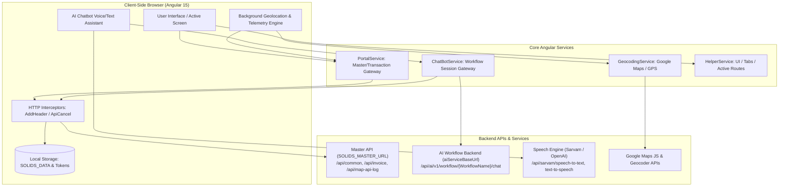
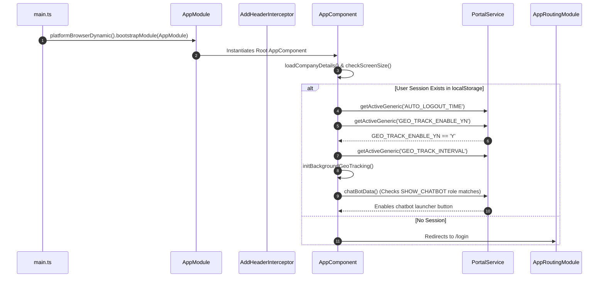
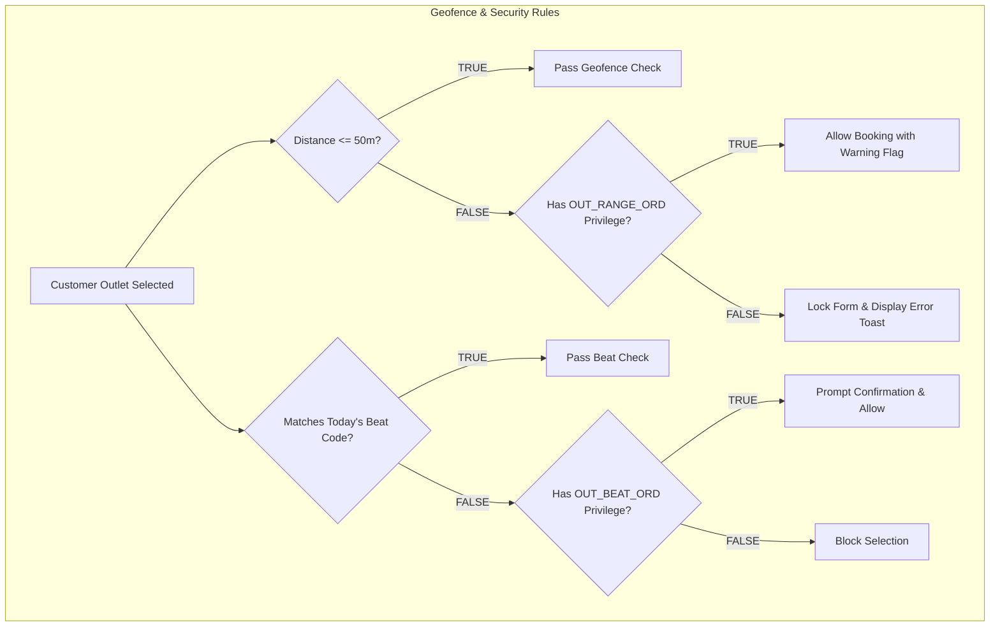
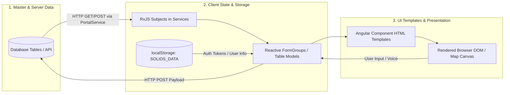

# Senior Angular Developer Codebase Deep Dive: SFA Frontend

---

## 1. Simple Architecture Overview

This project is an **Enterprise Sales Force Automation (SFA) & ERP Execution Frontend** built for distributors and sales organizations. It solves two critical operational problems:

1. **Field Compliance & Geo-Tracking:** Enforcing that field sales representatives are physically present at customer retail outlets on their designated Beat days, adhering to a 50-meter GPS geofence, and streaming background telemetry (GPS coordinates, battery levels, reverse-geocoded physical addresses, and IP).
2. **AI-Assisted Voice-First Order Booking:** Enabling sales reps to speak natural voice commands in Indian-English to auto-populate complex ERP forms (Sales Orders, Invoices, Delivery Notes, Material Requests) in real time and automatically navigate to generated transactions upon completion.

### High-Level Architecture Diagram



---

## 2. Project Structure

### 2.1 Angular Version & Core Ecosystem
* **Angular Version:** `15.1.0` (`@angular/core`, `@angular/common`, `@angular/router`, `@angular/forms`, `@angular/animations`).
* **Angular CDK & Material:** `15.2.1` (`@angular/cdk`, `@angular/material`).
* **TypeScript Version:** `~4.9.4`.
* **RxJS Version:** `~7.8.0`.
* **Node Environment Setting:** Uses `set NODE_OPTIONS=--openssl-legacy-provider` with `ng serve --port 4202 --host 0.0.0.0`.

### 2.2 Module Organization
* **Root Module:** [AppModule](file:///d:/Ramesh/SH_FE/sh_fe/src/app/app.module.ts) — Bootstraps [AppComponent](file:///d:/Ramesh/SH_FE/sh_fe/src/app/app.component.ts) and registers global providers, interceptors, and modal modules.
* **Shared Module:** [SharedModule](file:///d:/Ramesh/SH_FE/sh_fe/src/app/shared/shared.module.ts) — Houses shared UI components, buttons, pagination widgets, and common pipes.
* **Feature Modules (Lazy Loaded):**
  * `LoginModule`: [src/app/solids/login/login.module.ts](file:///d:/Ramesh/SH_FE/sh_fe/src/app/solids/login/login.module.ts)
  * `SalesOrderModule`: [src/app/sales-order/sales-order.module.ts](file:///d:/Ramesh/SH_FE/sh_fe/src/app/sales-order/sales-order.module.ts)
  * `SalesmanTrackerModule`: [src/app/masters/salesman-tracker/salesman-tracker.module.ts](file:///d:/Ramesh/SH_FE/sh_fe/src/app/masters/salesman-tracker/salesman-tracker.module.ts)
  * `SalesmanGeotrackingModule`: [src/app/masters/salesman-geotracking/salesman-geotracking.module.ts](file:///d:/Ramesh/SH_FE/sh_fe/src/app/masters/salesman-geotracking/salesman-geotracking.module.ts)
  * `SalesmanPerformanceDashboardModule`: [src/app/masters/salesman-performance-dashboard/salesman-performance-dashboard.module.ts](file:///d:/Ramesh/SH_FE/sh_fe/src/app/masters/salesman-performance-dashboard/salesman-performance-dashboard.module.ts)
  * `GeoApiReportModule`: [src/app/report-geo-api/geo-api-report.module.ts](file:///d:/Ramesh/SH_FE/sh_fe/src/app/report-geo-api/geo-api-report.module.ts)
  * `CustomeraddressModule`: [src/app/masters/customeraddress/customeraddress.module.ts](file:///d:/Ramesh/SH_FE/sh_fe/src/app/masters/customeraddress/customeraddress.module.ts)
  * `ChatTransactionUserMappingModule`: [src/app/masters/chat-transaction-user-mapping/chat-transaction-user-mapping.module.ts](file:///d:/Ramesh/SH_FE/sh_fe/src/app/masters/chat-transaction-user-mapping/chat-transaction-user-mapping.module.ts)
  * `CustomerlistModule`: [src/app/customer/customerlist/customerlist.module.ts](file:///d:/Ramesh/SH_FE/sh_fe/src/app/customer/customerlist/customerlist.module.ts)
  * `InvoiceDetailModule`: [src/app/invoice-detail/invoice-detail.module.ts](file:///d:/Ramesh/SH_FE/sh_fe/src/app/invoice-detail/invoice-detail.module.ts)
  * `DeliveryNoteModule`: [src/app/delivery-note/delivery-note.module.ts](file:///d:/Ramesh/SH_FE/sh_fe/src/app/delivery-note/delivery-note.module.ts)
  * `MaterialRequestModule`: [src/app/material-request/material-request.module.ts](file:///d:/Ramesh/SH_FE/sh_fe/src/app/material-request/material-request.module.ts)

### 2.3 Routing & Navigation
* Defined in [AppRoutingModule](file:///d:/Ramesh/SH_FE/sh_fe/src/app/app-routing.module.ts).
* 100% Lazy-Loaded route declarations using dynamic `import().then(m => m.Module)`.
* Route parameter conventions:
  * `:action` $\rightarrow$ `add`, `edit`, `view`
  * `:id` / `:userId` $\rightarrow$ Document AG_ID / Primary key
  * Query parameters: `erp_txn_code`, `erp_txn_name`, `order_type`.

### 2.4 Services, Guards, and Interceptors
* **Core Services:**
  * [PortalService](file:///d:/Ramesh/SH_FE/sh_fe/src/app/service/portal.service.ts): Central ERP data access layer (>2,800 lines).
  * [ChatBotService](file:///d:/Ramesh/SH_FE/sh_fe/src/app/chat-bot/chat-bot.service.ts): AI workflow communication and cross-component form draft updates.
  * [GeocodingService](file:///d:/Ramesh/SH_FE/sh_fe/src/app/service/geocoding.service.ts): Browser GPS geolocation wrapper and Google Maps Geocoder integration.
  * [AudioRecorderService](file:///d:/Ramesh/SH_FE/sh_fe/src/app/chat-bot/audio-recorder.service.ts): Web Audio API 16kHz PCM WAV recorder.
  * [SarvamSpeechService](file:///d:/Ramesh/SH_FE/sh_fe/src/app/chat-bot/sarvam-speech.service.ts) / [OpenAiSpeechService](file:///d:/Ramesh/SH_FE/sh_fe/src/app/chat-bot/openai-speech.service.ts): STT and TTS speech service adapters.
  * [HelperService](file:///d:/Ramesh/SH_FE/sh_fe/src/app/service/helper.service.ts): UI tab management, print helpers, and local state utilities.
* **Guards:**
  * [ConfirmDeactivateGuard](file:///d:/Ramesh/SH_FE/sh_fe/src/app/ConfirmDeactivateGuard.ts): `CanDeactivate` guard prompting user confirmation before navigating away from unsaved forms.
* **Interceptors:**
  * [AddHeaderInterceptor](file:///d:/Ramesh/SH_FE/sh_fe/src/app/interceptor/AddHeaderinterceptor.ts): Injects `Authorization: Bearer <SOLIDS_TOKEN>` and Excel content headers into outgoing requests.
  * [ApiCancelInterceptor](file:///d:/Ramesh/SH_FE/sh_fe/src/app/api-cancel.interceptor.ts): Cancels stale in-flight duplicate HTTP requests to `/fetchDatas` using RxJS `takeUntil`.

### 2.5 State Management Strategy
* **Persistent Session State:** Browser `localStorage` (Keys: `SOLIDS_DATA`, `SOLIDS_Token`, `SOLIDS_MASTER_URL`, `Route`, `Beat`, `ALQ_ACCESS`, `AUTO_LOGOUT_TIME`, `SOLIDS_DEVICE_ID`).
* **Cross-Component Shared Reactive State:** In-memory RxJS `BehaviorSubject` and `Subject` instances:
  * `ChatBotService.quotationData$` (hydrates ERP forms from AI draft responses).
  * `ChatBotService.closeChat$` (triggers chat reset).
  * `AudioRecorderService.volume$` (metering audio input volume).
* **Form & Table State:** Angular `FormGroup`, PrimeNG `Table`, and Angular Material `MatTableDataSource`.

### 2.6 Important Third-Party Libraries
* **UI Frameworks:** Bootstrap 4, ngx-bootstrap (`10.3.0`), PrimeNG (`15.4.1`), Angular Material (`15.2.1`).
* **Maps & Geolocation:** `@agm/core` (`1.1.0`), Google Maps JavaScript API SDK.
* **Speech & Media:** Web Audio API, Sarvam AI REST API, OpenAI Audio API.
* **Notifications & Internationalization:** `ngx-toastr` (`16.0.2`), `@ngx-translate/core` (`13.0.0`).
* **Data Processing & Utilities:** `xlsx` (`0.18.5`), `file-saver` (`2.0.5`), `dexie` (`3.2.3`), `ng-keyboard-shortcuts` (`13.0.8`).

---

## 3. Application Startup Flow



### Detailed Startup Steps

1. **Bootstrap (`main.ts`):**
   * **File:** [src/main.ts](file:///d:/Ramesh/SH_FE/sh_fe/src/main.ts)
   * **Code:** `platformBrowserDynamic().bootstrapModule(AppModule)`
   * **Action:** Starts the Angular runtime compiler and initializes `AppModule`.

2. **Root Module Registration (`app.module.ts`):**
   * **File:** [src/app/app.module.ts](file:///d:/Ramesh/SH_FE/sh_fe/src/app/app.module.ts)
   * **Action:** Registers providers ([AddHeaderInterceptor](file:///d:/Ramesh/SH_FE/sh_fe/src/app/interceptor/AddHeaderinterceptor.ts), [ApiCancelInterceptor](file:///d:/Ramesh/SH_FE/sh_fe/src/app/api-cancel.interceptor.ts), `DatePipe`, `DecimalPipe`), imports Google Maps AGM config (`environment.googleMapsApiKey`), and designates `AppComponent` as the bootstrap component.

3. **Root Component Lifecycle (`app.component.ts`):**
   * **File:** [src/app/app.component.ts](file:///d:/Ramesh/SH_FE/sh_fe/src/app/app.component.ts)
   * **Methods:** `ngOnInit()`, `loadGeoTrackingIntervalAndInit()`, `chatBotShowHide()`, `getAutoLogoutTime()`.
   * **Execution:**
     * Reads `localStorage.getItem('SOLIDS_DATA')`.
     * If session is valid:
       1. Calls `PortalService.getActiveGeneric('AUTO_LOGOUT_TIME', '')` and sets idle logout timers.
       2. Calls `PortalService.getActiveGeneric('GEO_TRACK_ENABLE_YN', '')` and `PortalService.getActiveGeneric('GEO_TRACK_INTERVAL', '')`.
       3. Invokes `initBackgroundGeoTracking()` to start background GPS telemetry.
       4. Invokes `chatBotShowHide()` via `PortalService.chatBotData()` to show the AI launcher button if role matches.
     * If session is missing or path is `/login`: Defaults to unauthenticated view and renders the router outlet.

4. **HTTP Header Interception (`AddHeaderinterceptor.ts`):**
   * **File:** [src/app/interceptor/AddHeaderinterceptor.ts](file:///d:/Ramesh/SH_FE/sh_fe/src/app/interceptor/AddHeaderinterceptor.ts)
   * **Method:** `intercept(req, next)`
   * **Action:** Intercepts every outgoing HTTP request, reads `SOLIDS_DATA.SOLIDS_TOKEN`, and attaches `Authorization: Bearer <token>`.

5. **Routing & Initial Screen Rendering:**
   * **File:** [src/app/app-routing.module.ts](file:///d:/Ramesh/SH_FE/sh_fe/src/app/app-routing.module.ts)
   * **Action:** Matches route path `''` $\rightarrow$ redirects to `/login` or loads the requested feature module (e.g. `/sales-order`, `/master/salesman-tracker`).

---

## 4. Main Business Features

### 4.1 Feature 1: User Authentication & Dynamic Backend Configuration
* **User Action:** Salesman enters User ID, Password, and Company ID on the Login screen and clicks **Login**.
* **Component:** [LoginComponent](file:///d:/Ramesh/SH_FE/sh_fe/src/app/solids/login/login.component.ts)
* **Method:** `submitLogin()`
* **Service:** [PortalService](file:///d:/Ramesh/SH_FE/sh_fe/src/app/service/portal.service.ts) $\rightarrow$ `loginRes()`
* **API:** `POST {SOLIDS_MASTER_URL}/api/user/login/validate`
* **Response:** Returns JWT `apiKey`, `roleId`, `compId`, `tenantId`, `userLocationCode`, `retailUserYN` (Currency details).
* **State/Data Update:** Serializes user credentials and permissions into `localStorage.setItem('SOLIDS_DATA', ...)`.
* **UI & Navigation:** Shows success toast and redirects to `/quotation-list` or configured landing route.

---

### 4.2 Feature 2: AI Voice-Driven Order Booking
* **User Action:** Salesman taps the floating mic button and says: *"Create sales order for Customer 1002, 10 cartons of Item A"*.
* **Component:** [ChatBotComponent](file:///d:/Ramesh/SH_FE/sh_fe/src/app/chat-bot/chat-bot.component.ts)
* **Method:** `startVoiceInput()` $\rightarrow$ `onRecordingStopped(blob)` $\rightarrow$ `sendMessage(fromVoice = true)`
* **Service:** [SarvamSpeechService](file:///d:/Ramesh/SH_FE/sh_fe/src/app/chat-bot/sarvam-speech.service.ts) / [OpenAiSpeechService](file:///d:/Ramesh/SH_FE/sh_fe/src/app/chat-bot/openai-speech.service.ts) $\rightarrow$ [ChatBotService](file:///d:/Ramesh/SH_FE/sh_fe/src/app/chat-bot/chat-bot.service.ts)
* **API:**
  1. `POST http://192.168.10.115:8089/api/sarvam/speech-to-text` (Model: `saaras:v3`)
  2. `POST {AI_SERVICE_BASE_URL}/api/ai/v1/workflow/Create Sale Order - Sun Hol (Copy)/chat` (Header: `X-Session-ID`)
* **Response:** Returns structured JSON containing dialog state, `draft` item details, and final `voucherId`.
* **State/Data Update:** Broadcasts draft details through `ChatBotService.updateQuotationData(draftJson)`. Active form components subscribe and update fields dynamically.
* **UI:** Plays synthetic TTS response using `SarvamSpeechService.synthesize()` (`bulbul:v3`, voice: `ishita`).
* **Navigation:** Upon `state === 'COMPLETED'`, calls `ChatBotService.returnRoute()` and navigates via `router.navigate([wtudTranUrl, voucherId])`.

---

### 4.3 Feature 3: Geofenced Sales Order Creation
* **User Action:** Salesman selects a customer from the autocomplete dropdown on the Sales Order screen.
* **Component:** [SalesOrderComponent](file:///d:/Ramesh/SH_FE/sh_fe/src/app/sales-order/sales-order.component.ts)
* **Method:** `onCustomerSelect()` / `checkCustomerGeoAndDistance()`
* **Service:** [PortalService](file:///d:/Ramesh/SH_FE/sh_fe/src/app/service/portal.service.ts) & [GeocodingService](file:///d:/Ramesh/SH_FE/sh_fe/src/app/service/geocoding.service.ts)
* **API:**
  1. `POST {SOLIDS_MASTER_URL}/api/customer/geo/byCompanyAndCustomer`
  2. `POST {SOLIDS_MASTER_URL}/api/customer/geo/calculate-distance`
* **Response:** Customer reference coordinates $(\text{Lat}, \text{Lng})$ and calculated distance in kilometers/meters.
* **State/Data Update:** Updates `this.salesmanLatitude`, `this.salesmanLongitude`, and `this.allowedRadius`.
* **Business Evaluation:**
  * If distance $\le 50\text{m}$ $\rightarrow$ Validated.
  * If distance $> 50\text{m}$ $\rightarrow$ Checks if user role has `OUT_RANGE_ORD` privilege. If missing, blocks order creation with error toast.
* **UI:** Enables item entry grid and submit buttons upon validation pass.

---

### 4.4 Feature 4: Salesman Field Tracker & Route Sequencer
* **User Action:** Salesman opens the **Salesman Tracker** page to review today's scheduled stops.
* **Component:** [SalesmanTrackerComponent](file:///d:/Ramesh/SH_FE/sh_fe/src/app/masters/salesman-tracker/salesman-tracker.component.ts)
* **Method:** `loadCustomerLocations()` $\rightarrow$ `orderLocationsByNearest()`
* **Service:** [PortalService](file:///d:/Ramesh/SH_FE/sh_fe/src/app/service/portal.service.ts)
* **API:**
  1. `POST {SOLIDS_MASTER_URL}/api/common/dynamic/landing/list` (`subcatgid: 'CUSTOMER_GEO_DETAILS_DATED'`)
  2. `POST {SOLIDS_MASTER_URL}/api/common/dynamic/landing/list` (`subcatgid: 'SALESMAN_CUSTOMER_VISIT_LIST'`)
* **Response:** List of assigned customer outlets and visited logs.
* **State/Data Update:** Merges visited and unvisited stops, dynamically sorting pending stops using the nearest-neighbor algorithm.
* **UI:** Renders Google Map with color-coded pins: 🟡 Check-in without order, 🔵/🔴 Productive visit with order, ⚪ Pending stop.

---

### 4.5 Feature 5: Supervisor Geotracking & Performance Analytics
* **User Action:** Sales Manager opens the **Salesman Performance Dashboard** and double-clicks a salesman row.
* **Component:** [SalesmanPerformanceDashboardComponent](file:///d:/Ramesh/SH_FE/sh_fe/src/app/masters/salesman-performance-dashboard/salesman-performance-dashboard.component.ts)
* **Method:** `loadDashboardData()` $\rightarrow$ `openVisitDetailsModal(salesman)`
* **Service:** [PortalService](file:///d:/Ramesh/SH_FE/sh_fe/src/app/service/portal.service.ts)
* **API:** `POST {SOLIDS_MASTER_URL}/api/common/dynamic/landing/list` (`subcatgid: 'GEO_SALES_PERF_3'`, `'GEO_SALES_PERF_4'`, `'GEO_SALES_PERF_5'`)
* **Response:** Grouped KPI data (planned visits, coverage %, productive visit %, booked monetary value, inside vs. outside geofence order ratio).
* **State/Data Update:** Populates `this.routePerformanceData`, `this.salesmanPerformanceData`, and modal timelines.
* **UI:** Renders summary cards, interactive data grids, and provides Excel export via `PortalService.XXlList('SALESMAN_PERF_XL_EXPORT')`.

---

## 5. API Flow Table

| Component | Method | Service | HTTP Method | Endpoint | Payload | Response | Purpose |
| :--- | :--- | :--- | :--- | :--- | :--- | :--- | :--- |
| [LoginComponent](file:///d:/Ramesh/SH_FE/sh_fe/src/app/solids/login/login.component.ts) | `submitLogin()` | `PortalService` | `POST` | `/api/user/login/validate` | `{ mailId, password, compId }` | User tokens, role ID, tenant ID, currency | Authenticate user and obtain session token |
| [AppComponent](file:///d:/Ramesh/SH_FE/sh_fe/src/app/app.component.ts) | `loadGeoTrackingIntervalAndInit()` | `PortalService` | `GET` | `/api/common/active/genericMaster/list?catgId=GEO_TRACK_ENABLE_YN` | None | Generic master list (`valueDesc: 'Y'/'N'`) | Check if company enables background location tracking |
| [AppComponent](file:///d:/Ramesh/SH_FE/sh_fe/src/app/app.component.ts) | `sendLocationLog()` | `HttpClient` | `POST` | `/api/map-api-log/save` | `{ wmalCompId, wmalUserId, wmalDeviceId, wmalLatitude, wmalLongitude, wmalBatteryPercentage, wmalAddress, ... }` | Status object | Save background GPS and device telemetry |
| [AppComponent](file:///d:/Ramesh/SH_FE/sh_fe/src/app/app.component.ts) | `chatBotShowHide()` | `PortalService` | `GET` | `/api/common/active/genericMaster/list?catgId=SHOW_CHATBOT` | None | List of allowed role IDs | Verify if logged-in role has permission to see AI Chatbot |
| [ChatBotComponent](file:///d:/Ramesh/SH_FE/sh_fe/src/app/chat-bot/chat-bot.component.ts) | `checkInsertion()` | `PortalService` | `POST` | `/api/common/dynamic/landing/list` | `{ subcatgid: 'CHECK_IF_INSERTED', filter: { TXNCODE, MONTH } }` | `[{ trueOrFalse: '1' }]` | Verify if transactions are permitted in the current accounting month |
| [ChatBotComponent](file:///d:/Ramesh/SH_FE/sh_fe/src/app/chat-bot/chat-bot.component.ts) | `onRecordingStopped()` | `SarvamSpeechService` | `POST` | `/api/sarvam/speech-to-text` | `FormData` (WAV Blob, `model: 'saaras:v3'`) | `{ transcript: "..." }` | Convert recorded audio voice into text |
| [ChatBotComponent](file:///d:/Ramesh/SH_FE/sh_fe/src/app/chat-bot/chat-bot.component.ts) | `sendMessage()` | `ChatBotService` | `POST` | `/api/ai/v1/workflow/{WorkflowName}/chat` | `{ message: "..." }` (Header: `X-Session-ID`) | `{ state, draft, voucherId, response }` | Execute conversational AI order booking step |
| [ChatBotComponent](file:///d:/Ramesh/SH_FE/sh_fe/src/app/chat-bot/chat-bot.component.ts) | `speak()` | `SarvamSpeechService` | `POST` | `/api/sarvam/text-to-speech` | `{ text, speaker: 'ishita', model: 'bulbul:v3' }` | `{ audios: [ base64String ] }` | Synthesize conversational voice feedback |
| [SalesOrderComponent](file:///d:/Ramesh/SH_FE/sh_fe/src/app/sales-order/sales-order.component.ts) | `checkGeoAccess()` | `PortalService` | `POST` | `/api/common/dynamic/landing/list` | `{ subcatgid: 'ACCESS_LIST', filter: { ROLE_ID, COMPID } }` | List of `AccessId` privileges | Fetch security privileges (`GEO_TRACK`, `OUT_RANGE_ORD`, `OUT_BEAT_ORD`) |
| [SalesOrderComponent](file:///d:/Ramesh/SH_FE/sh_fe/src/app/sales-order/sales-order.component.ts) | `getCustomerGeo()` | `PortalService` | `POST` | `/api/customer/geo/byCompanyAndCustomer` | `{ companyCode, customerCode }` | `{ data: { latitude, longitude, routeCode, beatCode } }` | Fetch customer master GPS coordinates |
| [SalesOrderComponent](file:///d:/Ramesh/SH_FE/sh_fe/src/app/sales-order/sales-order.component.ts) | `calculateDistance()` | `PortalService` | `POST` | `/api/customer/geo/calculate-distance` | `{ lat1, lon1, lat2, lon2 }` | `{ status: 'SUCCESS', distance_km: 0.035 }` | Calculate exact physical distance between salesman and store |
| [SalesmanTrackerComponent](file:///d:/Ramesh/SH_FE/sh_fe/src/app/masters/salesman-tracker/salesman-tracker.component.ts) | `saveCustomerVisit()` | `PortalService` | `POST` | `/api/salesman/customer/visit/save` | `{ companyCode, userId, customerCode, flexField03: 'No Order', flexField06: 'Shop Closed' }` | Success response | Log customer visit when no order was placed |
| [SalesmanPerformanceDashboardComponent](file:///d:/Ramesh/SH_FE/sh_fe/src/app/masters/salesman-performance-dashboard/salesman-performance-dashboard.component.ts) | `loadKPIs()` | `PortalService` | `POST` | `/api/common/dynamic/landing/list` | `{ subcatgid: 'GEO_SALES_PERF_4', filter: { FROMDATE, TODATE, COMPCODE } }` | Performance rows per salesman | Load manager KPIs and sales productivity data |
| [GeoApiReportComponent](file:///d:/Ramesh/SH_FE/sh_fe/src/app/report-geo-api/geo-api-report.component.ts) | `loadReport()` | `GeoApiReportService` | `POST` | `/api/common/dynamic/landing/list` | `{ subcatgid: 'GEO_API_REPORT', fromno, tono, filter: { COMPID, FROMDATE, TODATE } }` | Paginated raw telemetry logs | Audit salesman device tracking pings and battery levels |

---

## 6. Business Logic & Security Gates



### 6.1 Permission & Privilege Gates

| Privilege Key | Context / File | Business Rule | TRUE Action | FALSE Action |
| :--- | :--- | :--- | :--- | :--- |
| `GEO_TRACK` | [app.component.ts](file:///d:/Ramesh/SH_FE/sh_fe/src/app/app.component.ts) | Determines if user's location must be tracked in the background. | Starts background `setInterval` telemetry loop. | Location tracking loop is not started. |
| `OUT_RANGE_ORD` | [sales-order.component.ts](file:///d:/Ramesh/SH_FE/sh_fe/src/app/sales-order/sales-order.component.ts) | Governs whether a salesman can book an order beyond 50m of a customer store. | Allows order entry with an out-of-range flag. | Clears selected customer and locks order booking. |
| `OUT_BEAT_ORD` | [sales-order.component.ts](file:///d:/Ramesh/SH_FE/sh_fe/src/app/sales-order/sales-order.component.ts) | Governs whether a customer can be visited on an unscheduled Beat day. | Prompts confirmation modal and allows proceeding. | Blocks customer selection with error toast. |
| `OUT_ROUTE_ORD` | [sales-order.component.ts](file:///d:/Ramesh/SH_FE/sh_fe/src/app/sales-order/sales-order.component.ts) | Governs whether a salesman can book orders for customers outside their assigned route. | Prompts confirmation modal and allows proceeding. | Blocks customer selection with error toast. |
| `NO_ORD` | [sales-order.component.ts](file:///d:/Ramesh/SH_FE/sh_fe/src/app/sales-order/sales-order.component.ts) | Controls access to logging non-productive visits with reason codes. | Enables the **No Order** submission button and reasons dropdown. | Hides or disables the "No Order" button. |

### 6.2 Transaction Insertion Check (`CHECK_IF_INSERTED`)
* **Input:** ERP Transaction Code (e.g. `SO`, `INV`, `COL`) and current Month index.
* **Condition:** Evaluates `data[0].trueOrFalse === '1'`.
* **Business Rule:** If the current accounting period is closed or setup is missing for the transaction type, no new records can be inserted.
* **Effect:** When `false`, redirects user to `/invoice/list` and displays error toast: *"Transaction setup not available for transaction code (<TXN>)"*.

### 6.3 Anti-Drain Idle Protection
* **Condition:** User stays on the same route without UI activity for $2 \times \text{GEO\_TRACK\_INTERVAL}$.
* **Business Rule:** Prevent draining mobile battery when salesman is inactive.
* **Effect:** Clears the timer interval; resumes immediately when user navigates to any new route.

---

## 7. Data Flow



### Categorization of Data Sources

1. **Master & Configuration Data (Read-Only Cache):**
   * Loaded on demand from `PortalService.getActiveGeneric()`.
   * Stored in component variables: `routeList`, `beatList`, `managerList`, `currencyCode`.
2. **Session & Security State (Persistent Browser Storage):**
   * Managed via `localStorage`: `SOLIDS_DATA` (token, user ID, role ID, tenant ID), `SOLIDS_MASTER_URL`, `Route`, `Beat`, `ALQ_ACCESS`.
3. **Cross-Component Shared State (RxJS In-Memory):**
   * `ChatBotService.quotationDataSubject` $\rightarrow$ passes structured AI draft JSON from chatbot panel into active transaction screens.
   * `PortalService.backgroundGeoTrackIntervalId` $\rightarrow$ manages telemetry interval lifecycle across route transitions.
4. **Local Component & Form State:**
   * Reactive Angular `FormGroup` (e.g. `saleOrderForm`), Material Table data sources (`MatTableDataSource`), and modal references (`BsModalRef`).

---

## 8. Important Angular Concepts Used

### 8.1 Components & Standalone Integration
* Used across the app for encapsulation.
* Standard module-declared components ([AppComponent](file:///d:/Ramesh/SH_FE/sh_fe/src/app/app.component.ts), [ChatBotComponent](file:///d:/Ramesh/SH_FE/sh_fe/src/app/chat-bot/chat-bot.component.ts)) combined with standalone components imported directly into `AppModule` (e.g., [OrderValueComponent](file:///d:/Ramesh/SH_FE/sh_fe/src/app/dynamic-components/order-value/order-value.component.ts), [ItemLocationInfoComponent](file:///d:/Ramesh/SH_FE/sh_fe/src/app/dynamic-components/item-location-info/item-location-info.component.ts)).

### 8.2 Dependency Injection (DI) & Providers
* Global root singletons configured with `@Injectable({ providedIn: 'root' })` ([PortalService](file:///d:/Ramesh/SH_FE/sh_fe/src/app/service/portal.service.ts), [ChatBotService](file:///d:/Ramesh/SH_FE/sh_fe/src/app/chat-bot/chat-bot.service.ts), [GeocodingService](file:///d:/Ramesh/SH_FE/sh_fe/src/app/service/geocoding.service.ts)).
* Multi-provider token registration in `app.module.ts`:
  * `HTTP_INTERCEPTORS` with `AddHeaderInterceptor` and `ApiCancelInterceptor`.
  * `LAZY_MAPS_API_CONFIG` injected into `GeocodingService` for Google Maps API initialization.

### 8.3 HTTP Interceptors
* [AddHeaderInterceptor](file:///d:/Ramesh/SH_FE/sh_fe/src/app/interceptor/AddHeaderinterceptor.ts): Centralizes bearer token attachment and handles Excel export headers.
* [ApiCancelInterceptor](file:///d:/Ramesh/SH_FE/sh_fe/src/app/api-cancel.interceptor.ts): Prevents race conditions during rapid typing/autocomplete by canceling pending `/fetchDatas` requests via RxJS `takeUntil`.

### 8.4 Routing, Route Resolvers & Guards
* Lazy-loaded feature routes with `loadChildren` and `import()`.
* [ConfirmDeactivateGuard](file:///d:/Ramesh/SH_FE/sh_fe/src/app/ConfirmDeactivateGuard.ts) implementing `CanDeactivate` to prevent data loss on unsaved forms.

### 8.5 Reactive Forms
* Extensive usage of `FormBuilder`, `FormGroup`, and `FormControl` with custom validators and dynamic disable/enable logic (e.g., [SalesOrderComponent.intializeSaleOrderForm()](file:///d:/Ramesh/SH_FE/sh_fe/src/app/sales-order/sales-order.component.ts#L163)).

### 8.6 RxJS & Reactive State Management
* `BehaviorSubject` and `Subject` for event messaging (`quotationData$`, `closeChat$`, `volume$`).
* Operators: `takeUntil` (memory leak prevention & request cancellation), `catchError`, `map`, `tap`, `forkJoin`, `firstValueFrom`.

### 8.7 Change Detection & NgZone
* Explicit `ChangeDetectorRef.detectChanges()` used after asynchronous Geolocation callbacks, STT audio responses, and map marker updates.
* `NgZone.run()` ensures third-party Google Maps event listeners and Web Audio callbacks trigger Angular view updates.

### 8.8 Directives & Pipes
* Custom directives: [focus-on-click.directive.ts](file:///d:/Ramesh/SH_FE/sh_fe/src/app/focus-on-click.directive.ts).
* Custom pipes: [ngmultiselectfilter.pipe.ts](file:///d:/Ramesh/SH_FE/sh_fe/src/app/ngmultiselectfilter.pipe.ts), [pagination.pipe.ts](file:///d:/Ramesh/SH_FE/sh_fe/src/app/pagination.pipe.ts).

---

## 9. Top 15 Most Important Files

1. [src/app/app.component.ts](file:///d:/Ramesh/SH_FE/sh_fe/src/app/app.component.ts)
   * **Purpose:** Application root orchestrator; manages background GPS tracking heartbeat, auto-logout timers, screen resizing, and AI launcher visibility.
   * **Key Methods:** `initBackgroundGeoTracking()`, `sendLocationLog()`, `chatBotShowHide()`, `getAutoLogoutTime()`.
2. [src/app/service/portal.service.ts](file:///d:/Ramesh/SH_FE/sh_fe/src/app/service/portal.service.ts)
   * **Purpose:** Core data gateway (>2,800 lines); exposes all ERP master, transactional, customer geo, and distance APIs.
   * **Key Methods:** `getDynamicList()`, `getActiveGeneric()`, `calculateCustomerGeoDistance()`, `saveSalesmanCustomerVisit()`.
3. [src/app/sales-order/sales-order.component.ts](file:///d:/Ramesh/SH_FE/sh_fe/src/app/sales-order/sales-order.component.ts)
   * **Purpose:** Central ERP sales ordering screen (>15,000 lines); executes 50m geofence validation, Beat/Route checks, discount calculations, and form submission.
   * **Key Methods:** `intializeSaleOrderForm()`, `onCustomerSelect()`, `checkCustomerGeoAndDistance()`, `getOrderDateBeat()`.
4. [src/app/chat-bot/chat-bot.component.ts](file:///d:/Ramesh/SH_FE/sh_fe/src/app/chat-bot/chat-bot.component.ts)
   * **Purpose:** Conversational AI controller; handles audio capture, transcript normalization, AI response processing, and inline form hydration.
   * **Key Methods:** `startVoiceInput()`, `onRecordingStopped()`, `sendMessage()`, `speak()`, `checkInsertion()`.
5. [src/app/chat-bot/chat-bot.service.ts](file:///d:/Ramesh/SH_FE/sh_fe/src/app/chat-bot/chat-bot.service.ts)
   * **Purpose:** Bridge to external AI workflow server; maintains `X-Session-ID` and RxJS observables for ERP form updates.
   * **Key Methods:** `sendMessage()`, `returnRoute()`, `updateQuotationData()`.
6. [src/app/service/geocoding.service.ts](file:///d:/Ramesh/SH_FE/sh_fe/src/app/service/geocoding.service.ts)
   * **Purpose:** Wraps browser geolocation API (`enableHighAccuracy`) and connects to Google Maps reverse geocoder.
   * **Key Methods:** `getCurrentLocation()`, `getAddressFromCoords()`, `loadGoogleMapsScript()`.
7. [src/app/masters/salesman-tracker/salesman-tracker.component.ts](file:///d:/Ramesh/SH_FE/sh_fe/src/app/masters/salesman-tracker/salesman-tracker.component.ts)
   * **Purpose:** Salesman route view; orders customer stops using nearest-neighbor logic and manages check-ins and visits.
   * **Key Methods:** `loadCustomerLocations()`, `orderLocationsByNearest()`, `openRemarksModal()`.
8. [src/app/masters/salesman-geotracking/salesman-geotracking.component.ts](file:///d:/Ramesh/SH_FE/sh_fe/src/app/masters/salesman-geotracking/salesman-geotracking.component.ts)
   * **Purpose:** Supervisor map view; draws salesman breadcrumb polylines and color-coded visit pins.
   * **Key Methods:** `loadSalesmen()`, `drawRoute()`, `orderLocationsByNearest()`.
9. [src/app/masters/salesman-performance-dashboard/salesman-performance-dashboard.component.ts](file:///d:/Ramesh/SH_FE/sh_fe/src/app/masters/salesman-performance-dashboard/salesman-performance-dashboard.component.ts)
   * **Purpose:** Managerial KPI analytics; displays route productivity, inside vs. outside geofence order ratios, and visit timelines.
   * **Key Methods:** `loadDashboardData()`, `filterManagers()`, `openVisitDetailsModal()`.
10. [src/app/solids/login/login.component.ts](file:///d:/Ramesh/SH_FE/sh_fe/src/app/solids/login/login.component.ts)
    * **Purpose:** User authentication; resolves dynamic backend URLs, authenticates user, and initializes `localStorage`.
    * **Key Methods:** `submitLogin()`, `checkGeolocationPermission()`, `menuPriority()`.
11. [src/app/interceptor/AddHeaderinterceptor.ts](file:///d:/Ramesh/SH_FE/sh_fe/src/app/interceptor/AddHeaderinterceptor.ts)
    * **Purpose:** Injects Bearer token authorization headers into all outgoing HTTP requests.
    * **Key Methods:** `intercept()`.
12. [src/app/app-routing.module.ts](file:///d:/Ramesh/SH_FE/sh_fe/src/app/app-routing.module.ts)
    * **Purpose:** Application routing registry; defines lazy loading for all master and transactional modules.
13. [src/app/chat-bot/sarvam-speech.service.ts](file:///d:/Ramesh/SH_FE/sh_fe/src/app/chat-bot/sarvam-speech.service.ts)
    * **Purpose:** Integrates with Sarvam AI REST endpoints for Indian-English STT (`saaras:v3`) and TTS (`bulbul:v3`).
    * **Key Methods:** `transcribe()`, `synthesize()`.
14. [src/app/chat-bot/audio-recorder.service.ts](file:///d:/Ramesh/SH_FE/sh_fe/src/app/chat-bot/audio-recorder.service.ts)
    * **Purpose:** Web Audio API audio recorder capturing 16kHz mono PCM audio into WAV format with volume streams.
    * **Key Methods:** `startRecording()`, `stopRecording()`, `cancelRecording()`.
15. [src/app/report-geo-api/geo-api-report.component.ts](file:///d:/Ramesh/SH_FE/sh_fe/src/app/report-geo-api/geo-api-report.component.ts)
    * **Purpose:** Audit log screen displaying raw coordinate pings, accuracy in meters, and battery levels.
    * **Key Methods:** `loadCompanies()`, `search()`, `buildPayload()`.

---

## 10. Critical Runtime Flows

### Flow 1: Application Bootstrapping & Telemetry Startup

```
[Browser Launch]
   ↓
main.ts (bootstrap AppModule)
   ↓
AppComponent.ngOnInit()
   ↓
PortalService.getActiveGeneric('GEO_TRACK_ENABLE_YN') -> returns 'Y'
   ↓
PortalService.getActiveGeneric('GEO_TRACK_INTERVAL') -> returns duration (ms)
   ↓
AppComponent.checkGeoTrackingAccess() -> confirms 'GEO_TRACK' in ACCESS_LIST
   ↓
setInterval(sendLocationLog, intervalMs)
   ↓
GeocodingService.getCurrentLocation() & navigator.getBattery()
   ↓
HTTP POST /api/map-api-log/save -> Database updated with telemetry log
   ↓
UI: User sees app ready with telemetry running in background
```

---

### Flow 2: AI Voice Order Booking & Form Hydration

```
[Salesman taps microphone icon]
   ↓
ChatBotComponent.startVoiceInput() -> AudioRecorderService.startRecording()
   ↓
Salesman speaks -> AudioRecorderService.stopped$(WAV Blob)
   ↓
SarvamSpeechService.transcribe() -> returns English text
   ↓
ChatBotService.sendMessage(text, X-Session-ID)
   ↓
HTTP POST /api/ai/v1/workflow/{WorkflowName}/chat
   ↓
Response: { state: 'IN_PROGRESS', draft: { items: [...], total: 500 } }
   ↓
ChatBotService.updateQuotationData(draft)
   ↓
SalesOrderComponent updates form controls and line-item grid live
   ↓
SarvamSpeechService.synthesize() -> Voice confirmation played via Audio element
```

---

### Flow 3: AI Order Completion & Screen Navigation

```
[Salesman confirms final order details in Chat]
   ↓
ChatBotService.sendMessage("Confirm order")
   ↓
HTTP POST /api/ai/v1/workflow/{WorkflowName}/chat
   ↓
Response: { state: 'COMPLETED', voucherId: 'SO-2026-0042', transactionCode: 'SO' }
   ↓
ChatBotComponent.returnRoute('SO') -> PortalService queries chat-transaction-user-mapping
   ↓
Response: wtudTranUrl = '/sales-order/view'
   ↓
Angular Router executes router.navigate(['/sales-order/view', 'SO-2026-0042'])
   ↓
UI: Browser transitions to finalized Sales Order summary screen
```

---

### Flow 4: Customer Geofence & Beat Validation

```
[Salesman selects customer in Sales Order autocomplete]
   ↓
SalesOrderComponent.onCustomerSelect()
   ↓
PortalService.getCustomerGeoByCompanyAndCustomer(compId, custCode)
   ↓
GeocodingService.getCurrentLocation() -> Captures device GPS coordinates
   ↓
PortalService.calculateCustomerGeoDistance(userLat, userLng, custLat, custLng)
   ↓
Evaluation: Distance = 120 meters (> 50m limit)
   ↓
Check user privileges for 'OUT_RANGE_ORD'
   ↓
[If Missing] -> saleOrderForm.controls['customerNo'].setValue('') -> Toastr Error: "Beyond 50m limit"
   ↓
[If Present] -> Toastr Success: "Out of Range Order Approved" -> Item table unlocked
```

---

### Flow 5: Manager Performance Audit & Visit Timeline Review

```
[Manager navigates to /master/salesman-performance-dashboard]
   ↓
SalesmanPerformanceDashboardComponent.loadDashboardData()
   ↓
PortalService.getDynamicList({ subcatgid: 'GEO_SALES_PERF_4', filter: { ... } })
   ↓
UI: Grid populates with planned visits, actual visits, and productivity %
   ↓
Manager double-clicks a salesman row
   ↓
PortalService.getDynamicList({ subcatgid: 'GEO_SALES_PERF_5', filter: { USER_ID } })
   ↓
UI: Modal popup opens showing chronological visit timeline and salesman remarks
   ↓
Manager clicks 'Excel Export' -> PortalService.XXlList('SALESMAN_PERF_XL_EXPORT') downloads spreadsheet
```

---

## 11. Recommended Learning Order

For any developer joining this project, study the codebase in this exact sequence:

1. **Phase 1 — Configuration & Entry Point:**
   * [package.json](file:///d:/Ramesh/SH_FE/sh_fe/package.json) (dependencies and scripts)
   * [src/main.ts](file:///d:/Ramesh/SH_FE/sh_fe/src/main.ts) & [src/app/app.module.ts](file:///d:/Ramesh/SH_FE/sh_fe/src/app/app.module.ts)
   * [src/app/solids/login/login.component.ts](file:///d:/Ramesh/SH_FE/sh_fe/src/app/solids/login/login.component.ts)
2. **Phase 2 — HTTP, Auth & Core Communication:**
   * [src/app/interceptor/AddHeaderinterceptor.ts](file:///d:/Ramesh/SH_FE/sh_fe/src/app/interceptor/AddHeaderinterceptor.ts)
   * [src/app/service/portal.service.ts](file:///d:/Ramesh/SH_FE/sh_fe/src/app/service/portal.service.ts) (`getDynamicList`, `getActiveGeneric`)
3. **Phase 3 — Telemetry & Background Tracking:**
   * [src/app/service/geocoding.service.ts](file:///d:/Ramesh/SH_FE/sh_fe/src/app/service/geocoding.service.ts)
   * [src/app/app.component.ts](file:///d:/Ramesh/SH_FE/sh_fe/src/app/app.component.ts) (`initBackgroundGeoTracking`, `sendLocationLog`)
4. **Phase 4 — Conversational AI Chatbot:**
   * [src/app/chat-bot/audio-recorder.service.ts](file:///d:/Ramesh/SH_FE/sh_fe/src/app/chat-bot/audio-recorder.service.ts)
   * [src/app/chat-bot/sarvam-speech.service.ts](file:///d:/Ramesh/SH_FE/sh_fe/src/app/chat-bot/sarvam-speech.service.ts)
   * [src/app/chat-bot/chat-bot.service.ts](file:///d:/Ramesh/SH_FE/sh_fe/src/app/chat-bot/chat-bot.service.ts)
   * [src/app/chat-bot/chat-bot.component.ts](file:///d:/Ramesh/SH_FE/sh_fe/src/app/chat-bot/chat-bot.component.ts)
5. **Phase 5 — Core Transaction & Geofence Enforcement:**
   * [src/app/sales-order/sales-order.component.ts](file:///d:/Ramesh/SH_FE/sh_fe/src/app/sales-order/sales-order.component.ts)
6. **Phase 6 — Maps & Supervisor Dashboards:**
   * [src/app/masters/salesman-tracker/salesman-tracker.component.ts](file:///d:/Ramesh/SH_FE/sh_fe/src/app/masters/salesman-tracker/salesman-tracker.component.ts)
   * [src/app/masters/salesman-geotracking/salesman-geotracking.component.ts](file:///d:/Ramesh/SH_FE/sh_fe/src/app/masters/salesman-geotracking/salesman-geotracking.component.ts)
   * [src/app/masters/salesman-performance-dashboard/salesman-performance-dashboard.component.ts](file:///d:/Ramesh/SH_FE/sh_fe/src/app/masters/salesman-performance-dashboard/salesman-performance-dashboard.component.ts)
   * [src/app/report-geo-api/geo-api-report.component.ts](file:///d:/Ramesh/SH_FE/sh_fe/src/app/report-geo-api/geo-api-report.component.ts)

---

## 12. Unknowns (Things to Investigate on the Backend/Server)

* **Backend AI Workflow Engine Internal Prompting:**
  * The frontend invokes endpoints such as `POST /api/ai/v1/workflow/Create Sale Order - Sun Hol (Copy)/chat`. The LLM models, system prompts, vector stores, and parsing rules inside the AI service are managed externally on the AI microservice server (`http://192.168.10.115:8089` / configured `aiServiceBaseUrl`).
* **Database Stored Procedures & Dynamic Views:**
  * SFA relies heavily on generic SQL procedure wrappers (`/api/common/dynamic/landing/list` with codes like `GEO_SALES_PERF_3`, `GEO_SALES_PERF_4`, `CUSTOMER_GEO_DETAILS_DATED`). The underlying SQL joins, view definitions, and database indexes reside in the ERP database schema.
* **Sarvam AI Cloud Quotas & Network Routing:**
  * `SarvamSpeechService` points to a local gateway IP (`http://192.168.10.115:8089/api/sarvam/...`). Whether this gateway proxies directly to Sarvam AI cloud (`api.sarvam.ai`) or hosts on-premise speech inference containers depends on the client's deployment environment.