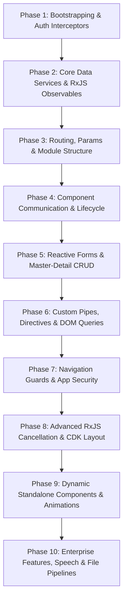

Listed directory sh_fe
Viewed package.json:1-78
Listed directory app
Viewed app.module.ts:1-110
Viewed app-routing.module.ts:1-100
Searched for "canActivate"
Searched for "Guard"
Listed directory service
Searched for "@Injectable"
Listed directory interceptor
Viewed AddHeaderinterceptor.ts:1-84
Viewed api-cancel.interceptor.ts:1-36
Viewed ConfirmDeactivateGuard.ts:1-22
Viewed customerlist.component.ts:1-100
Viewed focus-on-click.directive.ts:1-21
Viewed pagination.pipe.ts:1-56
Viewed shared.module.ts:1-33
Viewed user-master-detail.component.ts:1-100
Viewed user-master-detail.component.ts:100-160
Viewed chat-bot.component.ts:1-60
Listed directory dynamic-components
Viewed order-value.component.ts:1-60
Viewed portal.service.ts:1-70
Viewed helper.service.ts:1-60
Searched for "BehaviorSubject"
Viewed responsive.service.ts:1-62
Viewed items-table.component.ts:1-11
Viewed header.component.ts:1-100
Viewed login.component.ts:1-70
Viewed quotationdetail.component.ts:1-60
Listed directory sales-order
Viewed sales-order.component.ts:1-60

# Project-Based Angular Learning Curriculum
**Codebase Reference:** `d:/Ramesh/SH_FE/sh_fe` (Angular 15.x Enterprise ERP Application)

---

## 1. Concept Analysis Matrix (4 Columns)

| Concept | Where it exists in my project | What I need to learn | How deeply I need to learn it |
| :--- | :--- | :--- | :--- |
| **HTTP Interceptors (Auth & Headers)** | [`AddHeaderinterceptor.ts`](file:///d:/Ramesh/SH_FE/sh_fe/src/app/interceptor/AddHeaderinterceptor.ts#L16-L73) | How to clone requests, inject `Authorization: Bearer <token>`, set custom headers per endpoint, handle global HTTP 401 redirect to login, and register interceptors via `HTTP_INTERCEPTORS` multi-provider. | **MUST MASTER** |
| **HTTP Request Cancellation & RxJS Race Prevention** | [`api-cancel.interceptor.ts`](file:///d:/Ramesh/SH_FE/sh_fe/src/app/api-cancel.interceptor.ts#L7-L35) | Managing concurrent HTTP requests using `Subject` + `takeUntil`, tracking active API calls by URL in a `Map`, and cancelling stale `/fetchDatas` requests when a new search/filter fires. | **MUST MASTER** |
| **Dependency Injection & Core HTTP Services** | [`portal.service.ts`](file:///d:/Ramesh/SH_FE/sh_fe/src/app/service/portal.service.ts#L14-L40), [`helper.service.ts`](file:///d:/Ramesh/SH_FE/sh_fe/src/app/service/helper.service.ts#L6-L10) | `@Injectable({ providedIn: 'root' })`, singleton services, injecting `HttpClient`, typing responses, and organizing centralized API calls versus helper transformation logic. | **MUST MASTER** |
| **Reactive Forms & Dynamic Validation** | [`user-master-detail.component.ts`](file:///d:/Ramesh/SH_FE/sh_fe/src/app/masters/user-master-detail/user-master-detail.component.ts#L117-L153), [`sales-order.component.ts`](file:///d:/Ramesh/SH_FE/sh_fe/src/app/sales-order/sales-order.component.ts#L26) | `FormBuilder`, `FormGroup`, `FormControl`, `Validators` (`required`, `email`), `patchValue`, form state tracking (`valid`, `dirty`, `touched`), handling dynamic sub-forms. | **MUST MASTER** |
| **Component Lifecycle Hooks** | [`customerlist.component.ts`](file:///d:/Ramesh/SH_FE/sh_fe/src/app/customer/customerlist/customerlist.component.ts#L66-L100), [`sales-order.component.ts`](file:///d:/Ramesh/SH_FE/sh_fe/src/app/sales-order/sales-order.component.ts#L16-L25) | Execution order of `ngOnInit`, `ngOnChanges`, `ngAfterViewInit`, `ngAfterViewChecked`, and `ngOnDestroy`. Proper initialization of data, DOM-dependent queries, and teardown of timers/subscriptions. | **MUST MASTER** |
| **State Management with RxJS Subjects** | [`responsive.service.ts`](file:///d:/Ramesh/SH_FE/sh_fe/src/app/service/responsive.service.ts#L17-L36), [`chat-bot.service.ts`](file:///d:/Ramesh/SH_FE/sh_fe/src/app/chat-bot/chat-bot.service.ts#L24-L35) | Using `BehaviorSubject` and `Subject` for reactive cross-component state, exposing read-only `screenSize$` via `.asObservable()`, and pushing values with `.next()`. | **MUST MASTER** |
| **RxJS Operators & Combinators** | [`sales-order.component.ts`](file:///d:/Ramesh/SH_FE/sh_fe/src/app/sales-order/sales-order.component.ts#L13-L14), [`customerlist.component.ts`](file:///d:/Ramesh/SH_FE/sh_fe/src/app/customer/customerlist/customerlist.component.ts#L12) | Practical usage of `forkJoin` (parallel API execution), `firstValueFrom` (Observable to Promise conversion), `takeUntil` (unsubscribe pattern), `map`, `startWith`, and `catchError`. | **MUST MASTER** |
| **Routing, Lazy Loading & Feature Modules** | [`app-routing.module.ts`](file:///d:/Ramesh/SH_FE/sh_fe/src/app/app-routing.module.ts#L4-L65), [`sales-order-routing.module.ts`](file:///d:/Ramesh/SH_FE/sh_fe/src/app/sales-order/sales-order-routing.module.ts) | Configuring `Routes`, lazy loading via `loadChildren: () => import(...).then(m => m.FeatureModule)`, wildcard routing, route parameters (`:action/:roleId`), and code splitting. | **MUST MASTER** |
| **Route Parameters & Query Parameters** | [`customerlist.component.ts`](file:///d:/Ramesh/SH_FE/sh_fe/src/app/customer/customerlist/customerlist.component.ts#L95-L100), [`user-master-detail.component.ts`](file:///d:/Ramesh/SH_FE/sh_fe/src/app/masters/user-master-detail/user-master-detail.component.ts#L63-L75) | Subscribing to `ActivatedRoute.params` and `ActivatedRoute.queryParams`, reading URL state to toggle edit/view mode or drive filter tabs. | **MUST MASTER** |
| **Component Communication (`@Input`, `@Output`, `EventEmitter`)** | [`order-value.component.ts`](file:///d:/Ramesh/SH_FE/sh_fe/src/app/dynamic-components/order-value/order-value.component.ts#L12-L34), [`header.component.ts`](file:///d:/Ramesh/SH_FE/sh_fe/src/app/components/layouts/header/header.component.ts#L23-L28), [`quotationdetail.component.ts`](file:///d:/Ramesh/SH_FE/sh_fe/src/app/quotationdetail/quotationdetail.component.ts#L29-L39) | Passing data down via `@Input()`, listening to input changes in `ngOnChanges`, and emitting events upward using `@Output() = new EventEmitter<T>()`. | **MUST MASTER** |
| **View DOM Queries (`@ViewChild`, `@ViewChildren`, `ElementRef`, `TemplateRef`)** | [`header.component.ts`](file:///d:/Ramesh/SH_FE/sh_fe/src/app/components/layouts/header/header.component.ts#L24), [`sales-order.component.ts`](file:///d:/Ramesh/SH_FE/sh_fe/src/app/sales-order/sales-order.component.ts#L23-L24), [`chat-bot.component.ts`](file:///d:/Ramesh/SH_FE/sh_fe/src/app/chat-bot/chat-bot.component.ts#L54-L55) | Querying native DOM elements via `ElementRef`, querying nested child components/directives, capturing modal templates via `TemplateRef<any>`, and managing scroll position. | **MUST MASTER** |
| **Custom Pipes (Data Transformation)** | [`pagination.pipe.ts`](file:///d:/Ramesh/SH_FE/sh_fe/src/app/pagination.pipe.ts#L1-L55), [`ngmultiselectfilter.pipe.ts`](file:///d:/Ramesh/SH_FE/sh_fe/src/app/ngmultiselectfilter.pipe.ts) | Implementing `PipeTransform`, writing pure vs impure pipes, dynamic searching across nested object keys, and using built-in pipes (`DatePipe`, `DecimalPipe`). | **MUST MASTER** |
| **Custom Attribute Directives & `@HostListener`** | [`focus-on-click.directive.ts`](file:///d:/Ramesh/SH_FE/sh_fe/src/app/focus-on-click.directive.ts#L1-L21), [`header.component.ts`](file:///d:/Ramesh/SH_FE/sh_fe/src/app/components/layouts/header/header.component.ts#L47-L58) | Building custom DOM behavior directives using `ElementRef`, listening to global document events via `@HostListener('document:click')` and `@HostListener('document:keydown.enter')`. | **MUST MASTER** |
| **Shared Modules & Architectural Organization** | [`shared.module.ts`](file:///d:/Ramesh/SH_FE/sh_fe/src/app/shared/shared.module.ts#L15-L32), [`app.module.ts`](file:///d:/Ramesh/SH_FE/sh_fe/src/app/app.module.ts#L51-L109) | Structuring `SharedModule` with `declarations` and `exports` for common pipes, directives, and UI widgets to prevent circular module dependencies and duplicate code. | **MUST MASTER** |
| **Route Navigation Guards (`CanDeactivate`)** | [`ConfirmDeactivateGuard.ts`](file:///d:/Ramesh/SH_FE/sh_fe/src/app/ConfirmDeactivateGuard.ts#L8-L21) | Implementing `CanDeactivate<T>` to inspect dirty form flags (`target.hasChanges`) and prompt confirmation before users navigate away from unsaved data. | **MUST MASTER** |
| **Standalone Components (Modern Angular 15+)** | [`order-value.component.ts`](file:///d:/Ramesh/SH_FE/sh_fe/src/app/dynamic-components/order-value/order-value.component.ts#L8-L10), [`quotationdetail.component.ts`](file:///d:/Ramesh/SH_FE/sh_fe/src/app/quotationdetail/quotationdetail.component.ts#L23-L25) | `standalone: true`, declaring self-contained `imports: [...]` in components, and interoperating standalone components within existing NgModule-based architectures. | **SHOULD KNOW** |
| **Angular CDK Layout & Responsive Breakpoints** | [`responsive.service.ts`](file:///d:/Ramesh/SH_FE/sh_fe/src/app/service/responsive.service.ts#L1-L30) | Using `@angular/cdk/layout` `BreakpointObserver` to dynamically observe media queries (mobile, tablet, laptop, desktop) and pipe responsive layout state into streams. | **SHOULD KNOW** |
| **Change Detection & Performance Optimization** | [`sales-order.component.ts`](file:///d:/Ramesh/SH_FE/sh_fe/src/app/sales-order/sales-order.component.ts#L16), [`chat-bot.component.ts`](file:///d:/Ramesh/SH_FE/sh_fe/src/app/chat-bot/chat-bot.component.ts#L5) | Understanding Zone.js trigger cycles, utilizing `ChangeDetectorRef` (`detectChanges()`, `markForCheck()`), and running code outside zone with `NgZone.runOutsideAngular()`. | **SHOULD KNOW** |
| **DOM Manipulation & Renderer2 / Sanitization** | [`quotationdetail.component.ts`](file:///d:/Ramesh/SH_FE/sh_fe/src/app/quotationdetail/quotationdetail.component.ts#L49), [`chat-bot.component.ts`](file:///d:/Ramesh/SH_FE/sh_fe/src/app/chat-bot/chat-bot.component.ts#L16) | Safe DOM manipulation using `Renderer2` instead of direct `document` manipulation; sanitizing dynamic HTML strings using `DomSanitizer.bypassSecurityTrustHtml`. | **SHOULD KNOW** |
| **Modal & Dialog Integration (`ngx-bootstrap` & PrimeNG)** | [`header.component.ts`](file:///d:/Ramesh/SH_FE/sh_fe/src/app/components/layouts/header/header.component.ts#L93-L100), [`customerlist.component.ts`](file:///d:/Ramesh/SH_FE/sh_fe/src/app/customer/customerlist/customerlist.component.ts#L61) | Opening modals programmatically with `BsModalService.show()`, passing configs, handling backdrop/close events, and managing PrimeNG `p-dialog`. | **SHOULD KNOW** |
| **Angular CDK Drag & Drop** | [`sales-order.component.ts`](file:///d:/Ramesh/SH_FE/sh_fe/src/app/sales-order/sales-order.component.ts#L1-L9) | Reordering items in tables and transferring items across lists using `CdkDropListGroup`, `CdkDrag`, `moveItemInArray`, and `transferArrayItem`. | **SHOULD KNOW** |
| **Angular Animations (`@angular/animations`)** | [`sales-order.component.ts`](file:///d:/Ramesh/SH_FE/sh_fe/src/app/sales-order/sales-order.component.ts#L46-L59) | Creating animations with `trigger`, `transition`, `style`, `animate` (`:enter`, `:leave` transitions for dynamic table rows or floating panels). | **SHOULD KNOW** |
| **Internationalization (i18n with `@ngx-translate`)** | [`app.module.ts`](file:///d:/Ramesh/SH_FE/sh_fe/src/app/app.module.ts#L82-L89), [`login.component.ts`](file:///d:/Ramesh/SH_FE/sh_fe/src/app/solids/login/login.component.ts#L35) | Setting up `TranslateModule`, creating dynamic JSON loader factories with `TranslateHttpLoader`, switching languages dynamically, and using `translate` pipes. | **SHOULD KNOW** |
| **Local / Session Storage & Session State Architecture** | [`login.component.ts`](file:///d:/Ramesh/SH_FE/sh_fe/src/app/solids/login/login.component.ts#L41-L68), [`header.component.ts`](file:///d:/Ramesh/SH_FE/sh_fe/src/app/components/layouts/header/header.component.ts#L68-L83) | Managing authentication tokens, user role access (`ALQ_ACCESS`), multi-tenant IDs, and theme preferences across browser storage. | **SHOULD KNOW** |
| **File Exporting & Blob Handling** | [`customerlist.component.ts`](file:///d:/Ramesh/SH_FE/sh_fe/src/app/customer/customerlist/customerlist.component.ts#L4), [`sales-order.component.ts`](file:///d:/Ramesh/SH_FE/sh_fe/src/app/sales-order/sales-order.component.ts#L28) | Converting API arrays and table data into Excel/CSV files using `file-saver`, `xlsx`, and binary array buffer streams. | **SHOULD KNOW** |
| **Audio Processing & Streaming in Angular Services** | [`audio-recorder.service.ts`](file:///d:/Ramesh/SH_FE/sh_fe/src/app/chat-bot/audio-recorder.service.ts), [`openai-speech.service.ts`](file:///d:/Ramesh/SH_FE/sh_fe/src/app/chat-bot/openai-speech.service.ts) | Integrating Web Audio API (`MediaRecorder`, `AudioContext`) within Angular `@Injectable()` services to stream voice data to transcription endpoints. | **GOOD TO KNOW** |
| **Google Maps Integration (`@agm/core`)** | [`app.module.ts`](file:///d:/Ramesh/SH_FE/sh_fe/src/app/app.module.ts#L90-L93), [`geocoding.service.ts`](file:///d:/Ramesh/SH_FE/sh_fe/src/app/service/geocoding.service.ts) | Loading third-party JavaScript SDKs with environment keys, geocoding coordinates to addresses, and background tracking intervals. | **GOOD TO KNOW** |
| **Third-Party PrimeNG Component Suite** | [`app.module.ts`](file:///d:/Ramesh/SH_FE/sh_fe/src/app/app.module.ts#L37-L38), [`sales-order.component.ts`](file:///d:/Ramesh/SH_FE/sh_fe/src/app/sales-order/sales-order.component.ts#L33-L37) | Integrating PrimeNG data tables (`p-table`), auto-completes (`p-autoComplete`), and color pickers. | **GOOD TO KNOW** |
| **Keyboard Shortcut Integration** | [`customerlist.component.ts`](file:///d:/Ramesh/SH_FE/sh_fe/src/app/customer/customerlist/customerlist.component.ts#L6-L9), [`sales-order.component.ts`](file:///d:/Ramesh/SH_FE/sh_fe/src/app/sales-order/sales-order.component.ts#L29) | Registering hotkeys for ERP power users using `ng-keyboard-shortcuts`. | **GOOD TO KNOW** |
| **Client-Side Storage with Dexie / IndexedDB** | [`package.json`](file:///d:/Ramesh/SH_FE/sh_fe/package.json#L35) | Offline caching of master catalogs using IndexedDB abstractions. | **GOOD TO KNOW** |
| **JQuery Integration & Direct DOM Modification** | [`header.component.ts`](file:///d:/Ramesh/SH_FE/sh_fe/src/app/components/layouts/header/header.component.ts#L12), [`customerlist.component.ts`](file:///d:/Ramesh/SH_FE/sh_fe/src/app/customer/customerlist/customerlist.component.ts#L14) | Legacy `declare var $: any;` usages. (Anti-pattern in modern Angular; understand only to refactor away). | **NOT IMPORTANT FOR NOW** |
| **Custom Elements Schema (`CUSTOM_ELEMENTS_SCHEMA`)** | [`app.module.ts`](file:///d:/Ramesh/SH_FE/sh_fe/src/app/app.module.ts#L106) | Bypassing Angular compiler checks for custom HTML tags or web components. | **NOT IMPORTANT FOR NOW** |
| **Legacy Tree Component (`@circlon/angular-tree-component`)** | [`package.json`](file:///d:/Ramesh/SH_FE/sh_fe/package.json#L24) | Third-party legacy tree viewer (superseded by modern component libraries). | **NOT IMPORTANT FOR NOW** |

---

## 2. Ordered Learning Path (Step-by-Step Trajectory)



---

### Step 1: Application Bootstrapping & HTTP Interceptors Pipeline
* **First file to open:** [`app.module.ts`](file:///d:/Ramesh/SH_FE/sh_fe/src/app/app.module.ts#L95-L105)
* **Method to trace:** `AddHeaderInterceptor.intercept()` in [`AddHeaderinterceptor.ts`](file:///d:/Ramesh/SH_FE/sh_fe/src/app/interceptor/AddHeaderinterceptor.ts#L18-L68)
* **Related service:** `ToastrService`, `Router`
* **Related API:** Any protected REST endpoint (e.g. `/fetchDatas`, `/excel`)
* **Angular concept behind it:** `HTTP_INTERCEPTORS` multi-provider token, `HttpHandler`, request immutability (`req.clone()`).
* **Real-world reason for using it:** Automatically attaches Bearer tokens and dynamic headers to outgoing API requests without manually adding headers in hundreds of service calls.
* **Interview question to answer:** *“Why are `HttpRequest` objects immutable in Angular, and how do you modify headers or handle a 401 Unauthorized status globally across an entire application?”*

---

### Step 2: Centralized API Services & Dependency Injection
* **First file to open:** [`portal.service.ts`](file:///d:/Ramesh/SH_FE/sh_fe/src/app/service/portal.service.ts#L14-L40)
* **Method to trace:** `transactionList()` or `getActiveGeneric()` in [`portal.service.ts`](file:///d:/Ramesh/SH_FE/sh_fe/src/app/service/portal.service.ts)
* **Related service:** `PortalService`
* **Related API:** `/api/generic/master/get/all`
* **Angular concept behind it:** `@Injectable({ providedIn: 'root' })`, Angular Hierarchical Injector, `HttpClient` async request methods returning `Observable<T>`.
* **Real-world reason for using it:** Decouples UI components from HTTP networking logic, enables reusable endpoints, and ensures single instance sharing across feature modules.
* **Interview question to answer:** *“What is the difference between providing a service in `{ providedIn: 'root' }` versus providing it in an `@NgModule` or `@Component` `providers` array?”*

---

### Step 3: Lazy Loading, Feature Modules & URL Routing
* **First file to open:** [`app-routing.module.ts`](file:///d:/Ramesh/SH_FE/sh_fe/src/app/app-routing.module.ts#L4-L65)
* **Method to trace:** Route definition for `master/UserMasterDetail/:action/:userId` in [`app-routing.module.ts`](file:///d:/Ramesh/SH_FE/sh_fe/src/app/app-routing.module.ts#L42-L60)
* **Related service:** `Router`, `ActivatedRoute`
* **Related API:** N/A (Client-side routing)
* **Angular concept behind it:** `RouterModule.forRoot()`, `loadChildren`, Webpack code splitting, Route segment parameters vs Query parameters.
* **Real-world reason for using it:** Prevents the browser from downloading the entire multi-megabyte ERP bundle on initial login; routes load on-demand when users navigate.
* **Interview question to answer:** *“How does lazy loading work under the hood in Angular, and what are the performance implications of route-level code splitting?”*

---

### Step 4: Route Parameters & Dynamic Query Subscription
* **First file to open:** [`customerlist.component.ts`](file:///d:/Ramesh/SH_FE/sh_fe/src/app/customer/customerlist/customerlist.component.ts#L93-L105)
* **Method to trace:** `ngOnInit()` parameter subscription in [`customerlist.component.ts`](file:///d:/Ramesh/SH_FE/sh_fe/src/app/customer/customerlist/customerlist.component.ts#L95-L100)
* **Related service:** `ActivatedRoute`
* **Related API:** `/api/customer/get/customerList`
* **Angular concept behind it:** `ActivatedRoute.queryParams` / `ActivatedRoute.params` as reactive Observables.
* **Real-world reason for using it:** Allows URL deep linking (e.g., sharing a URL with `?tab=sales` or editing a specific ID) and ensures components react when query params change without destroying the component.
* **Interview question to answer:** *“Why are `route.params` and `route.queryParams` Observables instead of static objects, and when would you use `route.snapshot` instead?”*

---

### Step 5: Component Communication (`@Input()`, `@Output()`, `EventEmitter`)
* **First file to open:** [`order-value.component.ts`](file:///d:/Ramesh/SH_FE/sh_fe/src/app/dynamic-components/order-value/order-value.component.ts#L1-L60)
* **Method to trace:** `ngOnChanges()` in [`order-value.component.ts`](file:///d:/Ramesh/SH_FE/sh_fe/src/app/dynamic-components/order-value/order-value.component.ts#L47-L60) (consumed inside [`sales-order.component.html`](file:///d:/Ramesh/SH_FE/sh_fe/src/app/sales-order/sales-order.component.html))
* **Related service:** `DecimalPipe`
* **Related API:** N/A (Component data binding)
* **Angular concept behind it:** Property Binding `[salesOrder]`, `@Input()`, `@Output()`, `EventEmitter`, `SimpleChanges` detection.
* **Real-world reason for using it:** Isolates complex financial calculation widgets (tax, discounts, VAT, net values) into reusable presenter components used across Quotations, Sales Orders, and Invoices.
* **Interview question to answer:** *“How does `@Input()` change detection work, and how does `ngOnChanges` capture previous vs current values with `SimpleChanges`?”*

---

### Step 6: Reactive Forms & Dynamic Validation in Enterprise Masters
* **First file to open:** [`user-master-detail.component.ts`](file:///d:/Ramesh/SH_FE/sh_fe/src/app/masters/user-master-detail/user-master-detail.component.ts#L102-L160)
* **Method to trace:** Form initialization inside `ngOnInit()` in [`user-master-detail.component.ts`](file:///d:/Ramesh/SH_FE/sh_fe/src/app/masters/user-master-detail/user-master-detail.component.ts#L117-L153)
* **Related service:** `FormBuilder`, `PortalService`
* **Related API:** `/api/user/master/save` & `/api/user/master/get/detail`
* **Angular concept behind it:** `FormGroup`, `FormControl`, `Validators`, Form binding in HTML (`[formGroup]`, `formControlName`), programmatic validation checks.
* **Real-world reason for using it:** Handles large enterprise forms with conditional validation (e.g. required supervisor fields, email format checks, role assignments, password toggles).
* **Interview question to answer:** *“What are the advantages of Reactive Forms over Template-Driven Forms for complex enterprise applications, and how do you dynamically add or update form validators at runtime?”*

---

### Step 7: Shared Modules, Custom Pipes & Performance Filtering
* **First file to open:** [`shared.module.ts`](file:///d:/Ramesh/SH_FE/sh_fe/src/app/shared/shared.module.ts#L1-L33)
* **Method to trace:** `PaginationPipe.transform()` in [`pagination.pipe.ts`](file:///d:/Ramesh/SH_FE/sh_fe/src/app/pagination.pipe.ts#L37-L54)
* **Related service:** `DecimalPipe`, `DatePipe`
* **Related API:** N/A (In-memory search/filter pipe)
* **Angular concept behind it:** Custom `PipeTransform`, Pure vs Impure pipes, Shared Module export patterns.
* **Real-world reason for using it:** Provides instant client-side multi-field text search across complex ERP data tables without writing repetitive filter loops in every component.
* **Interview question to answer:** *“Why are Angular pipes pure by default, and what are the performance risks of creating an impure pipe or filtering large arrays in templates?”*

---

### Step 8: Custom Directives & DOM Event Listeners (`@HostListener`)
* **First file to open:** [`focus-on-click.directive.ts`](file:///d:/Ramesh/SH_FE/sh_fe/src/app/focus-on-click.directive.ts#L1-L21)
* **Method to trace:** `onClick()` in [`focus-on-click.directive.ts`](file:///d:/Ramesh/SH_FE/sh_fe/src/app/focus-on-click.directive.ts#L11-L19)
* **Related service:** `ElementRef`
* **Related API:** N/A (DOM enhancement)
* **Angular concept behind it:** `@Directive`, `ElementRef`, `@HostListener` capturing document and component events.
* **Real-world reason for using it:** Enhances third-party multi-select dropdowns to auto-focus search boxes on keyboard navigation without dirtying component business logic.
* **Interview question to answer:** *“How do Custom Directives differ from Components in Angular, and how do you safely listen to and manipulate DOM events using `@HostListener` and `Renderer2`?”*

---

### Step 9: View Queries (`@ViewChild`, `ElementRef`, `TemplateRef`) & Header Controls
* **First file to open:** [`header.component.ts`](file:///d:/Ramesh/SH_FE/sh_fe/src/app/components/layouts/header/header.component.ts#L20-L60)
* **Method to trace:** `handleOutsideClick()` and `openModalVoid()` in [`header.component.ts`](file:///d:/Ramesh/SH_FE/sh_fe/src/app/components/layouts/header/header.component.ts#L47-L58)
* **Related service:** `BsModalService`, `PortalService`
* **Related API:** `/api/company/master/get/comp/image`
* **Angular concept behind it:** `@ViewChild('dropdownMenu')`, `ElementRef.nativeElement`, `TemplateRef<any>`, outside click detection.
* **Real-world reason for using it:** Controls top navigation headers, user profile dropdowns, theme toggling, and opening modal dialog templates programmatically.
* **Interview question to answer:** *“What is the difference between static and dynamic `@ViewChild` queries, and in which lifecycle hook is a `@ViewChild` reference guaranteed to be available?”*

---

### Step 10: Navigation Guards (`CanDeactivate`)
* **First file to open:** [`ConfirmDeactivateGuard.ts`](file:///d:/Ramesh/SH_FE/sh_fe/src/app/ConfirmDeactivateGuard.ts#L1-L22)
* **Method to trace:** `canDeactivate()` in [`ConfirmDeactivateGuard.ts`](file:///d:/Ramesh/SH_FE/sh_fe/src/app/ConfirmDeactivateGuard.ts#L10-L20)
* **Related service:** `ConfirmDeactivateGuard`
* **Related API:** N/A (Router security & safety)
* **Angular concept behind it:** `CanDeactivate<T>` guard interface, routing lifecycle interception.
* **Real-world reason for using it:** Prevents users from accidentally navigating away from partially completed 50-item Sales Orders or dirty Master forms, preventing data loss.
* **Interview question to answer:** *“How do you implement a `CanDeactivate` guard to warn users about unsaved form changes, and how does the Router resolve boolean versus Observable return values?”*

---

### Step 11: Advanced RxJS: Request Cancellation & Race-Condition Prevention
* **First file to open:** [`api-cancel.interceptor.ts`](file:///d:/Ramesh/SH_FE/sh_fe/src/app/api-cancel.interceptor.ts#L1-L36)
* **Method to trace:** `intercept()` with `ongoingRequests.get(requestKey)?.next()` in [`api-cancel.interceptor.ts`](file:///d:/Ramesh/SH_FE/sh_fe/src/app/api-cancel.interceptor.ts#L10-L30)
* **Related service:** `ApiCancelInterceptor`
* **Related API:** `/fetchDatas` search endpoints
* **Angular concept behind it:** RxJS `Subject`, `takeUntil` operator, HTTP request aborting, Map-based concurrency state.
* **Real-world reason for using it:** When users type rapidly in a search box or switch tabs quickly, older in-flight HTTP requests are automatically aborted so outdated data cannot overwrite fresh results.
* **Interview question to answer:** *“How do you prevent race conditions from concurrent HTTP requests in Angular, and how does `takeUntil` cancel an underlying XMLHttpRequest/Fetch call?”*

---

### Step 12: Observable State Services & Responsive CDK Breakpoints
* **First file to open:** [`responsive.service.ts`](file:///d:/Ramesh/SH_FE/sh_fe/src/app/service/responsive.service.ts#L1-L62)
* **Method to trace:** `constructor()` breakpoint observer and `isMobile()` in [`responsive.service.ts`](file:///d:/Ramesh/SH_FE/sh_fe/src/app/service/responsive.service.ts#L20-L36)
* **Related service:** `ResponsiveService`, `BreakpointObserver` (`@angular/cdk/layout`)
* **Related API:** N/A (CDK Media Queries)
* **Angular concept behind it:** Reactive Service Store pattern with `BehaviorSubject`, `.asObservable()`, RxJS `map` derivation.
* **Real-world reason for using it:** Exposes responsive boolean streams (`isMobile()`, `isLargeDesktop()`) to components so UI logic can adapt without duplicate window resize listeners.
* **Interview question to answer:** *“What is the difference between a `Subject` and a `BehaviorSubject`, and why should you expose Observables using `.asObservable()` instead of exposing the Subject directly?”*

---

### Step 13: Parallel Data Fetching & RxJS Combinators (`forkJoin`, `firstValueFrom`)
* **First file to open:** [`sales-order.component.ts`](file:///d:/Ramesh/SH_FE/sh_fe/src/app/sales-order/sales-order.component.ts#L10-L40)
* **Method to trace:** Master data loading logic with `forkJoin` and `firstValueFrom` in [`sales-order.component.ts`](file:///d:/Ramesh/SH_FE/sh_fe/src/app/sales-order/sales-order.component.ts)
* **Related service:** `PortalService`, `HelperService`
* **Related API:** Multiple parallel master APIs (customers, items, payment terms, tax codes)
* **Angular concept behind it:** RxJS `forkJoin` (equivalent to `Promise.all`), RxJS 7 `firstValueFrom`, `async/await` interoperability.
* **Real-world reason for using it:** Loads 5+ lookup catalogs concurrently when opening a transactional document, waiting until all datasets arrive before rendering the UI.
* **Interview question to answer:** *“What happens in `forkJoin` if one Observable throws an error, and how does `forkJoin` differ from `combineLatest` and `zip`?”*

---

### Step 14: Standalone Components Architecture in Angular 15+
* **First file to open:** [`quotationdetail.component.ts`](file:///d:/Ramesh/SH_FE/sh_fe/src/app/quotationdetail/quotationdetail.component.ts#L1-L26)
* **Method to trace:** Component decorator metadata in [`quotationdetail.component.ts`](file:///d:/Ramesh/SH_FE/sh_fe/src/app/quotationdetail/quotationdetail.component.ts#L19-L25)
* **Related service:** `PortalService`
* **Related API:** `/api/quotation/get/quotationList`
* **Angular concept behind it:** `standalone: true`, component-level `imports: [CommonModule, FormsModule, NgxPaginationModule]`.
* **Real-world reason for using it:** Eliminates NgModule boilerplate, improves tree-shaking, and represents the modern architectural standard for Angular 15, 16, 17, and beyond.
* **Interview question to answer:** *“How do Standalone Components work in Angular 15+, and how can you use a Standalone Component inside an existing NgModule-based application?”*

---

### Step 15: Drag & Drop UI Workflows with Angular CDK
* **First file to open:** [`sales-order.component.ts`](file:///d:/Ramesh/SH_FE/sh_fe/src/app/sales-order/sales-order.component.ts#L1-L15)
* **Method to trace:** Drag drop handlers with `moveItemInArray()` and `transferArrayItem()` in [`sales-order.component.ts`](file:///d:/Ramesh/SH_FE/sh_fe/src/app/sales-order/sales-order.component.ts)
* **Related service:** `ViewportRuler` (`@angular/cdk/scrolling`)
* **Related API:** N/A (Client drag/drop interaction)
* **Angular concept behind it:** `@angular/cdk/drag-drop` directives (`cdkDropList`, `cdkDrag`, `cdkDropListGroup`), array reordering utilities.
* **Real-world reason for using it:** Enables warehouse and sales users to drag, re-order line items, or prioritize pending delivery notes interactively.
* **Interview question to answer:** *“How does Angular CDK Drag and Drop handle coordinate tracking and DOM reordering without mutating component state directly?”*

---

### Step 16: Voice & Web Audio Streaming Services
* **First file to open:** [`chat-bot.component.ts`](file:///d:/Ramesh/SH_FE/sh_fe/src/app/chat-bot/chat-bot.component.ts#L24-L37)
* **Method to trace:** Audio recording and transcription lifecycle across [`audio-recorder.service.ts`](file:///d:/Ramesh/SH_FE/sh_fe/src/app/chat-bot/audio-recorder.service.ts) and [`openai-speech.service.ts`](file:///d:/Ramesh/SH_FE/sh_fe/src/app/chat-bot/openai-speech.service.ts)
* **Related service:** `ChatBotService`, `AudioRecorderService`, `OpenAiSpeechService`
* **Related API:** Speech transcription & LLM completion APIs
* **Angular concept behind it:** Wrapping browser native Web Audio / MediaDevices APIs inside injectable Angular singleton services.
* **Real-world reason for using it:** Implements voice-enabled ERP assistant allowing hands-free item queries and stock lookups.
* **Interview question to answer:** *“How do you safely wrap browser-only Web APIs (like `navigator.mediaDevices` or `AudioContext`) in Angular services to ensure SSR safety and proper resource cleanup on component destroy?”*

---

## 3. Top 30 Concepts I Must Master from This Project

1. **`HTTP_INTERCEPTORS` & Global Request Pipeline** (`req.clone()`, token injection in [`AddHeaderinterceptor.ts`](file:///d:/Ramesh/SH_FE/sh_fe/src/app/interceptor/AddHeaderinterceptor.ts))
2. **RxJS Request Aborting with `takeUntil`** (Preventing stale search overwrites in [`api-cancel.interceptor.ts`](file:///d:/Ramesh/SH_FE/sh_fe/src/app/api-cancel.interceptor.ts))
3. **Reactive Forms Architecture** (`FormBuilder`, `FormGroup`, `FormControl` in [`user-master-detail.component.ts`](file:///d:/Ramesh/SH_FE/sh_fe/src/app/masters/user-master-detail/user-master-detail.component.ts))
4. **Form Validation & Dynamic State Tracking** (`Validators.required`, `Validators.email`, `valid`, `dirty`, `touched`)
5. **Component Lifecycle Management** (`ngOnInit`, `ngOnChanges`, `ngOnDestroy`, `ngAfterViewInit`)
6. **Unsubscribe Pattern & Memory Leak Prevention** (`takeUntil(destroy$)` and subscription teardown)
7. **Singleton Services & Dependency Injection** (`@Injectable({ providedIn: 'root' })` in [`portal.service.ts`](file:///d:/Ramesh/SH_FE/sh_fe/src/app/service/portal.service.ts))
8. **Reactive State Stores with `BehaviorSubject`** (`screenSizeSubject` & `screenSize$` in [`responsive.service.ts`](file:///d:/Ramesh/SH_FE/sh_fe/src/app/service/responsive.service.ts))
9. **`Subject` vs `BehaviorSubject` vs `Observable`** (Push vs Pull data streams, initial value caching)
10. **Parallel Stream Orchestration with `forkJoin`** (Concurrent catalog loading in [`sales-order.component.ts`](file:///d:/Ramesh/SH_FE/sh_fe/src/app/sales-order/sales-order.component.ts))
11. **Promise Interoperability with `firstValueFrom`** (Bridging RxJS Observables with `async/await` in Angular 15)
12. **Route Configuration & Lazy Loading** (`loadChildren` dynamic imports in [`app-routing.module.ts`](file:///d:/Ramesh/SH_FE/sh_fe/src/app/app-routing.module.ts))
13. **Route Segment & Query Parameters** (`ActivatedRoute.params` and `ActivatedRoute.queryParams` subscriptions)
14. **Programmatic Navigation & URL State** (`Router.navigate()` with parameters and query arguments)
15. **Route Navigation Guards (`CanDeactivate`)** (Unsaved changes protection in [`ConfirmDeactivateGuard.ts`](file:///d:/Ramesh/SH_FE/sh_fe/src/app/ConfirmDeactivateGuard.ts))
16. **Component Input Data Binding (`@Input`)** (Passing complex business objects to child components)
17. **Component Output Event Streaming (`@Output` & `EventEmitter`)** (Notifying parent containers of actions)
18. **Input Change Interception with `ngOnChanges`** (Tracking property mutations with `SimpleChanges`)
19. **DOM Querying with `@ViewChild` & `ElementRef`** (Accessing template elements and custom widgets)
20. **Modal Template References with `TemplateRef<any>`** (Passing templates to `BsModalService`)
21. **Custom Angular Pipes (`PipeTransform`)** (In-memory multi-key search in [`pagination.pipe.ts`](file:///d:/Ramesh/SH_FE/sh_fe/src/app/pagination.pipe.ts))
22. **Built-in Angular Pipes** (`DatePipe`, `DecimalPipe`, `AsyncPipe`, formatting enterprise numbers/dates)
23. **Custom Attribute Directives (`@Directive`)** (DOM enhancement in [`focus-on-click.directive.ts`](file:///d:/Ramesh/SH_FE/sh_fe/src/app/focus-on-click.directive.ts))
24. **Host Event Listening with `@HostListener`** (Global keyboard shortcuts and click-outside dismissal)
25. **Modular Code Sharing with `SharedModule`** (Managing declarations, imports, and exports)
26. **Modern Standalone Components (`standalone: true`)** (Module-free component declarations in [`order-value.component.ts`](file:///d:/Ramesh/SH_FE/sh_fe/src/app/dynamic-components/order-value/order-value.component.ts))
27. **Angular CDK Layout & Breakpoint Observation** (`BreakpointObserver` media query streaming)
28. **Angular CDK Drag and Drop Engine** (`CdkDropList`, `CdkDrag`, `moveItemInArray`, `transferArrayItem`)
29. **Change Detection Optimization (`ChangeDetectorRef`)** (`detectChanges()`, `markForCheck()` for async/outside-zone events)
30. **Security & DOM Sanitization (`DomSanitizer`)** (Safely rendering dynamic markup without XSS risks)


<!-- 


 -->


 # Developer Learning-Outcome & Architectural Mastery Analysis

> **Analysis Scope**: This document analyzes the **actual source code** of the enterprise Sales Force Automation (SFA) and ERP frontend application ([`sh_fe`](file:///d:/Ramesh/SH_FE/sh_fe/package.json)). It details the technical competencies, design patterns, domain logic, and architectural practices you will master by working on this codebase.

---

## 1. Angular Core Concepts

### 1.1 Component Architecture & Communication

| Concept | Evidence in Source Code | Location & Method/Property | Purpose in Project | Architectural / Developer Lesson |
| :--- | :--- | :--- | :--- | :--- |
| **Component Hierarchy** | [`AppComponent`](file:///d:/Ramesh/SH_FE/sh_fe/src/app/app.component.ts) | Shell root hosting `<app-header>`, `<router-outlet>`, `<app-chat-bot>` | Provides the persistent global shell with global timers and dynamic menus. | Understand how shell root components manage un-routed global widgets and app lifecycle. |
| **`@Input()` Data Binding** | [`ItemLocationInfoComponent`](file:///d:/Ramesh/SH_FE/sh_fe/src/app/dynamic-components/item-location-info/item-location-info.component.ts#L18) | `@Input() itemCode: string;` | Receives item code from parent to inspect multi-warehouse stock availability. | Master passing state downward to presentational and reusable modal dialogs. |
| **`@Output()` & `EventEmitter`** | [`AppComponent`](file:///d:/Ramesh/SH_FE/sh_fe/src/app/app.component.ts#L1452) | `@Output() closeSideBar = new EventEmitter<boolean>();` | Emits sidebar expansion/collapse events from header to layout container. | Master upward event delegation without direct component coupling. |
| **`@ViewChild` & `@ViewChildren`** | [`SalesOrderComponent`](file:///d:/Ramesh/SH_FE/sh_fe/src/app/sales-order/sales-order.component.ts#L62-L96) | `@ViewChild('autoCompleteCustomerNo') autoCompleteCustomerNo: AutoComplete;` | Programmatically focuses and triggers PrimeNG dropdown overlays during keyboard navigation. | Learn direct DOM/Widget manipulation and imperative widget orchestration in high-speed data entry forms. |
| **Dynamic Component Islands** | [`OrderValueComponent`](file:///d:/Ramesh/SH_FE/sh_fe/src/app/dynamic-components/order-value/order-value.component.ts) | Standalone component imported into multiple feature modules | Encapsulates gross total, VAT, discount, and net value banner calculations. | Learn how to extract reusable, calculation-heavy widget islands across transactions. |
| **Component Lifecycle Hooks** | [`ChatBotComponent`](file:///d:/Ramesh/SH_FE/sh_fe/src/app/chat-bot/chat-bot.component.ts#L274-L361) | `ngOnInit()`, `ngAfterViewChecked()`, `ngOnDestroy()` | Initializes Web Audio contexts, auto-scrolls chat window, and cleans up speech timers. | Master resource allocation, DOM synchronization, and garbage-collection safety. |
| **Smart (Container) Components** | [`SalesOrderComponent`](file:///d:/Ramesh/SH_FE/sh_fe/src/app/sales-order/sales-order.component.ts) | 15,652 lines managing 38 form controls, stock checks, pricing, and ERP integration | Coordinates backend communication, form state, and sub-modal state. | Learn the anatomy, complexity, and maintenance trade-offs of massive monolithic enterprise containers. |

---

### 1.2 Template Syntax & Directives

* **Structural Directives (`*ngIf`, `*ngFor`)**:
  * Used extensively in [`sales-order.component.html`](file:///d:/Ramesh/SH_FE/sh_fe/src/app/sales-order/sales-order.component.html) for rendering dynamic tables (`*ngFor="let item of quoteDetail; let i = index"`), conditionally displaying batch modals, and gating buttons based on `hasGeoTrackAccess`.
* **Custom Directives**:
  * [`FocusOnClickDirective`](file:///d:/Ramesh/SH_FE/sh_fe/src/app/focus-on-click.directive.ts): Listens to host click events to automatically highlight and select all text inside numeric inputs for rapid ERP data entry.
* **Custom & Built-in Pipes**:
  * Built-in: `DatePipe` (`dd/MM/yyyy`), `DecimalPipe` (`1.2-2` for currency formatting).
  * Custom Pipes: [`PaginationPipe`](file:///d:/Ramesh/SH_FE/sh_fe/src/app/pagination.pipe.ts) (slices in-memory arrays for client-side pagination), [`NgmultiselectfilterPipe`](file:///d:/Ramesh/SH_FE/sh_fe/src/app/ngmultiselectfilter.pipe.ts) (in-memory multi-attribute searching).
* **Two-Way Binding (`[(ngModel)]`)**:
  * Confined to standalone search inputs, filter bars, and modal inputs in [`quotation-list.component.html`](file:///d:/Ramesh/SH_FE/sh_fe/src/app/quotation-list/quotation-list.component.html).

---

## 2. Angular Architecture Concepts

```
+───────────────────────────────────────────────────────────────────────────────────────────────────+
| ARCHITECTURAL PATTERN          | WHERE IT APPEARS                     | LESSON LEARNED            |
+────────────────────────────────+──────────────────────────────────────+───────────────────────────+
| Hybrid NgModule + Standalone   | AppModule & dynamic-components/      | How to bridge legacy      |
| Architecture                   |                                      | NgModules with standalone |
+────────────────────────────────+──────────────────────────────────────+───────────────────────────+
| Lazy-Loaded Feature Routing    | AppRoutingModule (50+ routes)        | Minimizing initial bundle |
| (loadChildren)                 |                                      | size via route splitting  |
+────────────────────────────────+──────────────────────────────────────+───────────────────────────+
| Global HTTP Interceptors       | AddHeaderInterceptor &               | Centralized JWT injection |
|                                | ApiCancelInterceptor                 | & query auto-cancellation |
+────────────────────────────────+──────────────────────────────────────+───────────────────────────+
| Route CanDeactivate Guard      | ConfirmDeactivateGuard               | Preventing accidental     |
|                                |                                      | data loss on navigation   |
+────────────────────────────────+──────────────────────────────────────+───────────────────────────+
| Runtime Configuration Provider | assets/config.json &                 | Switching backend URLs at |
|                                | LoginComponent.ngOnInit()            | runtime without rebuilds  |
+────────────────────────────────+──────────────────────────────────────+───────────────────────────+
```

---

## 3. TypeScript Mastery in Practice

```typescript
// 1. COMPLEX DTO MODELING (src/app/service/portal.service.ts)
export interface ValidationResponse {
  valid: boolean;
  message?: string;
  field?: string;
}

// 2. CONTEXTUAL RECORD TYPES (src/app/chat-bot/openai-speech.service.ts)
export interface TranscriptionContext {
  spellMode?: boolean;
  orderType?: string | null;
  lastAssistantMessage?: string | null;
}

// 3. UNION TYPES & STATE MACHINE STATES (src/app/chat-bot/audio-recorder.service.ts)
export type RecorderState = 'idle' | 'recording' | 'stopping';
```

### TypeScript Competencies You Will Develop:
1. **Asynchronous Orchestration**: Combining native ES `async/await` with `Promise` wrappers and RxJS `firstValueFrom` in [`SalesOrderComponent.createOrder`](file:///d:/Ramesh/SH_FE/sh_fe/src/app/sales-order/sales-order.component.ts).
2. **Type Assertions & Parsing**: Defensive type handling for dynamic JSON objects returned from generic backend endpoints (`typeof response === 'string' ? JSON.parse(response) : response`).
3. **Hardware & Web API Typing**: Leveraging TypeScript definitions for Web Audio (`AudioContext`, `AnalyserNode`, `MediaRecorder`) and Geolocation (`GeolocationCoordinates`).

---

## 4. RxJS Reactive Programming & Operators

```
+──────────────────+──────────────────────────────────────+───────────────────────────────────────────────+
| RXJS OPERATOR    | EXACT CODE LOCATION                  | BUSINESS & REACTIVE EFFECT                    |
+──────────────────+──────────────────────────────────────+───────────────────────────────────────────────+
| BehaviorSubject  | ChatBotService.quotationDataSubject  | Caches active conversational order payload;   |
|                  | (chat-bot.service.ts:L24)            | multicasts draft updates to transaction views.|
+──────────────────+──────────────────────────────────────+───────────────────────────────────────────────+
| Subject          | ApiCancelInterceptor.ongoingRequests | Holds cancellation tokens for in-flight       |
|                  | (api-cancel.interceptor.ts:L9)       | duplicate /fetchDatas requests.               |
+──────────────────+──────────────────────────────────────+───────────────────────────────────────────────+
| takeUntil        | ApiCancelInterceptor.intercept()     | Auto-terminates prior HTTP requests when a    |
|                  | (api-cancel.interceptor.ts:L28)      | new search keystroke occurs.                  |
+──────────────────+──────────────────────────────────────+───────────────────────────────────────────────+
| forkJoin         | MaterialRequestAddComponent.ngOnInit | Concurrently fetches Locations, Categories,   |
|                  |                                      | and UOM masters before initializing view.     |
+──────────────────+──────────────────────────────────────+───────────────────────────────────────────────+
| switchMap / map  | OpenAiSpeechService.transcribe()     | Transforms HTTP response stream into parsed   |
|                  | (openai-speech.service.ts:L94)       | transcript strings.                           |
+──────────────────+──────────────────────────────────────+───────────────────────────────────────────────+
| catchError       | PortalService.validateHeader...()    | Intercepts HTTP 400/500 errors and converts   |
|                  | (portal.service.ts:L2695)            | them to structured user-facing Error objects. |
+──────────────────+──────────────────────────────────────+───────────────────────────────────────────────+
```

### Identified Anti-Patterns & Memory Leak Vectors:
* **Uncleared Polling Intervals**: [`CustomerlistComponent.startListInterval()`](file:///d:/Ramesh/SH_FE/sh_fe/src/app/customer/customerlist/customerlist.component.ts#L187) triggers recurring polling without an explicit `clearInterval()` on teardown.
* **Unsubscribed Router Streams**: [`SalesOrderComponent.constructor`](file:///d:/Ramesh/SH_FE/sh_fe/src/app/sales-order/sales-order.component.ts#L144) subscribes to `this.router.events` without calling `unsubscribe()` in `ngOnDestroy()`.

---

## 5. Signals vs. Traditional Reactivity

* **Signals Status**: **Not Present** in this codebase.
* **Reason**: Built on **Angular 15.1.0** (prior to the introduction of Angular Signals in Angular 16+).
* **Reactivity Model**: Pure **RxJS Streams** (`BehaviorSubject`, `Subject`, `Observable`) combined with **Zone.js** for change propagation.

---

## 6. Change Detection & Zone.js

* **Strategy**: Standard **`ChangeDetectionStrategy.Default`** with **Zone.js** polyfill.
* **Explicit `ChangeDetectorRef` Invocations**:
  * [`SalesOrderComponent`](file:///d:/Ramesh/SH_FE/sh_fe/src/app/sales-order/sales-order.component.ts) and [`ChatBotComponent`](file:///d:/Ramesh/SH_FE/sh_fe/src/app/chat-bot/chat-bot.component.ts) call `this.cdr.detectChanges()` over 180 times.
  * **Why Necessary**: Web Audio API audio event callbacks, Google Maps Geocoder asynchronous callbacks, and `BsModalService` popup triggers execute outside Angular's microtask queue, necessitating manual change detection cycles.

---

## 7. Reactive Forms & Enterprise Validation

### Form Architecture in [`SalesOrderComponent`](file:///d:/Ramesh/SH_FE/sh_fe/src/app/sales-order/sales-order.component.ts#L163-L206):
```
                       +---------------------------+
                       |    saleOrderForm (38)     |
                       +-------------+-------------+
                                     |
             +-----------------------+-----------------------+
             |                                               |
             v                                               v
+--------------------------+                   +---------------------------+
|      Header Controls     |                   |    quoteDetail Array      |
| customerNo, orderType,   |                   | [                         |
| termsCode, deliveryDt,   |                   |   { itemCode, quantity,   |
| locationCode, vat, etc.  |                   |     rate, batchDetail }   |
+--------------------------+                   | ]                         |
                                               +---------------------------+
```

### Complete Form Lifecycle:
1. **Hydration (`patchValue`)**: In `getDetail(id)`, JSON from `GET /api/invoice/detail` is converted into Date objects and decimals and patched into form controls.
2. **Business Validation**: `HelperService.calculationValidation()` validates:
   * `quantityLs <= maxLooseQty` (Loose quantity cannot exceed master packing limit).
   * `netRate >= itemCost` (WAC margin protection).
3. **Payload Mapping**: `HelperService.transformHeaderValuesToGenerateOrder()` strips disabled controls, computes exchange rates, attaches line items, and generates `WctInvoiceHeaderDTO`.

---

## 8. HTTP Architecture & API Pipeline

```
+─────────────────────────────────────────────────────────────────────────────────────────────────+
|                                    HTTP COMMUNICATION PIPELINE                                  |
+─────────────────────────────────────────────────────────────────────────────────────────────────+

[ Feature Component ] ──▶ [ PortalService Method ] ──▶ [ HttpClient (GET / POST / PUT) ]
                                                                 │
                                                                 ▼
[ Backend API ] ◀── [ AddHeaderInterceptor ] ◀── [ ApiCancelInterceptor ]
                         (Injects Bearer Token           (Cancels duplicate
                          & Excel Content-Type)           in-flight queries)
```

### API Verbs & Payloads Mastered:
* **`GET`**: Querying Generic Masters (`/api/common/active/genericMaster/list`), Customer Geo (`/api/v1/customer-geo/code/...`), User Roles.
* **`POST`**: Transaction Creation (`/api/invoice/create`), Batch Import (`/api/sales/quotation/import/excel`), GPS Logging (`/api/map-api-log/save`).
* **`PUT`**: Updating Sales Orders (`/api/invoice/update`), Customer Visits (`/api/v1/salesman-customer-visit/{id}`).
* **`PATCH`**: Updating GPS Coordinates (`/api/v1/customer-geo/coordinates/{code}`).
* **`DELETE`**: Deleting Geofence Records (`/api/v1/customer-geo/{id}`).

---

## 9. Routing & Navigation Patterns

1. **Lazy Loading Architecture**: 50+ feature modules loaded on demand via `AppRoutingModule`.
2. **Intermediary Refresh Pattern**:
   ```typescript
   this.router.navigateByUrl('/customer-detail', { skipLocationChange: true }).then(() => {
     this.router.navigate(['/' + targetPath], { queryParams: queryParamsData });
   });
   ```
   * **Why Used**: Bypasses Angular's default behavior of ignoring navigation to the currently active route, forcing components to reload fresh state without a full page refresh.
3. **Route Parameter Maps**: Preserving ERP transaction codes (`?erp_txn_code=...`) across multi-step wizards.

---

## 10. Dependency Injection (DI)

```
[ SalesOrderComponent ]
   ├── Injects: PortalService (Singleton @Injectable({ providedIn: 'root' }))
   │               └── Injects: HttpClient
   ├── Injects: HelperService (Business calculations & UOM math)
   ├── Injects: GeocodingService (Google Maps Geocoder & GPS)
   ├── Injects: ChatBotService (BehaviorSubject state bridge)
   └── Injects: BsModalService, ToastrService, FormBuilder
```

---

## 11. State Management Architecture

* **Client Persistence State**: `localStorage` coordinates tokens (`SOLIDS_DATA`), dynamic base URLs (`SOLIDS_MASTER_URL`), device UUIDs (`SOLIDS_DEVICE_ID`), and branch clearances (`ALQ_ACCESS`).
* **Reactive Inter-Component State**: `ChatBotService.quotationData$` propagates conversational drafts into transaction forms.
* **Component Local State**: Form groups and synchronized line-item arrays (`quoteDetail`).
* **Server State**: Generic master tables (`GENERIC_MASTER`) drive runtime UI behaviors and business rules.

---

## 12. Authentication & Authorization

```
+───────────────────────────────────────────────────────────────────────────────────────────────────+
| LAYER                          | IMPLEMENTATION                                                   |
+────────────────────────────────+──────────────────────────────────────────────────────────────────+
| 1. Credential / MFA Login      | LoginComponent.submitLogin() & submitOTPLogin()                  |
+────────────────────────────────+──────────────────────────────────────────────────────────────────+
| 2. Token Ingestion & Transport | AddHeaderInterceptor sets Authorization: Bearer <token>          |
+────────────────────────────────+──────────────────────────────────────────────────────────────────+
| 3. Dynamic Menu Authorization  | PortalService.getMenuList() -> GET /api/common/menu/role/list    |
+────────────────────────────────+──────────────────────────────────────────────────────────────────+
| 4. Feature Access Rights       | ACCESS_LIST checks: GEO_TRACK, NO_ORD, OUT_RANGE_ORD, SCP, COL    |
+────────────────────────────────+──────────────────────────────────────────────────────────────────+
| 5. Multi-Tier Approval Matrix  | AuthorizationSetupDetailComponent defines threshold limits       |
+────────────────────────────────+──────────────────────────────────────────────────────────────────+
```

---

## 13. Real-World Business Logic & Domain Formulas

### 1. UOM & Loose Quantity Conversion ([`HelperService.getQtyBuErp`](file:///d:/Ramesh/SH_FE/sh_fe/src/app/service/helper.service.ts#L1048-L1060)):
$$\text{Base Qty} = \left(\text{Qty} + \frac{\text{Qty}_{\text{Loose}}}{\text{MaxLooseQty}_1}\right) \times \text{ConvFactor} \times \text{BaseMaxLsCount}$$

### 2. WAC Price Margin Guard ([`HelperService.calculationValidation`](file:///d:/Ramesh/SH_FE/sh_fe/src/app/service/helper.service.ts#L908)):
$$\text{Net Rate} = \frac{\text{Rate} \times (1 - \text{Discount}\%) - \text{DiscAmount}}{\text{ConvFactor}}$$
$$\text{Condition: } \text{Net Rate} < \text{Cost} \implies \text{Block Entry with Error: "Net Rate cannot be less than Cost"}$$

### 3. Geofenced Distance & Beat Validation:
* Enforces $\le 50\text{m}$ radius between salesman GPS and customer registered coordinates.
* Out-of-range orders (`OUT_RANGE_ORD`), out-of-beat orders (`OUT_BEAT_ORD`), and "No Order" visits (`NO_ORD`) require supervisor clearance.

---

## 14. Browser & Web Platform APIs

* **`navigator.geolocation`**: Acquires GPS coordinates with high/low accuracy fallback in [`GeocodingService`](file:///d:/Ramesh/SH_FE/sh_fe/src/app/service/geocoding.service.ts).
* **Web Audio API (`AudioContext`, `AnalyserNode`)**: Analyzes live microphone RMS volume for speech detection in [`AudioRecorderService`](file:///d:/Ramesh/SH_FE/sh_fe/src/app/chat-bot/audio-recorder.service.ts).
* **`navigator.mediaDevices.getUserMedia`**: Captures PCM audio streams.
* **`navigator.getBattery`**: Captures device battery percentage for field tracking telemetry.
* **`window.crypto.randomUUID`**: Generates hardware device identifiers.

---

## 15. Third-Party Integrations

```
+──────────────────────────+─────────────────────────────────+──────────────────────────────────────+
| INTEGRATION              | ADAPTER SERVICE                 | PURPOSE                              |
+──────────────────────────+─────────────────────────────────+──────────────────────────────────────+
| Google Maps Platform     | GeocodingService                | GPS mapping, reverse geocoding,      |
|                          |                                 | polyline routes, customer markers.   |
+──────────────────────────+─────────────────────────────────+──────────────────────────────────────+
| OpenAI Whisper & GPT-4o  | OpenAiSpeechService             | STT voice transcription and          |
|                          |                                 | synthesized TTS feedback.            |
+──────────────────────────+─────────────────────────────────+──────────────────────────────────────+
| Sarvam AI Speech Engine  | SarvamSpeechService             | Indic speech recognition and         |
|                          |                                 | natural voice synthesis.             |
+──────────────────────────+─────────────────────────────────+──────────────────────────────────────+
| Spring Boot AI Gateway   | ChatBotService                  | NLU intent classification and ERP    |
|                          |                                 | transaction payload generation.      |
+──────────────────────────+─────────────────────────────────+──────────────────────────────────────+
| SheetJS (xlsx) & SaveAs  | QuotationListComponent          | Client-side Excel import/export      |
|                          |                                 | for batch line-item entries.         |
+──────────────────────────+─────────────────────────────────+──────────────────────────────────────+
```

---

## 16. Performance Concepts: Confirmed vs. Potential

### Confirmed Implementations:
* Route-level Lazy Loading across 50+ feature modules.
* In-flight HTTP request auto-cancellation via `ApiCancelInterceptor`.
* Dynamic script loading for Google Maps API.
* Route inactivity timeout monitoring to pause background GPS polling.

### Potential Performance Improvements:
* **Large Component Deconstruction**: Refactoring [`SalesOrderComponent`](file:///d:/Ramesh/SH_FE/sh_fe/src/app/sales-order/sales-order.component.ts) (15k lines) into smaller presentational sub-components.
* **`ChangeDetectionStrategy.OnPush`**: Adopting `OnPush` across heavy data tables to eliminate redundant change detection passes.
* **`trackBy` in `*ngFor`**: Adding `trackBy` functions to line-item arrays to avoid re-rendering entire table rows on single-cell edits.

---

## 17. Error Handling Architecture

```
[ Error Occurs ]
       │
       ├── HTTP 400/500 Server Error ──▶ Intercepted in Service ──▶ Transformed & Displayed via Toastr.error()
       │
       ├── GPS Acquisition Failure   ──▶ Caught in GeocodingService ──▶ Logs Error to POST /api/map-api-log/save
       │
       ├── STT / Voice Audio Error   ──▶ Caught in OpenAiSpeechService ──▶ Falls back to Browser SpeechSynthesis
       │
       └── Form Margin Violation     ──▶ Caught in HelperService ──▶ Blocks Submission & Highlights Field
```

---

## 18. Security Concepts: Confirmed vs. Risks

### Confirmed Security Implementations:
* Centralized Bearer token injection via `AddHeaderInterceptor`.
* Server-driven feature and transaction authorization lists (`ACCESS_LIST`).
* Multi-level authorization thresholds for high-value orders.

### Potential Security Risks:
* **Token Storage in `localStorage`**: JWT tokens in `localStorage` are accessible to any script in the same origin (XSS vulnerability).
* **Hardcoded API Keys in Client Bundles**: Sarvam AI and Google Maps API keys stored directly in `environment.ts`.
* **Dynamic Master URL Modification**: Reading backend base URLs from `localStorage.getItem('SOLIDS_MASTER_URL')` allows origin redirection if storage is compromised.

---

## 19. Enterprise Software Engineering Concepts

1. **Configuration-Driven Business Logic**: UI permissions, geofence intervals, VAT thresholds, and auto-logout timers are driven entirely by server-side master tables rather than hardcoded client logic.
2. **Multi-Tenant / Multi-Branch Design**: Company switching (`onHeaderSelect_1`) dynamically updates tenant IDs, branch locations, and currencies without requiring a new login session.
3. **Audit Trail Telemetry**: Comprehensive field visit logging capturing GPS coordinates, battery percentage, client IP, and geofence validation flags for every transaction.

---

## 20. Project-Specific Learning Outcomes

After working on this codebase for 6–12 months, you will have practical, hands-on experience in:

1. **Architecting Enterprise Angular Applications**: Managing complex multi-module apps with lazy loading, shared services, and interceptor chains.
2. **Handling Complex Business Logic**: Implementing complex pricing engines, WAC margin checks, and mixed-unit packaging conversions.
3. **Integrating Hardware & Web Platform APIs**: Working with device GPS, Web Audio API, and Battery Status APIs in production.
4. **Building Conversational AI Interfaces**: Integrating speech recognition, text-to-speech, and NLU workflow APIs into enterprise workflows.
5. **Managing Large-Scale Reactive Forms**: Coordinating complex, multi-field reactive forms with dynamic patching, arrays, and custom validation.
6. **Integrating Geospatial Services**: Using the Google Maps Platform for reverse geocoding, polyline route tracking, and geofencing.
7. **Maintaining Complex Legacy Codebases**: Navigating, debugging, and maintaining large enterprise component architectures.

---

## 21. Skill Classification Matrix

```
+───────────────────────────────────────────────────────+──────────────+──────────────────────────+
| TECHNICAL COMPETENCY                                  | LEVEL        | DOMAIN CATEGORY          |
+───────────────────────────────────────────────────────+──────────────+──────────────────────────+
| Reactive Forms & Complex Validation                   | 🔴 Advanced   | Angular Forms            |
| RxJS Stream Orchestration & Interceptors              | 🔴 Advanced   | RxJS                     |
| Web Audio API Voice Activity Detection (VAD)          | 🔴 Advanced   | Browser Platform APIs    |
| GPS Geofencing & Distance Mathematics                 | 🟡 Intermed.  | Business Logic / Geo     |
| Multi-Module Lazy Loading & Dynamic Routing           | 🟡 Intermed.  | Architecture             |
| Speech AI Integration (OpenAI / Sarvam)               | 🟡 Intermed.  | AI / Cloud Services      |
| Role-Based Dynamic Menu Generation                   | 🟢 Beginner   | Authentication           |
| PrimeNG / Bootstrap UI Composition                    | 🟢 Beginner   | UI Development           |
+───────────────────────────────────────────────────────+──────────────+──────────────────────────+
```

---

## 22. 10-Phase Developer Learning Roadmap

```
PHASE 1: Foundation          ──▶ package.json, angular.json, environment.ts, bootstrap flow
PHASE 2: Angular Core        ──▶ AppModule, AppRoutingModule, Shared Components & Pipes
PHASE 3: HTTP & Session      ──▶ AddHeaderInterceptor, ApiCancelInterceptor, LoginComponent
PHASE 4: API Infrastructure  ──▶ PortalService (120+ REST endpoints, dynamic list wrappers)
PHASE 5: Business Engine     ──▶ HelperService (UOM loose-qty formulas, WAC margin protection)
PHASE 6: Core Transactions   ──▶ SalesOrderComponent & QuotationListComponent
PHASE 7: Field Geotracking   ──▶ GeocodingService, Background GPS logging, 50m Geofencing
PHASE 8: AI Speech Pipeline  ──▶ AudioRecorderService, OpenAiSpeechService, ChatBotComponent
PHASE 9: Management Portals  ──▶ SalesmanTrackerComponent & SalesmanPerformanceDashboard
PHASE 10: Telemetry & Audits ──▶ GeoApiReportComponent & Multilevel Authorization Consoles
```

---

## 23. Technical Interview Competencies

| Interview Topic | Source Code Evidence in Project | Key Discussion Points | Complexity |
| :--- | :--- | :--- | :---: |
| **HTTP Interceptor Pipelines** | [`AddHeaderInterceptor`](file:///d:/Ramesh/SH_FE/sh_fe/src/app/interceptor/AddHeaderinterceptor.ts) & [`ApiCancelInterceptor`](file:///d:/Ramesh/SH_FE/sh_fe/src/app/api-cancel.interceptor.ts) | Bearer token injection, request cloning, and using `takeUntil` to cancel in-flight HTTP requests. | 🔴 Advanced |
| **Complex Reactive Forms** | [`SalesOrderComponent`](file:///d:/Ramesh/SH_FE/sh_fe/src/app/sales-order/sales-order.component.ts) | FormBuilder initialization of 38 controls, dynamic `patchValue`, loose quantity validation, and DTO transformation. | 🔴 Advanced |
| **Hardware & Web Audio Integration** | [`AudioRecorderService`](file:///d:/Ramesh/SH_FE/sh_fe/src/app/chat-bot/audio-recorder.service.ts) | Web Audio `AnalyserNode`, real-time RMS volume computation, noise floor calibration, and silence detection. | 🔴 Advanced |
| **Enterprise Geofencing** | [`GeocodingService`](file:///d:/Ramesh/SH_FE/sh_fe/src/app/service/geocoding.service.ts) & [`SalesOrderComponent`](file:///d:/Ramesh/SH_FE/sh_fe/src/app/sales-order/sales-order.component.ts) | Haversine distance formula, Google Maps Geocoding, and out-of-range order business rules. | 🟡 Intermediate |
| **Change Detection in Mixed Contexts** | [`AppComponent`](file:///d:/Ramesh/SH_FE/sh_fe/src/app/app.component.ts) & [`ChatBotComponent`](file:///d:/Ramesh/SH_FE/sh_fe/src/app/chat-bot/chat-bot.component.ts) | Why `ChangeDetectorRef.detectChanges()` is needed when integrating third-party SDKs and Web Audio events outside Zone.js. | 🟡 Intermediate |

---

## 24. Final Technical Learning Matrix

| Concept | Category | Used in Project? | File Location | Primary Method / Property | Difficulty | Practical Learning Outcome |
| :--- | :--- | :---: | :--- | :--- | :---: | :--- |
| **HTTP Request Interception** | Angular Architecture | **YES** | [`AddHeaderinterceptor.ts`](file:///d:/Ramesh/SH_FE/sh_fe/src/app/interceptor/AddHeaderinterceptor.ts) | `intercept()` | 🟡 Intermediate | Master injecting security headers and managing global request pipelines. |
| **Dynamic Request Cancellation** | RxJS / Networking | **YES** | [`api-cancel.interceptor.ts`](file:///d:/Ramesh/SH_FE/sh_fe/src/app/api-cancel.interceptor.ts) | `intercept()` with `takeUntil()` | 🔴 Advanced | Master eliminating race conditions and redundant network queries. |
| **Large-Scale Reactive Forms** | Forms & Validation | **YES** | [`sales-order.component.ts`](file:///d:/Ramesh/SH_FE/sh_fe/src/app/sales-order/sales-order.component.ts) | `intializeSaleOrderForm()` | 🔴 Advanced | Build complex transactional enterprise forms with mixed sub-arrays. |
| **WAC Margin Protection** | Domain Logic | **YES** | [`helper.service.ts`](file:///d:/Ramesh/SH_FE/sh_fe/src/app/service/helper.service.ts) | `calculationValidation()` | 🟡 Intermediate | Master implementing financial formulas and price protection in ERP clients. |
| **UOM Packaging Conversions** | Domain Logic | **YES** | [`helper.service.ts`](file:///d:/Ramesh/SH_FE/sh_fe/src/app/service/helper.service.ts) | `getQtyBuErp()` | 🟡 Intermediate | Master mixed packaging math (Boxes, Cartons, Loose pieces) across ERP lines. |
| **Web Audio VAD Detection** | Browser / Web APIs | **YES** | [`audio-recorder.service.ts`](file:///d:/Ramesh/SH_FE/sh_fe/src/app/chat-bot/audio-recorder.service.ts) | `startRecording()` / `analyser.getFloatTimeDomainData()` | 🔴 Advanced | Master building voice activity detection without third-party plugins. |
| **Speech AI Integration** | AI / Third-Party | **YES** | [`openai-speech.service.ts`](file:///d:/Ramesh/SH_FE/sh_fe/src/app/chat-bot/openai-speech.service.ts) | `transcribe()` / `synthesize()` | 🟡 Intermediate | Integrate multimodal speech APIs (STT/TTS) into enterprise applications. |
| **Background Geolocation** | Browser / Web APIs | **YES** | [`app.component.ts`](file:///d:/Ramesh/SH_FE/sh_fe/src/app/app.component.ts) | `sendLocationLog()` | 🟡 Intermediate | Capture device GPS, reverse geocode, and persist tracking logs. |
| **50-Meter Geofencing** | Business Logic | **YES** | [`sales-order.component.ts`](file:///d:/Ramesh/SH_FE/sh_fe/src/app/sales-order/sales-order.component.ts) | `getPrivelege()` / `checkAndDefaultStoredCustomer()` | 🟡 Intermediate | Implement geofenced visits and out-of-range approval exceptions. |
| **Lazy-Loaded Modular Routing** | Architecture | **YES** | [`app-routing.module.ts`](file:///d:/Ramesh/SH_FE/sh_fe/src/app/app-routing.module.ts) | `loadChildren: () => import(...)` | 🟢 Beginner | Structure enterprise applications with modular lazy loading. |

---

### Concepts NOT Currently Present in This Project (Recommended for Further Study):
1. **Angular Signals (`signal()`, `computed()`, `effect()`)**: Introduced in Angular 16+; this codebase runs on Angular 15.
2. **Modern Control Flow (`@if`, `@for`, `@switch`)**: Introduced in Angular 17; this codebase uses classic `*ngIf`, `*ngFor`.
3. **NgRx / Redux Global State Stores**: This project relies on `localStorage` and RxJS `BehaviorSubject` services rather than an immutable store.
4. **Zoneless Change Detection**: Runs on traditional `Zone.js`.
