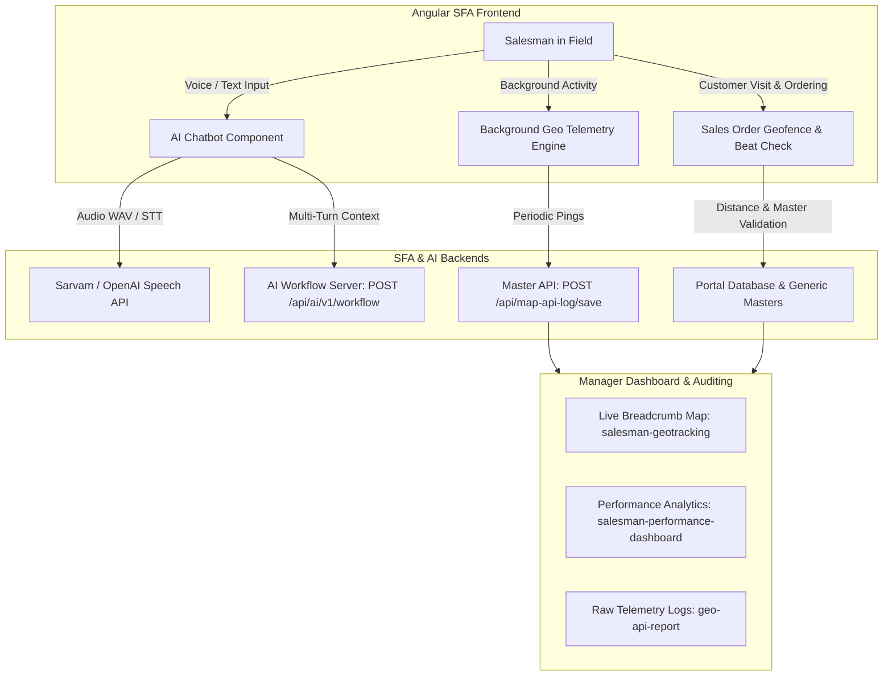
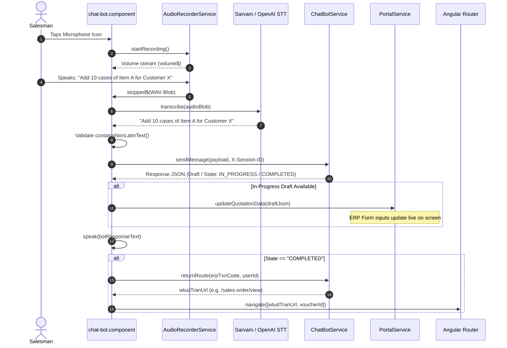
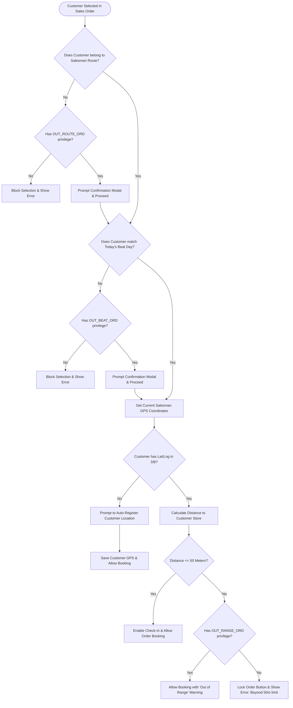

# Core Architecture & End-to-End Story Deep Dive: AI Chatbot & Geo-Location Tracking

---

## 1. Executive Summary & The Business Story

In field sales and Sales Force Automation (**SFA**), two major operational friction points exist:
1. **Complex Data Entry on Mobile/Handheld Devices:** Sales reps struggle to manually search catalogs, select item variants, apply discounts, and navigate complex ERP form structures while standing in front of a retail store owner.
2. **Field Compliance & Tracking Authenticity:** Companies need to ensure field salespeople actually visit assigned customer outlets on their designated beat days, adhere to physical geofences, and manage battery/device usage efficiently without fraudulent remote order entry.

This Angular SFA frontend solves both challenges with two tightly integrated engines:
* **The AI Conversational Order Engine:** A bilingual/Indian-English voice-first conversational AI assistant capable of multi-turn dialogues, auto-populating complex ERP transaction forms in real time, and navigating to final document views upon completion.
* **The Salesman Geo-Location & Telemetry Tracking Engine:** A background telemetry engine that tracks salesman location, enforces 50m geofence rules, maps beat calendars, sequences routes using nearest-neighbor algorithms, and provides management dashboards and audit trails.



---

## 2. Deep Dive: AI Chatbot Engine

### 2.1 File & Service Architecture
* [chat-bot.component.ts](file:///d:/Ramesh/SH_FE/sh_fe/src/app/chat-bot/chat-bot.component.ts) / [chat-bot.component.html](file:///d:/Ramesh/SH_FE/sh_fe/src/app/chat-bot/chat-bot.component.html) / [chat-bot.component.scss](file:///d:/Ramesh/SH_FE/sh_fe/src/app/chat-bot/chat-bot.component.scss): Primary UI controller managing conversation history, recording animations, Text-To-Speech (TTS) audio streaming, and inline draft previews.
* [chat-bot.service.ts](file:///d:/Ramesh/SH_FE/sh_fe/src/app/chat-bot/chat-bot.service.ts): External bridge to the AI workflow server, managing `X-Session-ID`, routing resolution, and RxJS communication observables.
* [audio-recorder.service.ts](file:///d:/Ramesh/SH_FE/sh_fe/src/app/chat-bot/audio-recorder.service.ts): Low-level Web Audio API service recording 16kHz WAV audio with volume metering and silence/VAD detection.
* [sarvam-speech.service.ts](file:///d:/Ramesh/SH_FE/sh_fe/src/app/chat-bot/sarvam-speech.service.ts) / [openai-speech.service.ts](file:///d:/Ramesh/SH_FE/sh_fe/src/app/chat-bot/openai-speech.service.ts): Speech-To-Text (STT) transcription and Text-To-Speech (TTS) synthesis adapters.
* [voice-transcript-normalizer.ts](file:///d:/Ramesh/SH_FE/sh_fe/src/app/chat-bot/voice-transcript-normalizer.ts): Sanitizes transcripts, removes non-Latin text, and normalizes quantities/spellings.
* [chat-transaction-user-mapping/](file:///d:/Ramesh/SH_FE/sh_fe/src/app/masters/chat-transaction-user-mapping/): Master configuration screen mapping user roles to specific ERP transaction codes (`wtudTranCode`) and routing URLs (`wtudTranUrl`).

---

### 2.2 Execution Flow: From Voice Input to ERP Document Creation



#### Step 1: Permissions & Insertion Gates
1. When the application loads, [app.component.ts](file:///d:/Ramesh/SH_FE/sh_fe/src/app/app.component.ts#L1468-L1489) executes `chatBotShowHide()`. It queries `PortalService.chatBotData()` to check if the current user's `SOLIDS_ROLEID` is authorized. If authorized, the floating chatbot launcher icon is rendered.
2. When the user clicks the launcher, `toggleChat()` checks [PortalService.checkInsertion(txnCode)](file:///d:/Ramesh/SH_FE/sh_fe/src/app/chat-bot/chat-bot.component.ts#L365-L418) via dynamic subcategory `CHECK_IF_INSERTED` to verify if accounting period rules permit new transaction creations in the current month. If disallowed, an error toast is displayed and navigation redirects to the list view.

#### Step 2: Audio Recording & Speech-to-Text Pipeline
1. Clicking the mic triggers [AudioRecorderService.startRecording()](file:///d:/Ramesh/SH_FE/sh_fe/src/app/chat-bot/audio-recorder.service.ts), capturing microphone input via `navigator.mediaDevices.getUserMedia`.
2. Audio is captured in 16-bit PCM mono format and encoded into a standard WAV blob.
3. The WAV blob is sent to [sarvam-speech.service.ts](file:///d:/Ramesh/SH_FE/sh_fe/src/app/chat-bot/sarvam-speech.service.ts#L33-L52) (`saaras:v3` model with `en-IN` language code) or [openai-speech.service.ts](file:///d:/Ramesh/SH_FE/sh_fe/src/app/chat-bot/openai-speech.service.ts).
4. **Validation Filters:**
   * `speechDetected`: If the user did not speak or silence was captured, a `"No speech detected"` warning appears and the voice loop stops.
   * `containsNonLatinText()` in [voice-transcript-normalizer.ts](file:///d:/Ramesh/SH_FE/sh_fe/src/app/chat-bot/voice-transcript-normalizer.ts): Rejects foreign script characters to ensure clean ERP query matching.

#### Step 3: AI Workflow Resolution
[ChatBotService.sendMessage()](file:///d:/Ramesh/SH_FE/sh_fe/src/app/chat-bot/chat-bot.service.ts#L45-L121) maps the active screen context to a specific backend workflow:
* `SO` $\rightarrow$ `Create Sale Order - Sun Hol (Copy)`
* `INV` $\rightarrow$ `Create Invoice - Sun Holding`
* `SR` $\rightarrow$ `Create Sale Return - Sun Holding`
* `DN` $\rightarrow$ `Create Delivery Note - Sun Holding`
* `MR` $\rightarrow$ `Create Material Request - Sun Hol`
* `LTO` / `LTI` $\rightarrow$ `Create Location Transfer Out / In - Sun Hol`

The request is sent as `POST {AI_SERVICE_BASE_URL}/api/ai/v1/workflow/{WorkflowName}/chat` with the persistent `X-Session-ID` header.

#### Step 4: Reactive Form Hydration & Navigation
* As the AI extracts customer codes, line items, and quantities, it returns structured `draft` JSON data.
* The chatbot notifies the active screen via `ChatBotService.updateQuotationData(draftJson)`. Active form components (e.g. Sales Order) subscribe to this observable to automatically fill tables and calculate tax/discounts on the fly.
* When the response indicates `state === 'COMPLETED'`, the chatbot retrieves the target transaction URL via `returnRoute(erpTxnCode)` and executes `router.navigate([wtudTranUrl, voucherId])`, landing the user directly on the finalized document view.
* The bot reads out conversational feedback using `SarvamSpeechService.synthesize()` (`bulbul:v3` model with the `ishita` speaker voice).

---

## 3. Deep Dive: Salesman Geo-Location Tracking System

### 3.1 File & Service Architecture
* [app.component.ts](file:///d:/Ramesh/SH_FE/sh_fe/src/app/app.component.ts): Core orchestrator running the background telemetry heartbeat timer, battery detection, and idle timeout protection.
* [geocoding.service.ts](file:///d:/Ramesh/SH_FE/sh_fe/src/app/service/geocoding.service.ts): Interfaces with browser geolocation APIs (`enableHighAccuracy`) and executes reverse-geocoding via Google Maps Geocoder.
* [sales-order.component.ts](file:///d:/Ramesh/SH_FE/sh_fe/src/app/sales-order/sales-order.component.ts): Validates salesman position against customer coordinates (50m geofence), enforces Beat calendar matching, and handles `OUT_RANGE_ORD` approvals.
* [salesman-tracker/](file:///d:/Ramesh/SH_FE/sh_fe/src/app/masters/salesman-tracker/): Salesman daily route screen showing nearest-neighbor sorted customer stops, check-ins, and visits.
* [salesman-geotracking/](file:///d:/Ramesh/SH_FE/sh_fe/src/app/masters/salesman-geotracking/): Supervisor live map tracing salesmen breadcrumbs and status-coded map pins.
* [salesman-performance-dashboard/](file:///d:/Ramesh/SH_FE/sh_fe/src/app/masters/salesman-performance-dashboard/): Management analytics dashboard showing route productivity, planned vs. actual visits, and order values.
* [geo-api-report/](file:///d:/Ramesh/SH_FE/sh_fe/src/app/report-geo-api/): Raw audit log viewer with GPS accuracy, battery telemetry, and Excel export.
* [customeraddress/](file:///d:/Ramesh/SH_FE/sh_fe/src/app/masters/customeraddress/): Customer GPS coordinates configuration with Google Places Autocomplete search.

---

### 3.2 Component Workflows & Business Logic

#### 3.2.1 Autonomous Background Telemetry Engine
In [app.component.ts](file:///d:/Ramesh/SH_FE/sh_fe/src/app/app.component.ts#L163-L207):
1. **Startup Check:** On user login, `loadGeoTrackingIntervalAndInit()` queries `GEO_TRACK_ENABLE_YN` for the company. If enabled, it fetches `GEO_TRACK_INTERVAL` (frequency in milliseconds).
2. **Permission Check:** `checkGeoTrackingAccess()` queries `ACCESS_LIST` to ensure the logged-in user role has the `GEO_TRACK` privilege.
3. **Heartbeat Loop (`sendLocationLog`):**
   * Calls `GeocodingService.getCurrentLocation()` with high-accuracy GPS options.
   * Calls `navigator.getBattery()` to capture battery percentage.
   * Resolves physical street address via Google Maps Geocoder (`getAddressFromCoords`).
   * Fetches public IP via `api.ipify.org`.
   * Dispatches payload to `POST /api/map-api-log/save`:
     ```json
     {
       "wmalCompId": "COMP01",
       "wmalUserId": "USR001",
       "wmalDeviceId": "DEV_WEB_XXXX-XXXX",
       "wmalLatitude": 25.2048,
       "wmalLongitude": 55.2708,
       "wmalLocationAccuracy": "12m",
       "wmalAddress": "Al Fahidi, Bur Dubai, Dubai, UAE",
       "wmalBatteryPercentage": "84%",
       "wmalTrackingSource": "GPS",
       "wmalFlexField02": "Regular"
     }
     ```
4. **Battery & Resource Protection (Idle Shutoff):** `handleTrackingCycleCompleted()` increments a cycle counter. If a user remains on the same screen without interaction for $2 \times \text{GEO\_TRACK\_INTERVAL}$, tracking pauses to prevent mobile battery drain. Navigating to any new route automatically reactivates the tracking loop.

---

#### 3.2.2 Geofence & Beat Validation in Order Booking
When a salesman opens [sales-order.component.ts](file:///d:/Ramesh/SH_FE/sh_fe/src/app/sales-order/sales-order.component.ts#L2440-L2640) and selects a customer:



* **Beat Validation:** `getOrderDateBeat()` translates the order date into standard weekday codes (e.g. `MON`, `TUE`, `WED`). SFA compares the salesman's assigned beat with the customer's scheduled beat.
* **Geofence Math:** Computes distance in meters between salesman device coordinates and customer pin.
* **Privilege Overrides:**
  * If distance $\le 50\text{m}$, the geofence check passes immediately.
  * If distance $> 50\text{m}$, SFA verifies whether the user possesses the `OUT_RANGE_ORD` privilege. If missing, order creation is blocked.
  * Similar security checks run for `OUT_BEAT_ORD` (booking on non-scheduled beat days) and `OUT_ROUTE_ORD` (booking customers outside assigned routes).

---

#### 3.2.3 Route Sequence Optimization (`orderLocationsByNearest`)
In [salesman-tracker.component.ts](file:///d:/Ramesh/SH_FE/sh_fe/src/app/masters/salesman-tracker/salesman-tracker.component.ts#L751) and [salesman-geotracking.component.ts](file:///d:/Ramesh/SH_FE/sh_fe/src/app/masters/salesman-geotracking/salesman-geotracking.component.ts#L693):
1. SFA retrieves assigned customer stops from `CUSTOMER_GEO_DETAILS_DATED` and merges them with logged visits from `SALESMAN_CUSTOMER_VISIT_LIST`.
2. The algorithm partitions outlets into **Visited** and **Unvisited**:
   * **Visited customers** are ordered chronologically based on check-in timestamps.
   * **Unvisited customers** are dynamically sorted using a nearest-neighbor TSP algorithm starting from the salesman's current GPS position (or the last visited shop).
3. The map renders the route path with colored indicators:
   * 🟡 **Yellow Pin:** Visited with check-in only (no order placed, e.g., shop closed).
   * 🔵/🔴 **Blue/Red Pin:** Productive visit (order booked with monetary value).
   * ⚪ **Gray Pin:** Scheduled, unvisited customer stop.

---

#### 3.2.4 Manager Analytics & Audit Reports
1. **Salesman Performance Dashboard ([salesman-performance-dashboard.component.ts](file:///d:/Ramesh/SH_FE/sh_fe/src/app/masters/salesman-performance-dashboard/salesman-performance-dashboard.component.ts)):**
   * **KPIs:** Active salesmen, planned vs. actual visits, visit coverage %, productive visit %, total booking value.
   * **Route Grid (`GEO_SALES_PERF_3`):** Breaks down orders booked inside vs. outside the 50m geofence per route.
   * **Salesman Grid (`GEO_SALES_PERF_4`):** Details individual rep productivity and coverage.
   * **Visit Timeline Modal (`GEO_SALES_PERF_5`):** Double-clicking a salesman row opens a chronological audit timeline of every customer visit, timestamp, order status, and salesman remarks.
   * **Excel Export:** `PortalService.XXlList('SALESMAN_PERF_XL_EXPORT')`.
2. **Geo API Audit Report ([geo-api-report.component.ts](file:///d:/Ramesh/SH_FE/sh_fe/src/app/report-geo-api/geo-api-report.component.ts)):**
   * Displays raw background tracking events: device ID, UTC timestamps, GPS coordinates, accuracy (meters), battery %, reverse-geocoded physical address, and linked ERP sales order numbers.

---

## 4. Master Data & Permission Matrix

To enable these modules for a user, the following master configurations in SFA Admin must be configured:

| Configuration Screen | Setting / Field | Purpose |
| :--- | :--- | :--- |
| **User Role Master** ([user-role-master-detail](file:///d:/Ramesh/SH_FE/sh_fe/src/app/masters/user-role-master-detail/)) | `GEO_TRACK` | Enables background GPS telemetry pings in `app.component.ts`. |
| | `NO_ORD` | Enables the "No Order" visit submission with reason codes (e.g. Store Closed). |
| | `OUT_RANGE_ORD` | Permits order creation when the salesman is $>50\text{m}$ away from the customer. |
| | `OUT_BEAT_ORD` | Permits customer visits on non-scheduled beat calendar days. |
| | `OUT_ROUTE_ORD` | Permits visiting customers assigned to a different route. |
| **Generic Master** ([generic-master](file:///d:/Ramesh/SH_FE/sh_fe/src/app/masters/generic-master/)) | `GEO_TRACK_ENABLE_YN` | Master toggle (`Y`/`N`) for location tracking per company. |
| | `GEO_TRACK_INTERVAL` | Ping interval duration in milliseconds (e.g. `300000` for 5 min). |
| | `AUTO_LOGOUT_TIME` | Automatic session expiration timeout for field security. |
| **Chatbot Mapping** ([chat-transaction-user-mapping](file:///d:/Ramesh/SH_FE/sh_fe/src/app/masters/chat-transaction-user-mapping/)) | `wtudTranCode` & `wtudTranUrl` | Maps user role to ERP transactions (e.g. `SO` $\rightarrow$ `/sales-order/view`). |
| **Customer Master** ([customeraddress](file:///d:/Ramesh/SH_FE/sh_fe/src/app/masters/customeraddress/)) | Latitude & Longitude | Reference physical coordinates representing customer store locations. |

---

## 5. End-to-End Story: A Day in the Life of a Field Sales Rep

```
 [08:30 AM] Salesman logs in to SFA
   │
   ├─► app.component checks 'GEO_TRACK' permission & 'GEO_TRACK_ENABLE_YN'
   │   └─► Telemetry heartbeat starts (GPS, Battery %, Address logged to DB)
   │
 [09:00 AM] Opens Salesman Tracker Map
   │
   ├─► System calculates nearest-neighbor route order from current position
   └─► Shows color-coded pins (Gray: pending stops, Yellow: check-in, Blue: order)
   │
 [09:30 AM] Arrives at Outlet A (Customer Store)
   │
   ├─► Opens Sales Order screen
   ├─► SFA verifies salesman is within 50m of Customer GPS pin (Geofence PASS)
   ├─► SFA verifies Customer matches today's scheduled Beat day (Beat PASS)
   │
 [09:35 AM] Creates Order via AI Voice Chatbot
   │
   ├─► Salesman clicks mic: "Create sales order, 25 cartons of Product X"
   ├─► Sarvam/OpenAI STT converts voice to text
   ├─► AI Backend parses intent, items, and pricing
   ├─► Active ERP form auto-populates live with draft line items
   ├─► AI completes transaction -> Router automatically navigates to Order View
   ├─► Voice response speaks confirmation: "Sales Order created successfully"
   │
 [05:30 PM] Manager Reviews Daily Performance
   │
   ├─► Opens Salesman Performance Dashboard & Geo Tracking Map
   ├─► Inspects traveled path polyline, geofence compliance, and visit timeline
   └─► Exports verified field report to Excel
```